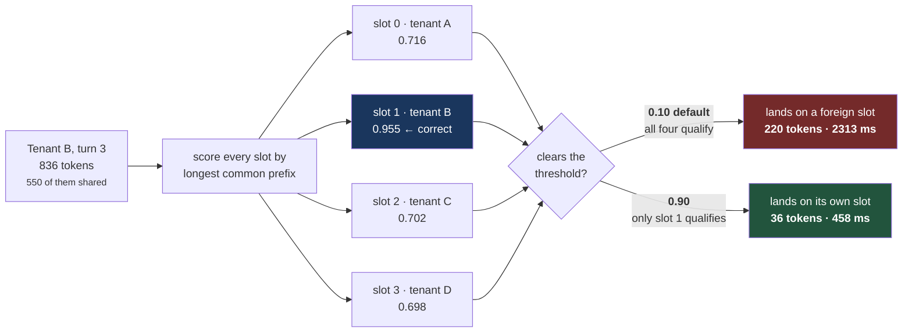
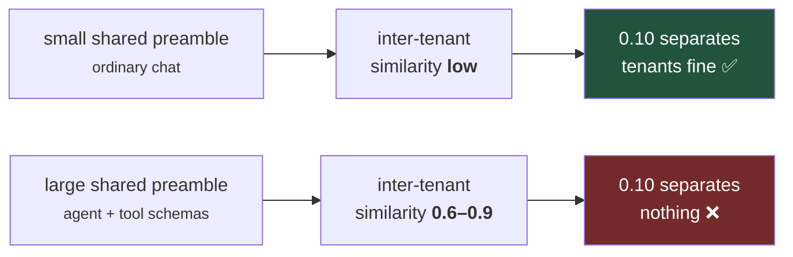
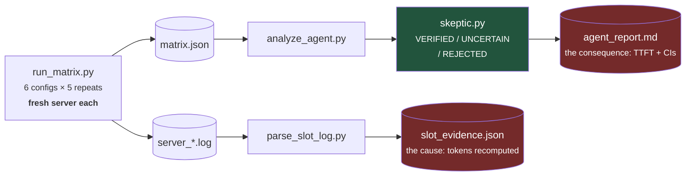

# Multi-tenant agent serving on Arm

**Four users of the same agent make llama.cpp recompute 6x more tokens per
request than one user does — because of a default that is right for chat and
wrong for agents.**

```
550-token system prompt + tool schemas, shared byte-identically by every tenant
836-token conversations, 4 turns each, requests issued sequentially

                          slot chosen at    tokens recomputed    time to
                          similarity        per request          first token
  1 tenant                0.955                  35                 503 ms
  4 tenants (default)     0.716                 220                2313 ms   4.6x
  4 tenants (fixed)       0.955                  36                 458 ms
```

One flag. `--slot-prompt-similarity 0.9`.

n=5 independent repeats per configuration, fresh server each time, 95%
confidence intervals disjoint, every relative standard deviation under 10%.
Thresholds were registered before any data existed.

---

## Why this happens

`llama-server` assigns each request to a slot by longest-common-prefix
similarity, keeping any slot that clears `--slot-prompt-similarity`
(**default 0.10**). It logs the decision:

```
selected slot by LCP similarity, f_sim_best = 0.716 (> 0.100 thold)
prompt eval time = ... / 220 tokens
```

Similarity is roughly `shared_prefix / total_prompt`. An agent's tenants all
carry the same system prompt and tool schemas, so **any two tenants are already
0.6–0.9 similar to each other**. Against a 0.10 threshold every slot looks like
a valid match for every tenant:



So tenants scatter across slots, and each recomputes its own history from
scratch every turn. Worse, it is self-sustaining: when B displaces A it also
destroys A's cache, so A pays full prefill on its next turn too. The regression
does not decay — it is a stable thrashing state.

The consequence is counterintuitive and worth stating plainly:



> **The larger your system prompt and tool schema, the worse the default
> behaves.** More shared context means higher inter-tenant similarity, which
> means the threshold separates tenants less well, not more.

It is also invisible to ordinary benchmarking, because a single-conversation
benchmark never has a second tenant to be confused with. We only found it after
a single-tenant test came back clean.

Full diagrams — slot lifetime, the measurement sequence, the adjudication gates,
CI — are in [docs/flows.md](docs/flows.md) and
[docs/architecture.md](docs/architecture.md).

## Reproduce it

Needs `llama-server`, a GGUF model, and Python 3 — stdlib only, nothing to
install.



```bash
python3 tools/run_matrix.py --server <llama-server> --model <model.gguf> --repeats 5
python3 tools/analyze_agent.py            # adjudicated table with CIs
python3 tools/parse_slot_log.py           # mechanism: tokens actually recomputed
```

~47 minutes for 30 runs. Or fork this repo and run the `bench` workflow, which
executes on `ubuntu-24.04-arm` — a free Arm-hosted runner (Cobalt 100 /
Neoverse N2) available at no cost on public repositories.

**On hardware dependence, stated precisely.** The *mechanism* is scheduler
behaviour, so it reproduces on any architecture. What it *costs* is prefill time
for those 220 extra tokens — so the price of a mis-routed slot scales with the
core's prefill throughput, which is not constant across Neoverse generations
(N1 has no i8mm; N2 does). Whether that changes the optimal threshold per core
is the obvious next question and **is not yet measured.** Nothing here claims it
does.

## Find the right threshold for your own agent

```bash
python3 tools/tune_similarity.py --sweep --server <llama-server> --model <model.gguf>
```

Measures each candidate threshold against a fresh server and reports which one
wins. There is also a fast analytic mode, but it is explicitly labelled a
heuristic: its model of the similarity formula is inferred from the flag's
documentation rather than read from source, and it has already disagreed with
measurement once.

## What lives here

| Path | Role |
|:--|:--|
| `tools/bench_agent.py` | One measurement run. Exact token counts from the server's own tokenizer. |
| `tools/run_matrix.py` | The config matrix, **fresh server per repeat** — a warm server measures carry-over, not the configuration. |
| `tools/analyze_agent.py` | Aggregates and adjudicates. Independent samples are per-repeat medians, not individual requests. |
| `tools/parse_slot_log.py` | Mechanism evidence from llama-server's own log: similarity chosen, tokens recomputed. |
| `tools/tune_similarity.py` | Finds the right threshold for your workload. |
| `tools/skeptic.py` | The adjudicator. One definition of VERIFIED, tested against known answers. |
| `tools/probe_prefill.py` | The opportunity sizer that started this — it is what proved single-tenant caching already works. |

## Documentation

| Document | Answers |
|:--|:--|
| [docs/flows.md](docs/flows.md) | Every flow, diagrammed. **Start with §1** — how a slot gets chosen wrong. |
| [docs/architecture.md](docs/architecture.md) | System context, module map, internals, data model, deployment |
| [docs/methodology.md](docs/methodology.md) | What is tested, how, and what would falsify it |

## The Skeptic

Every comparison returns **VERIFIED**, **UNCERTAIN** or **REJECTED** against
thresholds fixed in advance: ≥5 repeats, relative stdev ≤10%, effect ≥5%, and
disjoint 95% confidence intervals. A failed measurement is UNCERTAIN, never
REJECTED — "we measured nothing" and "we measured no gain" are different claims.

Uncertain and rejected rows are published. Two of the comparisons in the current
result are UNCERTAIN, and they stay in the table.

## What this does not claim

- **Not** that llama.cpp is poorly engineered. The 0.10 default is reasonable
  for chat, where the shared prefix is small. It is wrong for agents.
- **Not** a throughput result. Time-to-first-token only.
- **Not** yet measured on Arm. The finding is scheduler behaviour and should
  transfer, but the Arm numbers are owed and not yet collected.
- Independent samples are per-repeat medians, so `n` is the repeat count, not
  the request count.

Prefill token counts are byte-identical across repeats. That is expected, not
suspicious: temperature is 0 and the workload is fixed, so token sequences are
deterministic and only wall-clock varies.

## License

[Apache-2.0](LICENSE).

Built on [llama.cpp](https://github.com/ggml-org/llama.cpp). Model:
[Qwen2.5-1.5B-Instruct-GGUF](https://huggingface.co/Qwen/Qwen2.5-1.5B-Instruct-GGUF)
(Apache-2.0).
