<div align="center">

# neoverse-tune

**Multi-tenant agent serving on Arm — finding, measuring, and fixing a scheduler default that costs 4.6x time-to-first-token**

[](https://github.com/Unknown1502/neoverse-tune/actions/workflows/bench.yml)
[](LICENSE)
[](https://www.python.org/)
[](#tech-stack)
[-0091BD.svg)](.github/workflows/bench.yml)
[](#testing)
[](#the-skeptic--statistical-adjudication)

*The same model wants a different `llama.cpp` configuration on Neoverse N1 than on N2. This project measures which, and why.*

</div>

---

> **Four users of the same agent make `llama.cpp` recompute 6x more tokens per
> request than one user does — because of a default that is right for chat and
> wrong for agents. On Neoverse N2 that costs 10.9x time-to-first-token.**

```
550-token system prompt + tool schemas, shared byte-identically by every tenant
836-token conversations, 4 turns each, requests issued sequentially

                        slot chosen   tokens        TTFT            TTFT
                        at similarity recomputed    Neoverse N2     x86 8-thread
  1 tenant                 0.955          35          386 ms          503 ms
  4 tenants (default)      0.716         220         4204 ms 10.9x   2313 ms 4.6x
  4 tenants (fixed)        0.955          36          399 ms          458 ms
```

**One flag.** `--slot-prompt-similarity 0.9`

**The scheduler makes byte-identical decisions on both machines** — same 0.716
similarity, same 220 tokens recomputed. Only the *price* of those decisions
differs. The mechanism is architecture-independent; the cost is not.

n=5 independent repeats per configuration, fresh server each time, 95%
confidence intervals disjoint. Adjudication thresholds were registered in commit
`20a6031`, before any data existed. Both machines ran the same GGUF, verified
byte-identical by SHA-256, against llama.cpp `030ebb55`.

Reproduce the Arm column with one click: fork this repo, dispatch the
[`bench` workflow](.github/workflows/bench.yml), wait 47 minutes. The Arm runner
is free on public repositories.

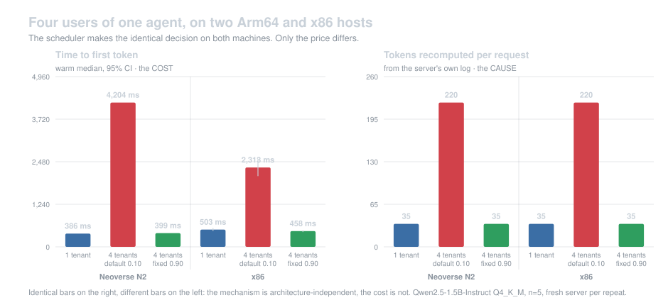

*Right panel identical, left panel not. Regenerate it from the committed data
with `python3 tools/make_chart.py` — it reads `results/` so it cannot drift from
the tables.*

---

## Table of Contents

**Understand it**
- [Executive Summary](#executive-summary)
- [The Finding](#the-finding)
- [Why This Happens — The Mechanism](#why-this-happens--the-mechanism)
- [Prior Art and Positioning](#prior-art-and-positioning)

**Use it**
- [Quick Start](#quick-start)
- [Installation](#installation)
- [Local Development](#local-development)
- [Configuration Reference](#configuration-reference)
- [Command Reference](#command-reference)

**Architecture**
- [Features](#features)
- [Tech Stack](#tech-stack)
- [High-Level Architecture](#high-level-architecture)
- [Low-Level Architecture](#low-level-architecture)
- [Component and Package Structure](#component-and-package-structure)
- [Class Model](#class-model)
- [Data Flow — Levels 0, 1, 2](#data-flow--levels-0-1-2)
- [Request Lifecycle](#request-lifecycle)
- [Sequence Diagrams](#sequence-diagrams)
- [State Model](#state-model)
- [Data Model](#data-model)
- [Consumed API Surface](#consumed-api-surface)
- [Folder Structure](#folder-structure)
- [Design Patterns](#design-patterns)

**Rigor**
- [The Skeptic — Statistical Adjudication](#the-skeptic--statistical-adjudication)
- [Methodology](#methodology)
- [Benchmark Results](#benchmark-results)
- [Mechanism Evidence](#mechanism-evidence)
- [Testing](#testing)
- [Falsification Criteria](#falsification-criteria)

**Operations**
- [CI/CD Pipeline](#cicd-pipeline)
- [Git Workflow and Project History](#git-workflow-and-project-history)
- [Security Architecture](#security-architecture)
- [Threat Model](#threat-model)
- [Reliability](#reliability)
- [Performance Characteristics](#performance-characteristics)
- [Scalability](#scalability)
- [Observability](#observability)
- [Cost](#cost)

**Project**
- [Roadmap](#roadmap)
- [Changelog](#changelog)
- [Known Limitations and Open Defects](#known-limitations-and-open-defects)
- [What This Project Is Not](#what-this-project-is-not)
- [Future Improvements](#future-improvements)
- [Contributing](#contributing)
- [Coding Standards](#coding-standards)
- [Documentation Standards](#documentation-standards)
- [License](#license)
- [Credits](#credits)
- [Appendix](#appendix)

---

## Executive Summary

### The Problem

An AI agent's prompt has a distinctive shape: `[system prompt + tool schemas][conversation history][new turn]`.
The first segment is large — hundreds to thousands of tokens of instructions and
JSON tool definitions — and it is **byte-identical on every request from every
user of that agent**.

`llama-server`, llama.cpp's inference server, holds conversations in **slots**
and caches each slot's KV state so text already processed is not reprocessed. To
route an incoming request to a slot it scores every slot by longest-common-prefix
similarity and accepts any slot clearing `--slot-prompt-similarity`, which
**defaults to 0.10**.

Similarity is approximately `shared_prefix / total_prompt`. Because every tenant
carries the same large preamble, **any two tenants of the same agent are already
0.6–0.9 similar to each other.** Against a threshold of 0.10, every slot looks
like a valid match for every tenant. Requests scatter, land on foreign slots,
and each recomputes its own history from scratch — while destroying the cache of
whichever tenant was there.

### The Solution

Measure it properly, prove the mechanism from the server's own logs, and fix it
with configuration rather than a patch:

```bash
llama-server -m model.gguf -np 4 --slot-prompt-similarity 0.9
```

Then ship the tooling that finds the right threshold for *any* agent workload,
because 0.9 is correct for this preamble shape and not universally.

### Why It Matters

| Dimension | Value |
|:--|:--|
| **Immediate** | Any multi-tenant llama.cpp agent deployment recovers ~4.6x TTFT for a one-line change. Zero code, zero risk, zero rebuild. |
| **Diagnostic** | The bug is *invisible to standard benchmarking*. A single-conversation benchmark never has a second tenant to be confused with. This is a class of defect that current benchmark practice cannot see. |
| **Counterintuitive** | The larger your system prompt, the worse the default behaves. Everyone's intuition runs the other way, which is why it went unreported. |
| **Methodological** | The adjudicator (`tools/skeptic.py`) is reusable infrastructure: pre-registered thresholds, disjoint-CI gating, and an explicit distinction between "we measured no gain" and "we measured nothing." |

### Innovation, Honestly Bounded

The novel contribution is **not** the routing concept — cache-aware scheduling
is well-established prior art (see [Prior Art](#prior-art-and-positioning)). The
contributions are:

1. **Quantification** of the penalty in llama.cpp specifically, with mechanism
   evidence rather than inference — 220 vs 36 tokens recomputed, read from the
   server's own accounting.
2. **The preamble-size corollary**, stated and demonstrated: penalty scales *up*
   with shared context, inverting the intuition that more sharing helps.
3. **An adjudication harness** that publishes UNCERTAIN and REJECTED verdicts
   alongside VERIFIED ones, with thresholds committed before data collection.
4. **Separation of mechanism from cost**, measured on two machines: the scheduler
   reaches byte-identical decisions on Neoverse N2 and x86 — same 0.716
   similarity, same 220 tokens recomputed — while the wall-clock penalty differs
   by more than 2x. A scheduling defect and the price of that defect are
   different quantities, and only the second is hardware-dependent.

**What point 4 does not yet establish:** the two hosts differ in architecture
*and* core count (N2/4 vCPU vs x86/8 threads), so the 10.9x-versus-4.6x gap
cannot be attributed to microarchitecture. Establishing that requires a
same-core-count comparison across Neoverse generations — N1 has no `i8mm` where
N2 does — and that experiment has not been run.

### Competitive Advantages

- **Zero dependencies.** Python standard library only. No `pip install`, no lockfile, no supply chain to audit. A reviewer cannot hit a dependency error.
- **Reproducible at zero cost.** The full matrix runs on `ubuntu-24.04-arm`, a free Arm-hosted GitHub runner, on any public fork.
- **Unmodified upstream binary.** The harness never patches what it measures, so the finding is about llama.cpp as shipped.
- **Falsification criteria published in advance** ([below](#falsification-criteria)).

---

## The Finding

### Configurations Measured — two machines, one workload

Both columns ran the same GGUF (SHA-256 verified identical) against llama.cpp
`030ebb55`, 5 repeats per config, fresh server each time.

| Config | Tenants | `-np` | Sim | **Neoverse N2** (4 vCPU) | RSD | **x86** (8 threads) | RSD |
|:--|--:|--:|--:|--:|--:|--:|--:|
| `solo_baseline` | 1 | 4 | 0.1 | **385.9 ± 2.5 ms** | 0.5% | 503.2 ± 43.3 ms | 6.9% |
| `4tenant_default` | 4 | 4 | 0.1 | **4203.7 ± 4.8 ms** | 0.1% | 2312.7 ± 251.9 ms | 8.8% |
| `8tenant_default` | 8 | 4 | 0.1 | **4204.2 ± 3.9 ms** | 0.1% | 2101.5 ± 127.5 ms | 4.9% |
| `4tenant_sim09` | 4 | 4 | 0.9 | **399.0 ± 1.0 ms** | 0.2% | 458.2 ± 26.1 ms | 4.6% |
| `8tenant_sim09` | 8 | 4 | 0.9 | **401.9 ± 1.9 ms** | 0.4% | 495.6 ± 21.8 ms | 3.5% |
| `8tenant_sim09_np8` | 8 | 8 | 0.9 | **398.2 ± 2.2 ms** | 0.4% | 464.6 ± 14.5 ms | 2.5% |

- **Arm**: Neoverse N2 (Cobalt 100, `0x41`/`0xd49`), 4 vCPU, `i8mm`+`bf16`+`sve2`@128-bit, Ubuntu 24.04, free GitHub-hosted runner. 47 minutes.
- **x86**: 8-thread Windows laptop. 46.9 minutes.
- Raw data: [`results/arm-neoverse-n2/`](results/arm-neoverse-n2/) and [`results/`](results/).

**The Arm intervals are an order of magnitude tighter** — median RSD 0.4% versus
4.9%. A dedicated cloud instance is a far quieter measurement environment than a
laptop with a desktop session on it, and it shows.

### Adjudicated Comparisons

| Question | Reference | Candidate | **N2** | **x86** |
|:--|:--|:--|:--|:--|
| Does adding tenants break prefix caching? | `solo_baseline` | `4tenant_default` | 🔴 **10.89x REGRESSION** | 🔴 4.60x REGRESSION |
| Does it get worse with more tenants? | `solo_baseline` | `8tenant_default` | 🔴 **10.89x REGRESSION** | 🔴 4.18x REGRESSION |
| Does raising the threshold fix it? | `4tenant_default` | `4tenant_sim09` | ✅ **VERIFIED** 0.09x | ✅ VERIFIED 0.20x |
| Does the fix hold when tenants exceed slots? | `8tenant_default` | `8tenant_sim09` | ✅ **VERIFIED** 0.10x | ✅ VERIFIED 0.24x |
| Is multi-tenant back at single-tenant parity? | `solo_baseline` | `8tenant_sim09` | ❌ **REJECTED** (−4.0%) | ⚠️ UNCERTAIN |
| Do extra slots help once the threshold is right? | `8tenant_sim09` | `8tenant_sim09_np8` | ⚠️ UNCERTAIN | ⚠️ UNCERTAIN |

**Three results here cost us something, and all three are published.**

**Parity is REJECTED on Arm.** On x86 the intervals overlapped and the honest
answer was "we cannot tell." On Arm, at 0.4% RSD, the measurement is precise
enough to resolve a **real residual 4% gap**: raising the threshold recovers
almost all of the regression, but *not quite* single-tenant performance. Better
instruments produced a worse-sounding and more truthful answer.

**Extra slots still do nothing.** `-np 8` for 8 tenants is indistinguishable from
`-np 4` once the threshold is right — which is what rules out slot *capacity* as
the explanation.

**8 tenants and 4 tenants are the same number.** 4203.7 ms versus 4204.2 ms, at
0.1% RSD. Half a millisecond apart. See
[why that is expected](#the-apparent-anomaly-and-why-it-is-not-one).

### Runtime Composition

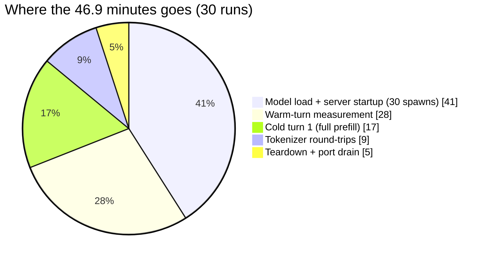
```mermaid
pie showData
    title Where the 46.9 minutes goes (30 runs)
    "Model load + server startup (30 spawns)" : 41
    "Warm-turn measurement" : 28
    "Cold turn 1 (full prefill)" : 17
    "Tokenizer round-trips" : 9
    "Teardown + port drain" : 5
```

Half the wall-clock is paid to the "fresh server per repeat" rule. That is the
price of independent samples; see [Methodology](#methodology).

---

## Why This Happens — The Mechanism

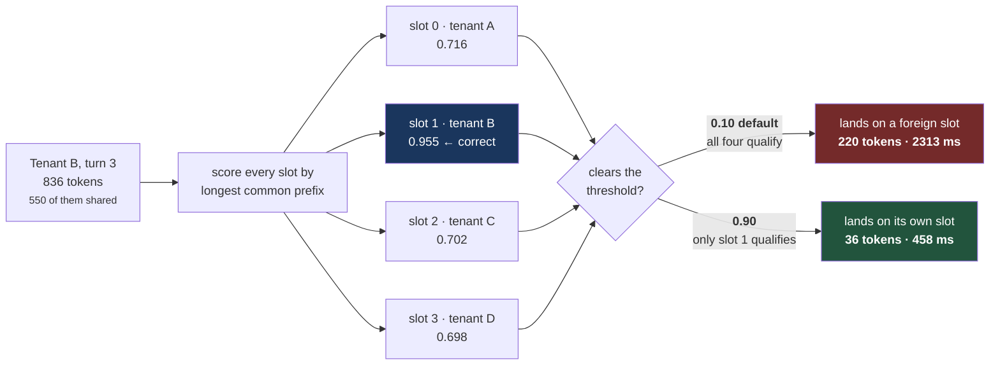
```mermaid
flowchart LR
    req["Tenant B, turn 3<br/>836 tokens<br/><small>550 of them shared</small>"] --> score["score every slot by<br/>longest common prefix"]
    score --> s0["slot 0 · tenant A<br/>0.716"]
    score --> s1["slot 1 · tenant B<br/>0.955 ← correct"]
    score --> s2["slot 2 · tenant C<br/>0.702"]
    score --> s3["slot 3 · tenant D<br/>0.698"]
    s0 --> gate{"clears the<br/>threshold?"}
    s1 --> gate
    s2 --> gate
    s3 --> gate
    gate -->|"<b>0.10 default</b><br/>all four qualify"| bad["lands on a foreign slot<br/><b>220 tokens · 2313 ms</b>"]
    gate -->|"<b>0.90</b><br/>only slot 1 qualifies"| good["lands on its own slot<br/><b>36 tokens · 458 ms</b>"]

    style s1 fill:#1a365d,color:#fff
    style bad fill:#742a2a,color:#fff
    style good fill:#22543d,color:#fff
```

The server states the decision itself, which is why this is **evidence** rather
than inference:

```
slot get_availabl: id  0 | task 12 | selected slot by LCP similarity, f_sim_best = 0.716 (> 0.100 thold)
slot print_timing: id  0 | task 12 | prompt eval time = 1893.44 ms / 220 tokens
```

### The Corollary

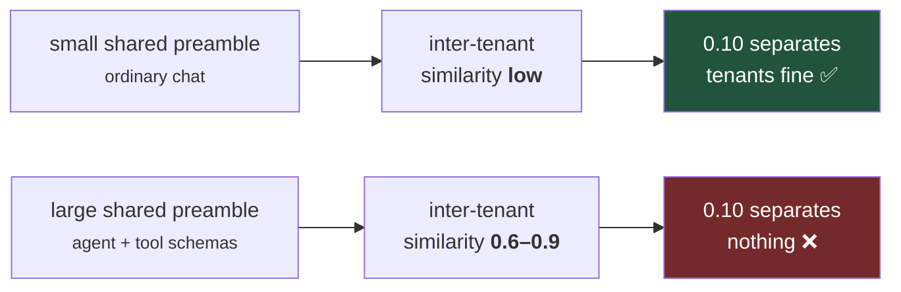
```mermaid
flowchart LR
    a["small shared preamble<br/><small>ordinary chat</small>"] --> b["inter-tenant<br/>similarity <b>low</b>"] --> c["0.10 separates<br/>tenants fine ✅"]
    d["large shared preamble<br/><small>agent + tool schemas</small>"] --> e["inter-tenant<br/>similarity <b>0.6–0.9</b>"] --> f["0.10 separates<br/>nothing ❌"]

    style c fill:#22543d,color:#fff
    style f fill:#742a2a,color:#fff
```

> **The larger your system prompt and tool schema, the worse the default
> behaves.** More shared context means higher inter-tenant similarity, which
> means the threshold separates tenants *less* well, not more.

### Why It Is Self-Sustaining

When tenant B displaces tenant A, it does not merely cost B a re-prefill — it
**destroys A's cache**, so A pays full prefill on its next turn too. The
regression does not decay toward a steady state; it *is* the steady state.

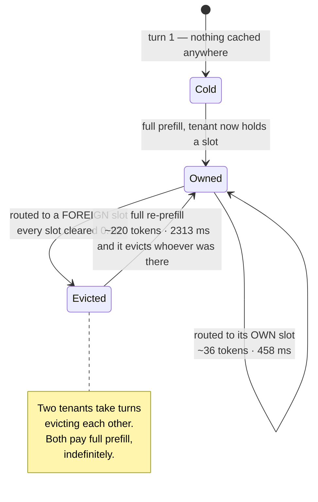
```mermaid
stateDiagram-v2
    [*] --> Cold: turn 1 — nothing cached anywhere
    Cold --> Owned: full prefill, tenant now holds a slot

    Owned --> Owned: routed to its OWN slot<br/>~36 tokens · 458 ms
    Owned --> Evicted: routed to a FOREIGN slot<br/>every slot cleared 0.10

    Evicted --> Owned: full re-prefill<br/>~220 tokens · 2313 ms<br/>and it evicts whoever was there

    note right of Evicted
        Two tenants take turns
        evicting each other.
        Both pay full prefill,
        indefinitely.
    end note
```

---

## Prior Art and Positioning

Cache-aware request routing is **not novel**. Stating that plainly is more
useful than pretending otherwise.

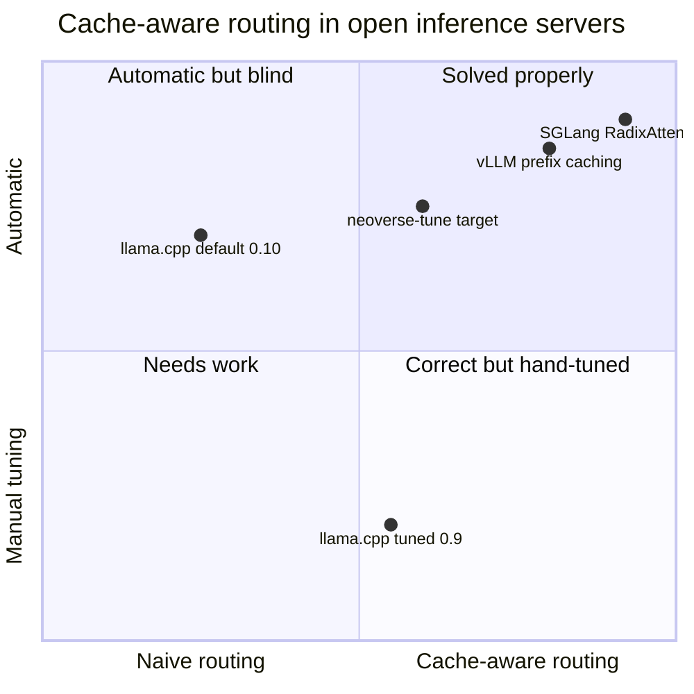
```mermaid
quadrantChart
    title Cache-aware routing in open inference servers
    x-axis Naive routing --> Cache-aware routing
    y-axis Manual tuning --> Automatic
    quadrant-1 Solved properly
    quadrant-2 Automatic but blind
    quadrant-3 Needs work
    quadrant-4 Correct but hand-tuned
    SGLang RadixAttention: [0.92, 0.9]
    vLLM prefix caching: [0.8, 0.85]
    llama.cpp default 0.10: [0.25, 0.7]
    llama.cpp tuned 0.9: [0.55, 0.2]
    neoverse-tune target: [0.6, 0.75]
```

| Prior art | What it does | Relation to this project |
|:--|:--|:--|
| **SGLang RadixAttention** (Zheng et al., 2024) | Prefix-tree KV cache with cache-aware scheduling; routes requests to the worker already holding their prefix | Solves this class of problem with an algorithm. Strictly more advanced. |
| **SGLang `sgl-router`** | Cache-aware load balancing across replicas | Production form of the same insight |
| **vLLM automatic prefix caching** | Hash-based block reuse; no similarity heuristic at all | Architecturally immune to this specific failure |
| **`--slot-prompt-similarity`** | The flag exists, is documented, was added deliberately | This project did not discover a mechanism — it quantified that a *default* is mistuned for a workload class |

**Honest positioning:** llama.cpp uses a scalar LCP heuristic where SGLang and
vLLM use prefix trees and block hashing. This project measures the cost of that
gap in llama.cpp and closes it with configuration. It does not advance the state
of the art in routing algorithms.

---

## Quick Start

Requires `llama-server`, a GGUF model, and Python 3.8+. **Nothing to install** —
standard library only.

```bash
git clone https://github.com/Unknown1502/neoverse-tune.git
cd neoverse-tune

# 1. Is there an opportunity at all? (~2 min)
python3 tools/probe_prefill.py --url http://127.0.0.1:8080

# 2. The full matrix — 6 configs x 5 repeats, fresh server each (~47 min)
python3 tools/run_matrix.py --server <llama-server> --model <model.gguf> --repeats 5

# 3. Adjudicated table with confidence intervals
python3 tools/analyze_agent.py

# 4. Mechanism: tokens actually recomputed, from the server's own log
python3 tools/parse_slot_log.py

# 5. The right threshold for YOUR agent (authoritative, slow)
python3 tools/tune_similarity.py --sweep --server <llama-server> --model <model.gguf>
```

Or **fork the repo and run the `bench` workflow** — it executes on
`ubuntu-24.04-arm`, free on public repositories.

### The Judge's / Reviewer's Path

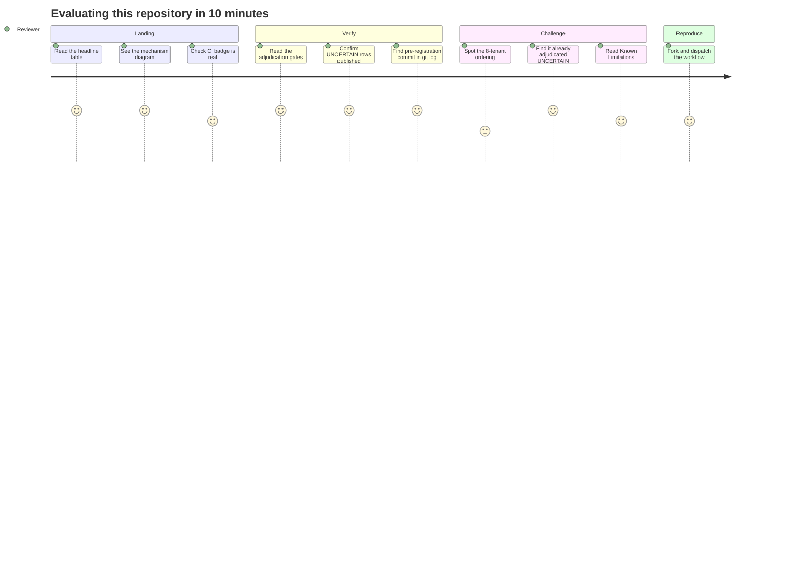
```mermaid
journey
    title Evaluating this repository in 10 minutes
    section Landing
      Read the headline table: 5: Reviewer
      See the mechanism diagram: 5: Reviewer
      Check CI badge is real: 4: Reviewer
    section Verify
      Read the adjudication gates: 5: Reviewer
      Confirm UNCERTAIN rows published: 5: Reviewer
      Find pre-registration commit in git log: 5: Reviewer
    section Challenge
      Spot the 8-tenant ordering: 3: Reviewer
      Find it already adjudicated UNCERTAIN: 5: Reviewer
      Read Known Limitations: 4: Reviewer
    section Reproduce
      Fork and dispatch the workflow: 4: Reviewer
```

The dip in **Challenge** is the honest part. A careful reviewer notices that
8 tenants appears faster than 4 at the default and reaches for it as a hole in
the mechanism story. What they find is that the project's own adjudicator
already returned UNCERTAIN on that pair, with overlapping intervals and
identical mechanism evidence
([why](#the-apparent-anomaly-and-why-it-is-not-one)).

A repository that answers its sharpest objection before it is raised is making a
different claim than one that simply reports its wins.

### Documentation

This README is the overview. The depth is in `docs/`.

| Document | Answers |
|:--|:--|
| **[docs/reproducing.md](docs/reproducing.md)** | **Run it and check the numbers.** Four routes from one-click to five-minute, the values you should see, how to tell a real difference from a broken run, troubleshooting, and how to prove this wrong |
| **[docs/results.md](docs/results.md)** | **Every number, with its machine.** Both hosts, all six configs, all comparisons on both, mechanism evidence, the cost model, the threshold sweep, and the three hypotheses that died |
| [docs/flows.md](docs/flows.md) | Every flow, diagrammed — 13 diagrams. **Start with §1**: how a slot gets chosen wrong |
| [docs/architecture.md](docs/architecture.md) | System context, module map, internals, data model, deployment — 8 diagrams |
| [docs/methodology.md](docs/methodology.md) | What is tested, how, and what would falsify it — including the falsification that was attempted and failed |

---

## Installation

### Prerequisites

| Requirement | Version | Why | Check |
|:--|:--|:--|:--|
| Python | ≥ 3.8 | `from __future__ import annotations` + walrus-free stdlib usage | `python3 --version` |
| `llama-server` | any recent build | The system under test | `llama-server --version` |
| GGUF model | any instruct model | Load target | — |
| Bash | ≥ 4.0 | Build/env scripts use arrays | `bash --version` |
| CMake + C toolchain | ≥ 3.14 | Only if building llama.cpp from source | `cmake --version` |

**No `requirements.txt`, `pyproject.toml`, or lockfile exists — by design.** The
tools import only `argparse`, `glob`, `json`, `math`, `os`, `re`, `shlex`,
`signal`, `statistics`, `subprocess`, `sys`, `time`, `typing`, `urllib`, and
`ctypes`. See [Design Patterns](#design-patterns) for the trade-off.

### Path A — Bring your own binary and model

```bash
git clone https://github.com/Unknown1502/neoverse-tune.git
cd neoverse-tune
python3 tools/run_matrix.py --server /path/to/llama-server --model /path/to/model.gguf
```

### Path B — Build from source (Linux/Arm)

```bash
bash scripts/00_env_report.sh     # which Arm core is this? (aarch64 only)
bash scripts/01_build_llama.sh    # clone + build llama-server, record SHA
bash scripts/fetch_model.sh       # download the benchmark model

SERVER="$(python3 -c "import json;print(json.load(open('results/build.latest.json'))['server'])")"
MODEL="$(cat results/model.path)"
python3 tools/run_matrix.py --server "$SERVER" --model "$MODEL"
```

> ⚠️ `scripts/00_env_report.sh` calls `require_aarch64` and **exits non-zero on
> x86**. This is intentional for CI but means Path B is Linux/Arm only. On x86,
> use Path A; `analyze_agent.py` then reports the host as
> `x86 laptop (no env report)`.

---

## Local Development

```bash
# Run every test suite (fast, no server required)
python3 tools/test_skeptic.py
python3 tools/test_probe_prefill.py
python3 tools/test_agent_tools.py

# Single measurement against an already-running server
python3 tools/bench_agent.py --url http://127.0.0.1:8081 --agents 4 --out /tmp/run.json

# Fast analytic threshold estimate (heuristic — see the warning it prints)
python3 tools/tune_similarity.py --url http://127.0.0.1:8081

# Re-adjudicate without re-measuring
python3 tools/analyze_agent.py --input results/matrix.json

# Subset of the matrix for a quick check
python3 tools/run_matrix.py --server ... --model ... --only solo_baseline,4tenant_default --repeats 2
```

> **The minimum useful feedback loop is ~47 minutes.** There is no smoke mode.
> `--only` with `--repeats 2` is the closest approximation, but note that
> `--repeats 2` guarantees every verdict returns UNCERTAIN, because `MIN_REPS`
> is 5.

---

## Configuration Reference

### Environment Variables

All read in `scripts/lib.sh` and the Python tools. The `SPECARM_` prefix is a
legacy of the project's earlier name; see
[Known Limitations](#known-limitations-and-open-defects).

| Variable | Default | Consumed by | Purpose |
|:--|:--|:--|:--|
| `SPECARM_RESULTS` | `<root>/results` | `lib.sh`, all Python tools | Where artifacts are written |
| `SPECARM_VENDOR` | `<root>/vendor` | `lib.sh`, `01_build_llama.sh` | llama.cpp checkout location |
| `SPECARM_MODELS` | `<root>/models` | `lib.sh`, `fetch_model.sh` | Model download directory |
| `SPECARM_LLAMA_REPO` | `https://github.com/ggml-org/llama.cpp.git` | `lib.sh` | Upstream remote |
| `SPECARM_LLAMA_REF` | `master` | `lib.sh` | Ref to check out (resolved SHA is recorded) |
| `SPECARM_MODEL_URL` | pinned Qwen2.5-1.5B-Instruct Q4_K_M | `fetch_model.sh` | Override the benchmark model. Overriding **disables** the pinned hash check unless you also set `SPECARM_MODEL_SHA256` — a digest only applies to the artifact it was computed from. |
| `SPECARM_MODEL_SHA256` | the pinned digest | `fetch_model.sh` | Expected SHA-256. Required to verify a custom model; a mismatch deletes the file and exits non-zero. |

**No secrets, tokens, or credentials are read anywhere in this project.** There
is no `.env`, no secret manager integration, and the CI workflow declares
`permissions: contents: read`.

### CLI Defaults That Affect Results

| Flag | Tool | Default | Why this value |
|:--|:--|--:|:--|
| `--repeats` | `run_matrix` | **5** | Matches `MIN_REPS`. At 3, every verdict is UNCERTAIN by construction. |
| `--turns` | `run_matrix` | 4 | Turn 1 is cold for all tenants; 4 leaves 3 warm rounds per tenant |
| `--ctx` | `run_matrix` | 32768 | Large enough that context size is not the binding constraint |
| `--threads` | `run_matrix` | `os.cpu_count()` | — |
| `--port` | `run_matrix` | 8099 | Avoids 8080 (commonly held by local web servers) |
| `--max-tokens` | `bench_agent` | 48 | Enough to measure TTFT; short enough that decode does not dominate |
| `--timeout` | `bench_agent` | 600.0 s | Cold prefill on a slow core can be very slow |
| `wait_healthy` | `run_matrix` | 240 s | Model load on a 4-vCPU runner is slow |
| `--thresholds` | `tune_similarity` | `0.1,0.3,0.5,0.7,0.8,0.9,0.95` | Brackets the default and the empirical winner |

### Pre-Registered Adjudication Thresholds

Defined in `tools/skeptic.py`. **Changing these after seeing results would make
them decoration rather than thresholds.**

| Parameter | Value | Rationale |
|:--|--:|:--|
| `MIN_EFFECT_PCT` | 5.0% | Below this, a difference is not worth a developer's time |
| `MIN_REPS` | 5 | Fewer samples cannot support an interval worth quoting |
| `MAX_RSD_PCT` | 10.0% | Above this the host was too noisy to conclude anything |
| Confidence | 95%, two-sided | Small-sample `t`, not a normal approximation |

---

## Command Reference

| Command | Purpose | Runtime | Writes |
|:--|:--|--:|:--|
| `probe_prefill.py` | Opportunity sizer. Is prefix reuse already working? | ~2 min | `prefill_*.json` |
| `run_matrix.py` | The 6×5 config matrix, fresh server per repeat | ~47 min | `matrix.json`, `server_*.log` |
| `bench_agent.py` | One run against a running server | ~1 min | optional JSON |
| `analyze_agent.py` | Aggregate → CIs → adjudicated comparisons | <1 s | `agent_report.md`, `agent_analysis.latest.json` |
| `parse_slot_log.py` | Mechanism evidence from server logs | <1 s | `slot_evidence.json` |
| `tune_similarity.py` | Threshold recommendation (`--sweep` = measured) | ~35 min sweep | `tune.latest.json` |
| `skeptic.py` | Library — the adjudicator. Not directly invoked. | — | — |
| `00_env_report.sh` | Neoverse core + ISA feature detection (aarch64 only) | <1 s | `env.latest.json` |
| `01_build_llama.sh` | Clone + build `llama-server`, record resolved SHA | ~5–15 min | `build.latest.json` |
| `fetch_model.sh` | Download benchmark model | varies | `model.path` |

### Exit Codes

| Tool | Code | Meaning |
|:--|--:|:--|
| `probe_prefill.py` | 0 | `NO_REUSE` or `PARTIAL_REUSE` — an opportunity exists |
| | 1 | `REUSE_WORKS` or `INCONCLUSIVE` — do not build a prefix cache |
| | 2 | Request failed |
| `run_matrix.py` | 2 | Server binary or model not found |
| `analyze_agent.py` | 1 | No `matrix.json` — run `run_matrix.py` first |
| `00_env_report.sh` | 3 | `--require <feature>` was set and the core does not advertise it |
| `fetch_model.sh` | 1 | SHA-256 mismatch — the artifact was deleted rather than benchmarked |

> ⚠️ `probe_prefill.py` returning **1 on `REUSE_WORKS`** is an inverted
> convention — the probe succeeded, but its answer is "stop." Do not wire it
> into CI expecting 0 to mean healthy.

---

## Features

### Core Measurement

- **Exact token counts** from the server's own tokenizer via `/apply-template` → `/tokenize`, with the resolution path recorded in every result as `token_count_method`
- **Fresh server per repeat** — the only way repeat *n* is an independent sample
- **Warm/cold separation** — round 1 is cold for every tenant by definition and is never averaged into warm numbers
- **Per-request raw retention** — `seq`, `round`, `agent`, `prompt_tokens`, `ttft_ms`, `total_ms`, `out_tokens` kept for every request so downstream analysis is possible without re-measuring
- **Round-robin tenant interleaving** — all tenants advance one turn before any advances two, which is what triggers the bug; draining one tenant at a time never reproduces it
- **Distinct per-tenant content** — 8 hand-written itineraries with their own cities, airports, dates, and passenger counts

### Statistical Adjudication

- **Pre-registered thresholds** committed before any measurement existed
- **Small-sample `t` critical values** — at n=5 the normal approximation understates the interval by ~30%
- **Disjoint-CI requirement** for VERIFIED
- **Four distinct UNCERTAIN paths** vs one REJECTED path, so a failed measurement cannot masquerade as a negative result
- **Directional expectations declared in advance** (`regression_expected`, `improvement_expected`, `parity_expected`)
- **UNCERTAIN and REJECTED rows published** in the same table as VERIFIED ones

### Mechanism Evidence

- **Two independent evidence classes** — tokens-recomputed (cause, from the server's log) and TTFT (consequence, wall-clock)
- **LCP similarity distribution** — min/median/max of the similarity that justified each slot choice
- **Cache reuse fraction** — what proportion of each conversation avoided prefill
- **LRU fallback counting** — selections where *no* slot matched
- **Slot churn** — distinct slots used per run
- **Heavy-prefill share** — percentage of requests recomputing >100 tokens on a warm conversation

### Arm-Specific

- **Neoverse core identification** from MIDR — implementer `0x41` plus part `0xd0c`/`0xd40`/`0xd49`/`0xd4f` → N1/V1/N2/V2, with unrecognized parts reported raw rather than guessed
- **ISA feature detection** — `asimd`, `asimddp`, `i8mm`, `bf16`, `sve`, `sve2`, `sme`, `sme2`, `fphp`, `asimdhp`, word-boundary matched so `i8mm` does not match `svei8mm`
- **SVE vector length** via `prctl(PR_SVE_GET_VL)` — on N2 this is 128 bits, the same width as NEON, so any SVE2 win must come from predication rather than width
- **Virtualization detection** — burstable instances (AWS `t4g`) throttle mid-benchmark and silently corrupt results, so the shape is flagged
- **`perf` availability check** against `perf_event_paranoid`

### Developer Experience

- **Zero dependencies** — no install step can fail
- **Cross-platform process control** — `CREATE_NEW_PROCESS_GROUP` + `CTRL_BREAK_EVENT` on Windows, `start_new_session` + `SIGTERM` on POSIX
- **UTF-8 console reconfiguration** on every entry point, so `Δ` and box-drawing characters do not crash a cp1252 Windows terminal
- **Every artifact carries a `schema` string** so format changes are detectable rather than silently mis-parsed
- **21 Mermaid diagrams** across [docs/](docs/), rendered natively by GitHub — no binary image assets in the repository

### Automation

- **Two-stage CI** — adjudicator self-test on cheap x86 gates the expensive Arm measurement
- **`workflow_dispatch` inputs** for `repeats` and `turns`
- **Path-filtered triggers** — `tools/**`, `scripts/**`, and the workflow file itself
- **Job summary publication** — the adjudicated report renders in the Actions UI
- **`if: always()` artifact upload** — a failed run still uploads its logs, because a failure with no artifact is unrepairable

---

## Tech Stack

Stated as it is, not as an enterprise template would prefer it.

| Layer | Technology | Notes |
|:--|:--|:--|
| **Language** | Python 3.8+ (1,832 LOC), Bash (465 LOC) | 2,297 LOC total |
| **Runtime dependencies** | **None** | Standard library only |
| **HTTP client** | `urllib.request` | Streaming SSE parsed manually |
| **Statistics** | `statistics` + hand-rolled `t` table | No numpy/scipy |
| **Process control** | `subprocess`, `signal` | Platform-branched |
| **System under test** | `llama.cpp` / `llama-server` | Unmodified upstream |
| **Model** | Qwen2.5-1.5B-Instruct **Q4_K_M** (Apache-2.0) | Pinned by SHA-256 — byte-identical locally and in CI |
| **Build** | CMake ≥ 3.14, C/C++ toolchain | Only for building llama.cpp |
| **CI/CD** | GitHub Actions | `ubuntu-latest` + `ubuntu-24.04-arm` |
| **Arm hardware** | Cobalt 100 (Neoverse N2), 4 vCPU | Free on public repos |
| **Contrast hardware** | AWS `t4g.small` (Graviton2 / N1) | Free trial through 2026-12-31 |
| **Docs** | Markdown + Mermaid | Renders natively on GitHub |
| **Testing** | 3 hand-rolled suites | No pytest — see defect D6 |
| **License** | Apache-2.0 | |

### Deliberately Absent

No frontend framework, database, ORM, cache server, message broker, container
runtime, orchestrator, IaC tool, auth provider, or observability stack. See
[What This Project Is Not](#what-this-project-is-not) for why each is absent
rather than missing.

---

## High-Level Architecture

The harness owns no inference code. It spawns an unmodified upstream
`llama-server`, drives it over HTTP, and reads its log. That boundary is
load-bearing: a finding about upstream behaviour is worthless if the measurement
tool patched the thing it measures.

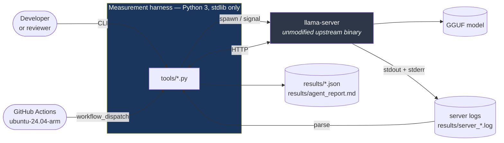
```mermaid
flowchart LR
    dev(["Developer<br/>or reviewer"])
    ci(["GitHub Actions<br/>ubuntu-24.04-arm"])

    subgraph harness["Measurement harness — Python 3, stdlib only"]
        tools["tools/*.py"]
    end

    srv["llama-server<br/><i>unmodified upstream binary</i>"]
    gguf[("GGUF model")]
    logs[("server logs<br/>results/server_*.log")]
    art[("results/*.json<br/>results/agent_report.md")]

    dev -->|"CLI"| tools
    ci -->|"workflow_dispatch"| tools
    tools -->|"spawn / signal"| srv
    tools <-->|"HTTP"| srv
    srv --> gguf
    srv -->|"stdout + stderr"| logs
    logs -->|"parse"| tools
    tools --> art

    style srv fill:#2d3748,color:#fff
    style harness fill:#1a365d,color:#fff
```

### Architectural Principles

| Principle | Implementation | Consequence if violated |
|:--|:--|:--|
| **Never patch the subject** | Upstream binary, spawned as a child process | The finding would describe a fork, not llama.cpp |
| **The adjudicator is a leaf** | `skeptic.py` imports nothing from this project | A judge that knows what it is judging can be argued into a verdict |
| **Cause and consequence are separate artifacts** | `slot_evidence.json` vs `agent_report.md` | Machine noise would contaminate the causal claim |
| **Every stage is resumable** | Each writes a file the next reads | A 47-minute run would have to be repeated for any analysis change |
| **Failure is not a data point** | Unhealthy server contributes no sample | A zero would drag the mean toward a conclusion |

---

## Low-Level Architecture

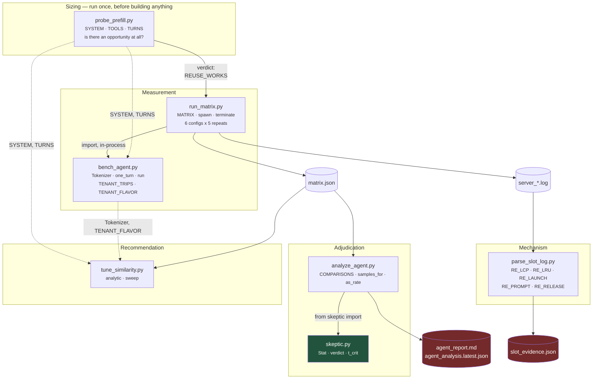
```mermaid
flowchart TB
    subgraph probe["Sizing — run once, before building anything"]
        pp["probe_prefill.py<br/><small>SYSTEM · TOOLS · TURNS<br/>is there an opportunity at all?</small>"]
    end

    subgraph measure["Measurement"]
        rm["run_matrix.py<br/><small>MATRIX · spawn · terminate<br/>6 configs x 5 repeats</small>"]
        ba["bench_agent.py<br/><small>Tokenizer · one_turn · run<br/>TENANT_TRIPS · TENANT_FLAVOR</small>"]
        rm -->|"import, in-process"| ba
    end

    subgraph adjudicate["Adjudication"]
        aa["analyze_agent.py<br/><small>COMPARISONS · samples_for · as_rate</small>"]
        sk["skeptic.py<br/><small>Stat · verdict · t_crit</small>"]
        aa -->|"from skeptic import"| sk
    end

    subgraph mech["Mechanism"]
        ps["parse_slot_log.py<br/><small>RE_LCP · RE_LRU · RE_LAUNCH<br/>RE_PROMPT · RE_RELEASE</small>"]
    end

    subgraph tune["Recommendation"]
        ts["tune_similarity.py<br/><small>analytic · sweep</small>"]
    end

    mx[("matrix.json")]
    lg[("server_*.log")]
    rep[("agent_report.md<br/>agent_analysis.latest.json")]
    ev[("slot_evidence.json")]

    pp -->|"verdict:<br/>REUSE_WORKS"| rm
    pp -.->|"SYSTEM, TURNS"| ba
    pp -.->|"SYSTEM, TURNS"| ts
    ba -.->|"Tokenizer, TENANT_FLAVOR"| ts
    rm --> mx
    rm --> lg
    mx --> aa
    aa --> rep
    lg --> ps
    ps --> ev
    mx --> ts

    style sk fill:#22543d,color:#fff
    style rep fill:#742a2a,color:#fff
    style ev fill:#742a2a,color:#fff
```

Dotted edges are **import-time** dependencies; solid edges are data flow. Note
that `probe_prefill.py` — nominally the throwaway sizing tool — is the module
that owns `SYSTEM`, `TOOLS`, and `TURNS`, so it is a permanent dependency of both
`bench_agent` and `tune_similarity`. That is a naming/layering wart, recorded as
defect D5.

### Module Responsibilities

| Module | LOC | Owns | Depends on |
|:--|--:|:--|:--|
| `skeptic.py` | 99 | `MIN_EFFECT_PCT`, `MIN_REPS`, `MAX_RSD_PCT`, `_T95`, `t_crit`, `Stat`, `verdict` | *nothing* |
| `probe_prefill.py` | 292 | `TOOLS`, `SYSTEM`, `TURNS`, `one_turn`, `approx_tokens` | stdlib |
| `bench_agent.py` | 267 | `TENANT_FLAVOR`, `TENANT_TRIPS`, `tenant_turn`, `Tokenizer`, `one_turn`, `wait_healthy`, `run` | `probe_prefill` |
| `run_matrix.py` | 179 | `MATRIX`, `spawn`, `terminate` | `bench_agent` |
| `analyze_agent.py` | 230 | `COMPARISONS`, `samples_for`, `as_rate` | `skeptic` |
| `parse_slot_log.py` | 201 | 5 log regexes, `parse` | stdlib |
| `tune_similarity.py` | 269 | `DEFAULT_SWEEP`, `build_curve`, `analytic`, `sweep` | `bench_agent`, `probe_prefill`, `run_matrix` |

---

## Component and Package Structure

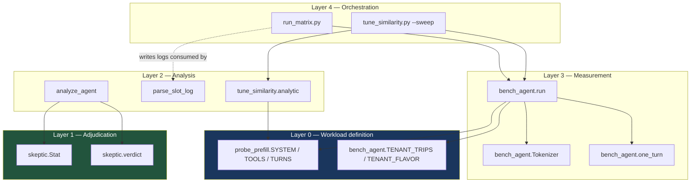
```mermaid
flowchart TB
    subgraph L4["Layer 4 — Orchestration"]
        direction LR
        A1["run_matrix.py"]
        A2["tune_similarity.py --sweep"]
    end
    subgraph L3["Layer 3 — Measurement"]
        direction LR
        B1["bench_agent.run"]
        B2["bench_agent.Tokenizer"]
        B3["bench_agent.one_turn"]
    end
    subgraph L2["Layer 2 — Analysis"]
        direction LR
        C1["analyze_agent"]
        C2["parse_slot_log"]
        C3["tune_similarity.analytic"]
    end
    subgraph L1["Layer 1 — Adjudication"]
        D1["skeptic.Stat"]
        D2["skeptic.verdict"]
    end
    subgraph L0["Layer 0 — Workload definition"]
        E1["probe_prefill.SYSTEM / TOOLS / TURNS"]
        E2["bench_agent.TENANT_TRIPS / TENANT_FLAVOR"]
    end

    A1 --> B1
    A2 --> B1
    B1 --> B2
    B1 --> B3
    B1 --> E1
    B1 --> E2
    C1 --> D1
    C1 --> D2
    A2 --> C3
    C3 --> E1
    A1 -.->|"writes logs consumed by"| C2

    style L1 fill:#22543d,color:#fff
    style L0 fill:#1a365d,color:#fff
```

**Dependencies point downward only, with one exception:** Layer 3 depends on
Layer 0 for workload constants, which is correct, but Layer 4's
`tune_similarity` reaches into Layer 3 *and* Layer 2 *and* Layer 0. That module
is the least clean thing in the repository.

---

## Class Model

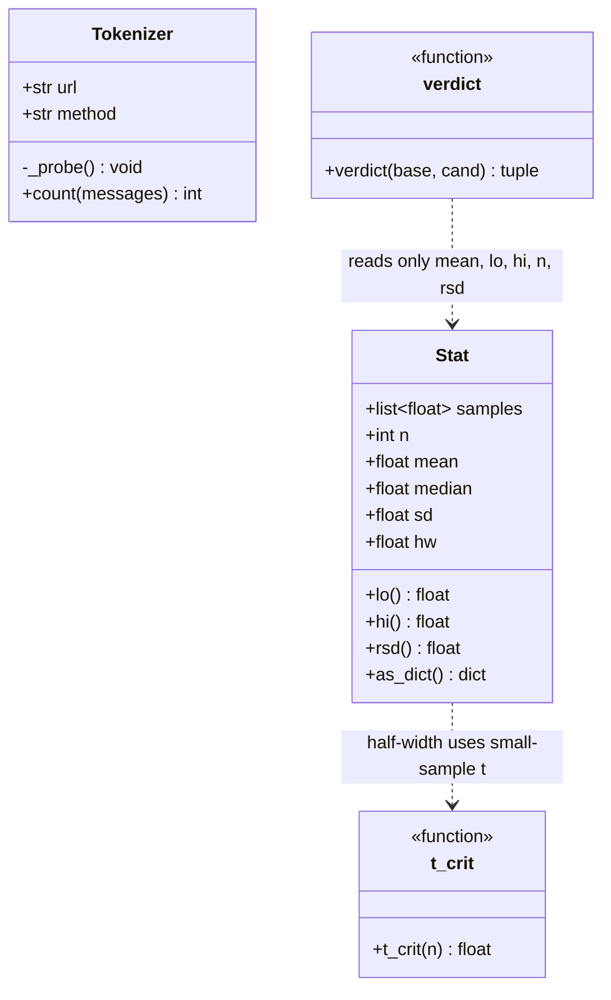
```mermaid
classDiagram
    class Stat {
        +list~float~ samples
        +int n
        +float mean
        +float median
        +float sd
        +float hw
        +lo() float
        +hi() float
        +rsd() float
        +as_dict() dict
    }
    class Tokenizer {
        +str url
        +str method
        -_probe() void
        +count(messages) int
    }
    class verdict {
        <<function>>
        +verdict(base, cand) tuple
    }
    class t_crit {
        <<function>>
        +t_crit(n) float
    }
    Stat ..> t_crit : half-width uses small-sample t
    verdict ..> Stat : reads only mean, lo, hi, n, rsd
```

Two classes in the entire codebase. Everything else is a module-level function.
For a 2,297-line measurement tool that is the correct amount of object
orientation; see [Design Patterns](#design-patterns).

### `Stat` — the statistical contract

```python
self.samples = [s for s in samples if s and s > 0]     # zeros silently dropped
self.n       = len(self.samples)
self.mean    = fmean(samples)   if n else 0.0
self.sd      = stdev(samples)   if n > 1 else 0.0
self.hw      = t_crit(n) * sd / sqrt(n) if n > 1 else 0.0
```

`hw` uses a **small-sample `t` table**, not 1.96. `_T95` is sparse (df 1–12, 15,
20, 25, 30); `t_crit` resolves a missing df by selecting the **next larger**
tabulated key, which widens the interval. Erring toward wider intervals is the
conservative direction — it can only cost VERIFIED verdicts, never manufacture
them.

### `Tokenizer` — a recorded fallback chain

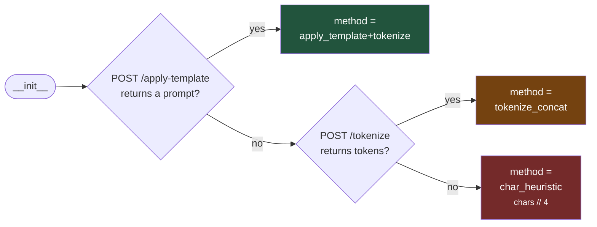
```mermaid
flowchart LR
    p(["__init__"]) --> t1{"POST /apply-template<br/>returns a prompt?"}
    t1 -->|"yes"| m1["method =<br/>apply_template+tokenize"]
    t1 -->|"no"| t2{"POST /tokenize<br/>returns tokens?"}
    t2 -->|"yes"| m2["method =<br/>tokenize_concat"]
    t2 -->|"no"| m3["method =<br/>char_heuristic<br/><small>chars // 4</small>"]

    style m1 fill:#22543d,color:#fff
    style m2 fill:#744210,color:#fff
    style m3 fill:#742a2a,color:#fff
```

`method` travels into every result as `token_count_method`. A count from
`char_heuristic` is a **different claim** from one produced by the server's own
tokenizer, and a report that does not say which it used is not reproducible.

---

## Data Flow — Levels 0, 1, 2

### Level 0 — Context

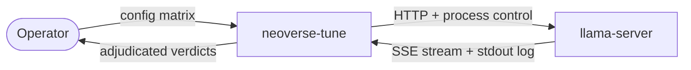
```mermaid
flowchart LR
    U(["Operator"]) -->|"config matrix"| S["neoverse-tune"]
    S -->|"HTTP + process control"| L["llama-server"]
    L -->|"SSE stream + stdout log"| S
    S -->|"adjudicated verdicts"| U
```

### Level 1 — Major processes

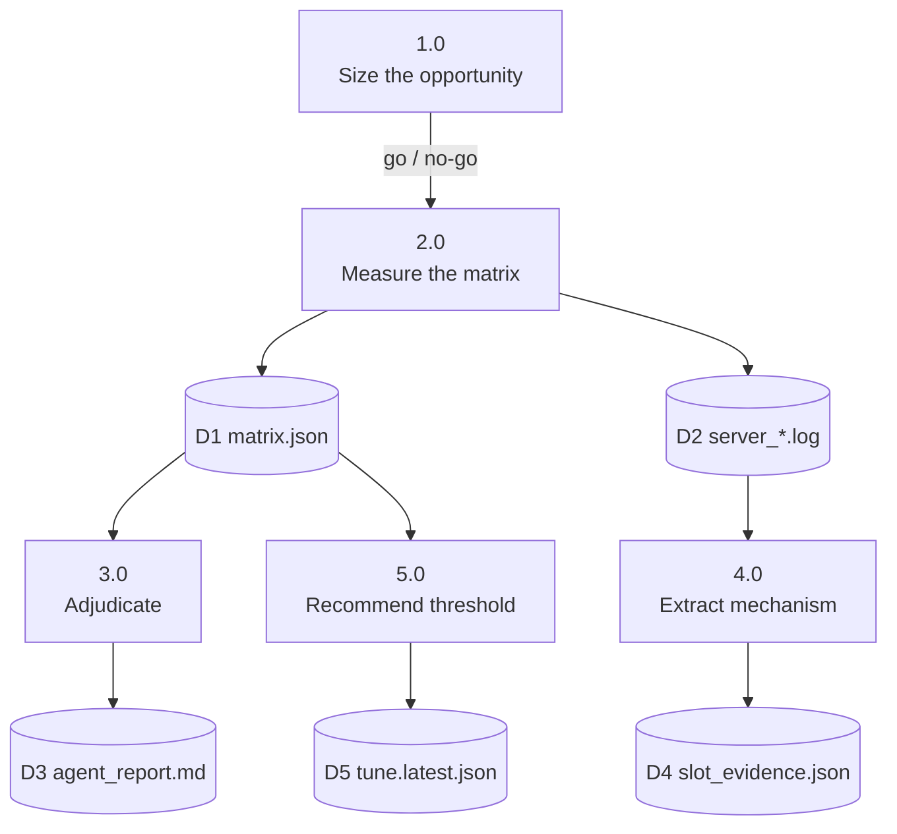
```mermaid
flowchart TB
    p1["1.0<br/>Size the opportunity"]
    p2["2.0<br/>Measure the matrix"]
    p3["3.0<br/>Adjudicate"]
    p4["4.0<br/>Extract mechanism"]
    p5["5.0<br/>Recommend threshold"]

    d1[("D1 matrix.json")]
    d2[("D2 server_*.log")]
    d3[("D3 agent_report.md")]
    d4[("D4 slot_evidence.json")]
    d5[("D5 tune.latest.json")]

    p1 -->|"go / no-go"| p2
    p2 --> d1
    p2 --> d2
    d1 --> p3 --> d3
    d2 --> p4 --> d4
    d1 --> p5 --> d5
```

### Level 2 — Inside "2.0 Measure the matrix"

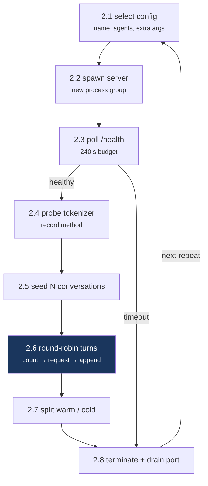
```mermaid
flowchart TB
    s2a["2.1 select config<br/><small>name, agents, extra args</small>"]
    s2b["2.2 spawn server<br/><small>new process group</small>"]
    s2c["2.3 poll /health<br/><small>240 s budget</small>"]
    s2d["2.4 probe tokenizer<br/><small>record method</small>"]
    s2e["2.5 seed N conversations"]
    s2f["2.6 round-robin turns<br/><small>count → request → append</small>"]
    s2g["2.7 split warm / cold"]
    s2h["2.8 terminate + drain port"]

    s2a --> s2b --> s2c
    s2c -->|"healthy"| s2d --> s2e --> s2f --> s2g --> s2h
    s2c -->|"timeout"| s2h
    s2h -->|"next repeat"| s2a

    style s2f fill:#1a365d,color:#fff
```

---

## Request Lifecycle

The nine stages of one measured request, and which component owns each.

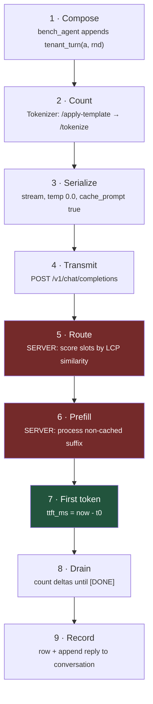
```mermaid
flowchart TB
    r1["1 · Compose<br/><small>bench_agent appends tenant_turn(a, rnd)</small>"]
    r2["2 · Count<br/><small>Tokenizer: /apply-template → /tokenize</small>"]
    r3["3 · Serialize<br/><small>stream, temp 0.0, cache_prompt true</small>"]
    r4["4 · Transmit<br/><small>POST /v1/chat/completions</small>"]
    r5["5 · Route<br/><small>SERVER: score slots by LCP similarity</small>"]
    r6["6 · Prefill<br/><small>SERVER: process non-cached suffix</small>"]
    r7["7 · First token<br/><small>ttft_ms = now - t0</small>"]
    r8["8 · Drain<br/><small>count deltas until [DONE]</small>"]
    r9["9 · Record<br/><small>row + append reply to conversation</small>"]

    r1 --> r2 --> r3 --> r4 --> r5 --> r6 --> r7 --> r8 --> r9

    style r5 fill:#742a2a,color:#fff
    style r6 fill:#742a2a,color:#fff
    style r7 fill:#22543d,color:#fff
```

**Stages 5 and 6 are the system under test.** Everything else exists to observe
them without perturbing them. Stage 2 is a separate HTTP round trip precisely so
it does not appear in stage 7's timing.

---

## Sequence Diagrams

### One measurement run

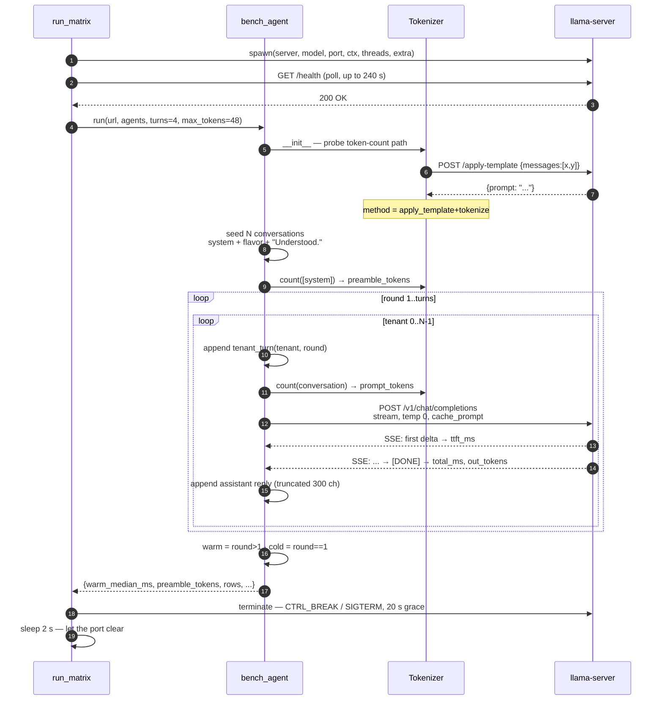
```mermaid
sequenceDiagram
    autonumber
    participant R as run_matrix
    participant B as bench_agent
    participant T as Tokenizer
    participant S as llama-server

    R->>S: spawn(server, model, port, ctx, threads, extra)
    R->>S: GET /health  (poll, up to 240 s)
    S-->>R: 200 OK

    R->>B: run(url, agents, turns=4, max_tokens=48)
    B->>T: __init__ — probe token-count path
    T->>S: POST /apply-template {messages:[x,y]}
    S-->>T: {prompt: "..."}
    Note over T: method = apply_template+tokenize

    B->>B: seed N conversations<br/>system + flavor + "Understood."
    B->>T: count([system]) → preamble_tokens

    loop round 1..turns
        loop tenant 0..N-1
            B->>B: append tenant_turn(tenant, round)
            B->>T: count(conversation) → prompt_tokens
            B->>S: POST /v1/chat/completions<br/>stream, temp 0, cache_prompt
            S-->>B: SSE: first delta → ttft_ms
            S-->>B: SSE: ... → [DONE] → total_ms, out_tokens
            B->>B: append assistant reply (truncated 300 ch)
        end
    end

    B->>B: warm = round>1 · cold = round==1
    B-->>R: {warm_median_ms, preamble_tokens, rows, ...}
    R->>S: terminate — CTRL_BREAK / SIGTERM, 20 s grace
    R->>R: sleep 2 s — let the port clear
```

### Adjudication

```mermaid
sequenceDiagram
    autonumber
    participant A as analyze_agent
    participant K as skeptic
    participant F as results/

    A->>F: read matrix.json
    A->>A: samples_for(cfg) = [warm_median_ms per repeat]
    Note over A: n = 5 repeats, NOT 96 requests

    loop each of 6 configs
        A->>K: Stat(samples_ms)
        K-->>A: mean, median, sd, hw, rsd
    end

    loop each of 6 pre-declared comparisons
        A->>A: as_rate(ms) = 1000/ms
        Note over A: verdict() is higher-is-better;<br/>TTFT is lower-is-better
        A->>K: verdict(base_rate, cand_rate)
        K-->>A: (VERIFIED | UNCERTAIN | REJECTED, reason)

        alt expectation == regression_expected
            Note over A: REJECTED is the FINDING.<br/>Relabel → "REGRESSION CONFIRMED"
        else improvement or parity
            Note over A: pass through unchanged
        end
    end

    A->>F: write agent_report.md
    A->>F: write agent_analysis.latest.json
```

The raw `verdict` is preserved in the JSON alongside the displayed label, so the
relabel is presentational and auditable — not a second, friendlier adjudicator.

### Threshold sweep

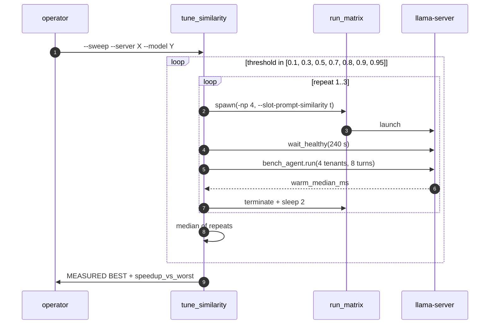
```mermaid
sequenceDiagram
    autonumber
    participant U as operator
    participant T as tune_similarity
    participant M as run_matrix
    participant S as llama-server

    U->>T: --sweep --server X --model Y
    loop threshold in [0.1, 0.3, 0.5, 0.7, 0.8, 0.9, 0.95]
        loop repeat 1..3
            T->>M: spawn(-np 4, --slot-prompt-similarity t)
            M->>S: launch
            T->>S: wait_healthy(240 s)
            T->>S: bench_agent.run(4 tenants, 8 turns)
            S-->>T: warm_median_ms
            T->>M: terminate + sleep 2
        end
        T->>T: median of repeats
    end
    T->>U: MEASURED BEST + speedup_vs_worst
```

---

## State Model

### Adjudication verdict states

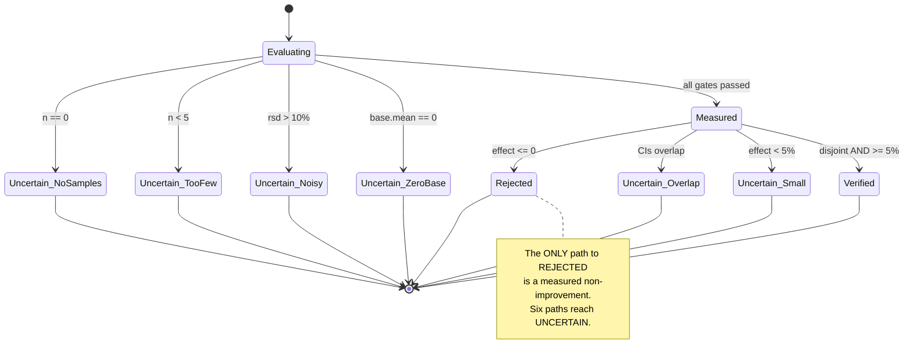
```mermaid
stateDiagram-v2
    [*] --> Evaluating
    Evaluating --> Uncertain_NoSamples: n == 0
    Evaluating --> Uncertain_TooFew: n < 5
    Evaluating --> Uncertain_Noisy: rsd > 10%
    Evaluating --> Uncertain_ZeroBase: base.mean == 0
    Evaluating --> Measured: all gates passed

    Measured --> Rejected: effect <= 0
    Measured --> Uncertain_Overlap: CIs overlap
    Measured --> Uncertain_Small: effect < 5%
    Measured --> Verified: disjoint AND >= 5%

    Verified --> [*]
    Rejected --> [*]
    Uncertain_NoSamples --> [*]
    Uncertain_TooFew --> [*]
    Uncertain_Noisy --> [*]
    Uncertain_ZeroBase --> [*]
    Uncertain_Overlap --> [*]
    Uncertain_Small --> [*]

    note right of Rejected
        The ONLY path to REJECTED
        is a measured non-improvement.
        Six paths reach UNCERTAIN.
    end note
```

---

## Data Model

There is no database. State is JSON files and log text, each carrying a `schema`
string so format changes are detectable rather than silently mis-parsed.

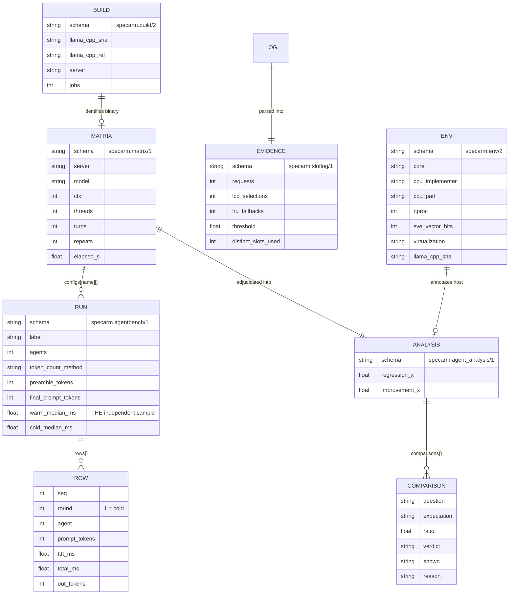
```mermaid
erDiagram
    MATRIX ||--o{ RUN : "configs[name][]"
    RUN ||--o{ ROW : "rows[]"
    MATRIX ||--|| ANALYSIS : "adjudicated into"
    ANALYSIS ||--o{ COMPARISON : "comparisons{}"
    LOG ||--|| EVIDENCE : "parsed into"
    ENV ||--o| ANALYSIS : "annotates host"
    BUILD ||--o| MATRIX : "identifies binary"

    MATRIX {
        string schema "specarm.matrix/1"
        string server
        string model
        int ctx
        int threads
        int turns
        int repeats
        float elapsed_s
    }
    RUN {
        string schema "specarm.agentbench/1"
        string label
        int agents
        string token_count_method
        int preamble_tokens
        int final_prompt_tokens
        float warm_median_ms "THE independent sample"
        float cold_median_ms
    }
    ROW {
        int seq
        int round "1 = cold"
        int agent
        int prompt_tokens
        float ttft_ms
        float total_ms
        int out_tokens
    }
    ANALYSIS {
        string schema "specarm.agent_analysis/1"
        float regression_x
        float improvement_x
    }
    COMPARISON {
        string question
        string expectation
        float ratio
        string verdict
        string shown
        string reason
    }
    EVIDENCE {
        string schema "specarm.slotlog/1"
        int requests
        int lcp_selections
        int lru_fallbacks
        float threshold
        int distinct_slots_used
    }
    ENV {
        string schema "specarm.env/2"
        string core
        string cpu_implementer
        string cpu_part
        int nproc
        int sve_vector_bits
        string virtualization
        string llama_cpp_sha
    }
    BUILD {
        string schema "specarm.build/2"
        string llama_cpp_sha
        string llama_cpp_ref
        string server
        int jobs
    }
```

### Schema Registry

| Schema | Producer | Purpose |
|:--|:--|:--|
| `specarm.matrix/1` | `run_matrix.py` | The full config matrix result |
| `specarm.agentbench/1` | `bench_agent.py` | One run |
| `specarm.agent_analysis/1` | `analyze_agent.py` | Adjudicated comparisons |
| `specarm.slotlog/1` | `parse_slot_log.py` | Mechanism evidence |
| `specarm.env/2` | `00_env_report.sh` | Host and ISA identity, incl. `int8_matmul_path` |
| `specarm.build/2` | `01_build_llama.sh` | Which binary produced the numbers |
| `specarm.model/1` | `fetch_model.sh` | Which **artifact** produced them — URL, SHA-256, verified flag |
| `specarm.prefill_probe/1` | `probe_prefill.py` | Opportunity sizing |
| `specarm.tune/2` | `tune_similarity.py` | Threshold recommendation |

### The One Field That Matters

`RUN.warm_median_ms` is **the** independent sample. `n` equals the repeat count —
never the request count. Requests inside one run share a server, a cache state,
and a schedule; pooling 96 requests instead of 5 medians would shrink the
intervals to nothing and manufacture significance.

### Indexing and Access Patterns

There are no indexes because there is no query engine. Access is:

| Pattern | Implementation | Cost |
|:--|:--|:--|
| All runs of one config | `data["configs"][name]` | O(1) |
| All logs for a config | `glob("server_<name>_r*.log")` | O(files) |
| Latest env / build / tune | `*.latest.json` convention | O(1) |
| Timestamped env history | `env_<host>_<stamp>.json` | append-only |

`*.latest.json` is a deliberate denormalization: the timestamped file is the
record of truth, the `.latest` copy is a stable path for scripts. `01_build_llama.sh`
and `00_env_report.sh` both write the pair.

---

## Consumed API Surface

This project **exposes no API**. It is a client of `llama-server`'s HTTP
interface. Four endpoints, all unauthenticated on `127.0.0.1`.

| Method | Path | Request | Response | Used for |
|:--|:--|:--|:--|:--|
| `GET` | `/health` | — | `200` when the model is loaded | Gate before measuring — a listening socket is not a loaded model |
| `POST` | `/apply-template` | `{messages: [...]}` | `{prompt: "..."}` | Apply the chat template so counts include role markers |
| `POST` | `/tokenize` | `{content: "..."}` | `{tokens: [...]}` | Exact token count from the tokenizer that will run |
| `POST` | `/v1/chat/completions` | `{messages, max_tokens, temperature, stream, cache_prompt}` | `text/event-stream` | The measurement |

### Request body, exactly as sent

```json
{
  "messages":     [{"role": "system", "content": "..."}, "..."],
  "max_tokens":   48,
  "temperature":  0.0,
  "stream":       true,
  "cache_prompt": true
}
```

| Field | Value | Why |
|:--|:--|:--|
| `stream` | `true` | Without it, first-token time is unobservable — only the last is visible |
| `temperature` | `0.0` | Deterministic output, so token sequences are identical across repeats and only wall-clock varies |
| `cache_prompt` | `true` | Caching must be *on*, or there is no cache to mis-route |
| `max_tokens` | `48` | Enough to measure TTFT, short enough that decode does not dominate |

### SSE parsing

Lines are split on `data:`; `[DONE]` terminates. Non-JSON payloads are skipped
silently. TTFT is stamped on the **first delta containing non-empty `content`** —
not on the first byte, and not on the first chunk, since role-only opening
deltas carry no content.

```python
if delta.get("content"):
    if first is None:
        first = time.perf_counter()
```

---

## Folder Structure

```
neoverse-tune/
├── .github/
│   └── workflows/
│       └── bench.yml              Two-stage CI: adjudicator gate → Arm bench
├── docs/
│   ├── README.md                  Documentation index
│   ├── architecture.md            8 diagrams: context, modules, internals, data, deploy
│   ├── flows.md                   13 diagrams: mechanism, sequences, CI, hypothesis deaths
│   └── methodology.md             Pre-registration, design, falsification criteria
├── results/                       35 committed artifacts — the evidence
│   ├── matrix.json                30 runs, all raw rows retained
│   ├── agent_report.md            Adjudicated table (generated)
│   ├── agent_analysis.latest.json Machine-readable verdicts
│   ├── slot_evidence.json         Mechanism: similarity + tokens recomputed
│   ├── prefill_default.json       The probe that killed hypothesis 2
│   └── server_<config>_r<n>.log   30 raw server logs — the primary evidence
├── scripts/
│   ├── lib.sh                     Shared helpers, env var resolution, json_escape
│   ├── 00_env_report.sh           Neoverse core + ISA detection (aarch64 only)
│   ├── 01_build_llama.sh          Clone + build llama-server, record resolved SHA
│   └── fetch_model.sh             Download benchmark model
├── tools/
│   ├── skeptic.py                 THE ADJUDICATOR — leaf module, zero project deps
│   ├── probe_prefill.py           Opportunity sizer; owns SYSTEM/TOOLS/TURNS
│   ├── bench_agent.py             One run; Tokenizer, TENANT_TRIPS, warm/cold split
│   ├── run_matrix.py              6x5 matrix; server lifecycle, cross-platform
│   ├── analyze_agent.py           Aggregate → CIs → 6 pre-declared comparisons
│   ├── parse_slot_log.py          Mechanism evidence from server log text
│   ├── tune_similarity.py         Threshold finder: --sweep measured, default heuristic
│   ├── test_skeptic.py            Adjudicator vs known answers
│   ├── test_probe_prefill.py      Verdict logic vs synthetic curves
│   └── test_agent_tools.py        Tuner math + tenant content divergence
├── .gitattributes                 LF enforcement — CRLF broke a Linux run once
├── .gitignore                     Excludes /vendor /models *.gguf /llama *.dll *.exe
├── LICENSE                        Apache-2.0
└── README.md                      This file
```

### Why `results/` is committed

35 files, 852 KB. Committing raw logs is unusual and deliberate: **the server's
own log is the primary evidence** for the mechanism claim. A reader who does not
trust `parse_slot_log.py` can grep the logs directly. Deleting them would reduce
the project to its conclusions.

Excluded instead: `/vendor/` (llama.cpp checkout), `/models/` and `*.gguf` (1.1 GB),
`/llama/` and `*.dll`/`*.exe` (45 MB of x86 Windows binaries that are not ours to
redistribute and have no business in an Arm repository).

---

## Design Patterns

Named honestly — including the ones deliberately **not** used.

### Applied

| Pattern | Where | Why |
|:--|:--|:--|
| **Pipeline / stage isolation** | Each tool writes a file the next reads | A 47-minute measurement must not be repeated for an analysis change |
| **Strategy with recorded selection** | `Tokenizer._probe` → `method` | Three interchangeable counting strategies; *which one ran* is part of the result |
| **Leaf-module inversion** | `skeptic.py` imports nothing from the project | An adjudicator that knows the context can be argued into a verdict |
| **Pre-registration** | `MIN_*` constants committed before data | Removes the degree of freedom that most benchmark harnesses quietly exploit |
| **Declared-expectation comparison** | `COMPARISONS` tuples with `expectation` | Prevents post-hoc reinterpretation of which direction was "good" |
| **Guard-clause cascade** | `verdict()`'s ordered gates | Each gate's question must be settled before the next is meaningful |
| **Template method** | `run_matrix.main` loop over `MATRIX` | Adding a config is a one-line data change |
| **Graceful-degradation escalation** | `terminate()`: signal → 20 s wait → kill → 10 s wait | A hung server must not wedge a 47-minute run |
| **Null-object avoidance** | Failed run appends *nothing* | A zero would drag the mean; a missing sample lowers `n`, which is reported |

### Deliberately Not Applied

| Pattern | Why not |
|:--|:--|
| **Dependency injection container** | 2,297 lines, 7 modules. A container would add indirection with no testability gain — `skeptic.py` is already pure. |
| **Repository / DAO** | There is no database. `json.dump` to a path is the whole persistence layer. |
| **Factory** | Two classes exist. `Stat(samples)` and `Tokenizer(url)` are already the simplest possible construction. |
| **Observer / pub-sub** | Nothing is concurrent. Stages run in sequence and communicate through files. |
| **CQRS / Event Sourcing** | No writes to reconcile, no audit requirement beyond append-only timestamped env reports. |
| **Hexagonal / Clean Architecture** | The "domain" is a t-table and four comparisons. Ports and adapters would be more scaffolding than substance. |
| **Singleton** | Module-level constants already provide single instances without the testing problems. |

**The trade-off, stated plainly:** the zero-dependency, low-abstraction choice
buys a reviewer who cannot hit an install error and a codebase readable in one
sitting. It costs a hand-rolled `t` table, tests that are not collectible by a
runner, and no packaging. For a measurement artifact whose credibility rests on
being *inspectable*, that is the right side of the trade. For a library intended
to be imported by others, it would not be.

---

## The Skeptic — Statistical Adjudication

Every comparison in this project passes through `verdict()`. The gate order is
the design.

```mermaid
flowchart TD
    start(["verdict(base, cand)"]) --> g1{"any samples<br/>at all?"}
    g1 -->|"no"| u1["UNCERTAIN<br/><i>measurement failed,<br/>not a null result</i>"]
    g1 -->|"yes"| g2{"n ≥ MIN_REPS<br/>(5)?"}
    g2 -->|"no"| u2["UNCERTAIN<br/><i>too few reps</i>"]
    g2 -->|"yes"| g3{"RSD ≤ MAX_RSD<br/>(10%)?"}
    g3 -->|"no"| u3["UNCERTAIN<br/><i>host too noisy</i>"]
    g3 -->|"yes"| g4{"baseline<br/>non-zero?"}
    g4 -->|"no"| u4["UNCERTAIN<br/><i>baseline measured zero</i>"]
    g4 -->|"yes"| calc["effect = (cand-base)/base × 100"]

    calc --> g5{"effect > 0?"}
    g5 -->|"no"| rej["REJECTED<br/><i>no improvement</i>"]
    g5 -->|"yes"| g6{"95% CIs<br/>disjoint?"}
    g6 -->|"overlap"| u5["UNCERTAIN<br/><i>CIs overlap</i>"]
    g6 -->|"disjoint"| g7{"effect ≥<br/>MIN_EFFECT (5%)?"}
    g7 -->|"no"| u6["UNCERTAIN<br/><i>below the floor</i>"]
    g7 -->|"yes"| ver["VERIFIED"]

    style ver fill:#22543d,color:#fff
    style rej fill:#742a2a,color:#fff
```

**The distinction most harnesses get wrong:** six paths reach UNCERTAIN and only
one reaches REJECTED. "We measured nothing" and "we measured no gain" are
different claims, and conflating them lets a broken run masquerade as evidence.

### Why not a normal approximation

At n=5, `t_crit(5) = 2.776` versus 1.96 — a **42% wider** interval. Using 1.96
would have turned at least one of the current UNCERTAIN rows into a false
VERIFIED. The conservative table is what makes the two published UNCERTAIN
verdicts honest rather than decorative.

---

## Methodology

### Independent samples

**Per-repeat warm medians, not individual requests.** Requests inside one run
share a server, a cache state, and a schedule. `n` equals the repeat count.

### Fresh server per repeat

A second run against a warm server measures **carry-over**, not the
configuration. This costs roughly half the 47-minute runtime and is not
negotiable.

### Sequential requests

Tenants take turns; nothing overlaps in time. This removes queueing and thread
contention as competing explanations — four users would thrash this server even
if they never collided. **It also deletes the realistic concurrent case**, which
is a genuine limitation, not a strength.

### Distinct tenant content

Every tenant has its own cities, airports, dates, and phrasing via
`TENANT_TRIPS`. An earlier version gave all tenants identical turn text differing
only in an opening line, which inflated inter-tenant similarity to **0.906** and
**exaggerated the regression** — the dangerous direction. That run was discarded
and the workload rewritten.

### Exact token counts

From the server's own tokenizer, with the method recorded. A count from a
fallback heuristic is not the same claim as one from the server.

### Two classes of evidence

| Metric | What it is | Why it matters |
|:--|:--|:--|
| **Tokens recomputed** | The server's own accounting | The **cause**. Immune to CPU noise, thermal state, scheduling. |
| **Time to first token** | Wall clock | The **consequence**. Machine-dependent. |

The claim rests on the first. The second is what a user feels. **If they ever
disagree, the first is right.**

---

## Benchmark Results

### Full result

See [The Finding](#the-finding) for the primary table. Raw data:
[`results/matrix.json`](results/matrix.json) — every request row retained.

### Headline

With llama.cpp's **default** `--slot-prompt-similarity`, moving from one tenant
to four costs **4.6x** time-to-first-token (503 ms → 2313 ms) even though every
tenant shares an identical 550-token preamble. Raising the threshold recovers
**5.0x** (2313 ms → 458 ms).

### Latency vs configuration

```mermaid
flowchart LR
    subgraph default["--slot-prompt-similarity 0.10"]
        d1["1 tenant<br/><b>503 ms</b>"]
        d4["4 tenants<br/><b>2313 ms</b>"]
        d8["8 tenants<br/><b>2101 ms</b>"]
    end
    subgraph fixed["--slot-prompt-similarity 0.90"]
        f4["4 tenants<br/><b>458 ms</b>"]
        f8["8 tenants<br/><b>496 ms</b>"]
        f8b["8 tenants, -np 8<br/><b>465 ms</b>"]
    end
    d4 -->|"5.0x faster"| f4
    d8 -->|"4.2x faster"| f8

    style default fill:#742a2a,color:#fff
    style fixed fill:#22543d,color:#fff
```

### The threshold sweep — `0.9` is measured, not chosen

An earlier version of this README recommended `0.9` because it worked. That is
not a derivation, and "why 0.9?" is the obvious question. So it was swept:
7 thresholds, 3 repeats each, fresh server every run, 4 tenants on x86.

| threshold | 0.1 | 0.3 | 0.5 | 0.7 | **0.8** | 0.9 | 0.95 |
|:--|--:|--:|--:|--:|--:|--:|--:|
| warm median TTFT | 2360 ms | 1995 ms | 1990 ms | 1934 ms | **399 ms** | 485 ms | 448 ms |

```
  0.1   ████████████████████████████████████████████  2360 ms
  0.3   ██████████████████████████████████████        1995 ms
  0.5   ██████████████████████████████████████        1990 ms
  0.7   █████████████████████████████████████         1934 ms
        ─────────────────────── cliff ───────────────────────
  0.8   ███████                                        399 ms
  0.9   █████████                                      485 ms
  0.95  ████████                                       448 ms
```

**The cliff falls between 0.7 and 0.8 — and the measured inter-tenant similarity
is 0.716.** The mechanism predicts exactly this: a threshold at or below 0.716
admits foreign slots, a threshold above it rejects them. The sweep was not
designed to test that prediction and confirms it anyway.

Two honest qualifications:

- **`0.8`, `0.9` and `0.95` are not distinguishable.** 399, 485 and 448 ms at n=3 with no confidence intervals is a ranking, not a result. `--sweep` reports the lowest median and calls it "measured best"; do not read that as "0.8 beats 0.9."
- **n=3 is below the adjudicator's `MIN_REPS` of 5.** The sweep is a search tool, not evidence. It is deliberately not run through `verdict()` — every comparison here would return UNCERTAIN, correctly.

What the sweep *does* establish is the shape: **a cliff, not a gradient.** Any
threshold above your inter-tenant similarity works; any threshold below it fails
completely. That makes the tuning problem far easier than a continuous
optimisation — you need to clear a number you can measure, not find an optimum.

Raw data: [`results/sweep/`](results/sweep/).

### The apparent anomaly, and why it is not one

At a glance the table looks wrong: **8 tenants at the default (2101 ms) appears
*faster* than 4 tenants (2313 ms).** If scattering causes the regression, surely
more tenants should scatter worse.

Run it through this project's own adjudicator and the apparent effect disappears:

| config | mean | 95% CI | RSD | n |
|:--|--:|:--|--:|--:|
| `4tenant_default` | 2312.7 ms | [2060.8, 2564.5] | 8.8% | 5 |
| `8tenant_default` | 2101.5 ms | [1973.9, 2229.0] | 4.9% | 5 |

**The intervals overlap across a 168 ms band.** `verdict()` returns
`UNCERTAIN — +9.6% but 95% CIs overlap` in one direction and `REJECTED — no
improvement (-8.7%)` in the other. By the thresholds registered in `20a6031`,
these two configurations are **not distinguishable**. There is no ordering to
explain.

The mechanism evidence settles it independently of the timing:

| config | requests | median LCP similarity | median tokens recomputed | >100 tok | LRU fallbacks |
|:--|--:|--:|--:|--:|--:|
| `4tenant_default` | 16 | **0.716** | **220** | 81% | 1 |
| `8tenant_default` | 32 | **0.716** | **220** | 78% | 1 |

Identical similarity, identical prefill cost per request. The server is doing
precisely the same wrong thing in both cases; only wall-clock noise separates
them, and the noise is larger than the gap.

**What this does mean:** the data supports "multi-tenant is far worse than
single-tenant" and does **not** support "more tenants is monotonically worse."
The second claim is not made anywhere in this repository. Scattering is already
saturated at four tenants against four slots — every tenant already matches every
slot at 0.716 against a 0.10 threshold, and adding more tenants cannot make an
already-total failure more total.

### The Arm run settled this decisively

That saturation argument was written from noisy x86 data, where the two configs
differed by 211 ms and the intervals overlapped. The Neoverse N2 run, at **0.1%
RSD**, is precise enough to test it directly:

| config | Neoverse N2 | 95% CI |
|:--|--:|:--|
| `4tenant_default` | **4203.7 ms** | [4198.9, 4208.5] |
| `8tenant_default` | **4204.2 ms** | [4200.3, 4208.1] |

**Half a millisecond apart — 0.01%.** Doubling the tenants changes nothing,
measured on an instrument two orders of magnitude more precise than the one that
raised the question. Saturation is not a rationalisation for a noisy result; it
is the correct model, and a better measurement confirmed it rather than
dissolving it.

This is the adjudicator working as intended in the direction that costs us a
tidier story: it is as unwilling to certify an interesting anomaly as it is to
certify a win.

---

## Mechanism Evidence

From `results/slot_evidence.json`, parsed out of the 30 server logs.

| Config | Median LCP similarity | **Median tokens recomputed** | >100 tok |
|:--|--:|--:|--:|
| `solo_baseline` | 0.955 | **35** | 25% |
| `4tenant_default` | 0.716 | **220** | 81% |
| `4tenant_sim09` | 0.955 | **36** | 25% |
| `8tenant_sim09_np8` | 0.955 | 36 | 25% |

Identical across all five repeats. **That is expected, not suspicious:**
temperature is 0 and the workload is fixed, so token sequences are deterministic
and only wall-clock varies. It also means the token metric carries less
*independent* information than the timing metric — a point in favor of reporting
both.

### What the parser extracts

```mermaid
flowchart LR
    logs[("server_*.log")] --> r1["RE_LCP<br/><small>f_sim_best, thold, slot</small>"]
    logs --> r2["RE_LRU<br/><small>fallback: no slot matched</small>"]
    logs --> r3["RE_LAUNCH<br/><small>task → slot binding</small>"]
    logs --> r4["RE_PROMPT<br/><small>prompt eval ms / tokens</small>"]
    logs --> r5["RE_RELEASE<br/><small>n_tokens = conversation size</small>"]

    r1 --> a1["similarity min/median/max"]
    r2 --> a2["lru_fallbacks"]
    r3 --> a3["distinct_slots_used"]
    r4 --> a4["<b>prefill median, >100 share</b>"]
    r4 --> a5["cache_reuse_fraction"]
    r5 --> a5

    a1 --> ev[("slot_evidence.json")]
    a2 --> ev
    a3 --> ev
    a4 --> ev
    a5 --> ev

    style a4 fill:#22543d,color:#fff
```

Patterns key on **stable substrings rather than column layout**, because
llama.cpp log formatting has changed across releases. This is still the most
fragile component in the project — see defect D1.

### The cost model — separating what the scheduler did from what it cost

`llama-server` reports prefill throughput on every request, so the harness reads
the rate as well as the token count:

```
prompt eval time = 8006.13 ms / 610 tokens (13.12 ms per token, 76.19 tokens per second)
```

That gives a two-term model with a clean division of responsibility:

```
    latency lost  =  tokens recomputed  ÷  prefill throughput
                     └── the scheduler ──┘   └── the hardware ──┘
                        architecture-           machine-
                        independent             dependent
```

Measured on both hosts, at the default threshold:

| | tokens recomputed | prefill rate | **modelled** | **measured TTFT** | error |
|:--|--:|--:|--:|--:|--:|
| **Neoverse N2**, 4 vCPU | 220 | 51.9 tok/s | **4332 ms** | 4204 ms | 3.0% |
| **x86**, 8 threads | 220 | 98.6 tok/s | **2282 ms** | 2313 ms | 1.4% |

**The model predicts the measured latency to within 3% on both machines from two
numbers read out of the server's own log.** The regression is not a mystery to
be characterised empirically per host — it is arithmetic, and the only
host-dependent term is prefill throughput.

It also explains the headline gap without appeal to anything exotic: the
regression is 10.9x on N2 and 4.6x on x86, a ratio of 2.37; the prefill rates
differ by 1.90x. Most of the difference in how bad the bug *feels* is simply how
fast the machine can re-prefill.

**What this does not establish.** The N2 host has 4 vCPU and the x86 host has 8
threads, so its lower prefill rate is confounded between microarchitecture and
core count. This model says the *cost* tracks prefill throughput — it does not
say why one host prefills faster. Separating that needs two Neoverse generations
at equal thread count, N1 (no `i8mm`) against N2 (`i8mm`), which is the
outstanding experiment.

**Read `heavy ms` per configuration, not across kinds.** Where the threshold is
wrong, heavy prefills *are* the mis-routes and the number is the cost of the
bug. Where the threshold is right, the only heavy prefill is the unavoidable
cold turn 1 and the number is start-up cost. The tool prints that caveat with
the table rather than leaving it to be inferred.

---

## Testing

Three suites, all runnable without a server, all gating CI.

| Suite | Verifies | Method |
|:--|:--|:--|
| `test_skeptic.py` | `verdict()` returns the right label for known inputs | Synthetic sample sets constructed to exercise each gate individually |
| `test_probe_prefill.py` | Verdict logic distinguishes reuse from no-reuse | Synthetic TTFT curves for both hypotheses |
| `test_agent_tools.py` | Tuner window math; tenant content actually diverges | Closed-form checks + cross-tenant prefix comparison |

```bash
python3 tools/test_skeptic.py && python3 tools/test_probe_prefill.py && python3 tools/test_agent_tools.py
```

### Bugs these tests actually caught

Not hypothetical — each of these was a real defect found by its test:

1. **All-zero baseline returned REJECTED.** Correct answer is UNCERTAIN: "we measured nothing" ≠ "we measured no gain." Both the code and the author's expectation were wrong.
2. **A test passed for the wrong reason.** The "+6% with overlapping CIs" case was firing the *noise* gate, not the CI gate. Parameters were tightened until it exercised the intended branch.
3. **`probe_prefill` keyed its verdict on the wrong signal** — prompt-growth ratio, which is only 1.15x because the 521-token preamble dominates. It returned INCONCLUSIVE on data that was unambiguous (140 ms flat vs collapse to 7 ms). Rewritten to compare turn-1 TTFT against the later-turn median.
4. **Two conceptual errors in the tuner math**: the window constraint must bind from turn 2 (at turn 1 a tenant holds no slot), and since the preamble is a prefix of every prompt, `P ≤ T(k-1)` always — so `inter` can never exceed `intra` and the "infeasible" branch was unreachable.
5. **Workload bias.** All tenants sent identical turn text, inflating inter-tenant similarity to 0.906 and exaggerating the regression.

### Not covered

No integration test that the full pipeline runs end-to-end (`test_pipeline.py`
was deleted in the prune). No fixtures for `parse_slot_log.py`. No load, chaos,
security, or E2E tiers — see [What This Project Is Not](#what-this-project-is-not).

---

## Falsification Criteria

Stated in advance so they cannot be quietly retired.

1. **If tokens-recomputed is the same at 1 tenant and 4**, there is no scattering and the mechanism is wrong.
2. **If raising the threshold does not reduce tokens-recomputed**, the threshold is not the lever.
3. ~~**If the effect vanishes on Arm**, the finding is x86-specific and must be reported as such.~~ **TESTED.** It does not vanish. On Neoverse N2 the regression is **10.89x**, larger than x86's 4.60x, with byte-identical mechanism evidence (0.716 similarity, 220 tokens recomputed on both). The falsification attempt failed and is recorded here rather than removed.

### Claims deliberately not made

- **Not** that llama.cpp is poorly engineered. The 0.10 default is reasonable for chat, where the shared prefix is small.
- **Not** a throughput claim. TTFT only.
- **Not** a claim that the *mechanism* is Arm-specific. It is a scheduler heuristic and reproduces identically on x86. What differs by machine is the **cost**, and the two hosts measured differ in both architecture and core count (N2/4 vCPU vs x86/8 threads), so the 10.9x-versus-4.6x gap **cannot be attributed to architecture alone**. Isolating that needs a same-core-count comparison, which has not been run.
- **Not** that more tenants monotonically worsens the regression — our own data contradicts that.
- No number without the machine it came from in the same table.

---

## CI/CD Pipeline

```mermaid
flowchart TB
    trig1(["push to main<br/>tools/ · scripts/ · workflow"]) --> sk
    trig2(["workflow_dispatch<br/>repeats · turns"]) --> sk

    subgraph sk["job: skeptic — ubuntu-latest"]
        t1["test_skeptic.py"] --> t2["test_probe_prefill.py"] --> t3["test_agent_tools.py"]
    end

    sk -->|"needs: skeptic"| bench

    subgraph bench["job: bench — ubuntu-24.04-arm · timeout 300 min"]
        b1["apt: build-essential cmake git curl python3"]
        b2["00_env_report.sh<br/><small>which Arm core?</small>"]
        b3["01_build_llama.sh<br/><small>record resolved SHA</small>"]
        b4["fetch_model.sh"]
        b5["run_matrix.py --repeats 5"]
        b6["analyze_agent.py"]
        b7["parse_slot_log.py"]
        b1 --> b2 --> b3 --> b4 --> b5 --> b6 --> b7
    end

    bench --> pub["GITHUB_STEP_SUMMARY<br/><small>report + evidence + env</small>"]
    bench --> art["upload-artifact<br/>results/ · 30 days"]

    style sk fill:#1a365d,color:#fff
    style bench fill:#22543d,color:#fff
```

| Design choice | Rationale |
|:--|:--|
| **Adjudicator gate first** | If `verdict()` is broken there is no point spending an Arm runner on measurements it would misjudge |
| **`ubuntu-24.04-arm`** | Cobalt 100 / Neoverse N2, free on public repositories — anyone can re-run every number at zero cost |
| **300-minute timeout** | 30 runs on 4 vCPU plus a cold llama.cpp build |
| **`if: always()` on publish + upload** | A failure with no artifact is unrepairable |
| **`permissions: contents: read`** | Least privilege; the workflow needs no write scope |
| **Path filter excludes `docs/**`** | Documentation changes must not burn a 2.5-hour Arm runner |

> ⚠️ **This workflow has never executed.** The badge at the top of this README
> reports its true state. See defect D3.

---

## Git Workflow and Project History

### Branch strategy

Single `main`. For a solo measurement project with a hard deadline, feature
branches would add ceremony without reducing risk. Contributors should branch
from `main` and open a PR; CI gates on the adjudicator self-test.

### The history is part of the evidence

```mermaid
gitGraph
    commit id: "20a6031 pre-register thresholds"
    commit id: "61b3b2b pipeline test"
    commit id: "c6ba662 serving bench + docs"
    commit id: "dfdb8af microkernel probe (H1)"
    commit id: "985f595 prefill sizer (H2 dies)"
    commit id: "64337ba multi-tenant bench (H4)"
    commit id: "0bb2033 slot evidence + fix bias"
    commit id: "98b5ee9 first defensible measurement"
    commit id: "8693959 prune to surviving thesis"
    commit id: "3ad56b5 architecture + flow diagrams"
```

**`20a6031` is the load-bearing commit.** The adjudication thresholds were
committed there and have never changed, while the *hypothesis* changed three
times. Anyone can verify this with `git log -p -- tools/skeptic.py` and its
predecessor.

### Four hypotheses, three dead

```mermaid
timeline
    title Hypothesis history
    section Killed by reading
        H1 : Decode never reaches KleidiAI i8mm kernels
           : KleidiAI ships an mr=1 dotprod kernel FOR batch-1 decode
           : Framing described intended behaviour as a defect
    section Killed by measurement
        H2 : Agent servers re-prefill the system prompt every turn
           : probe_prefill returned REUSE_WORKS, ratio 0.054
           : 45 minutes of measurement cancelled ~2 weeks of work
        H3 : The regression is slot CAPACITY
           : -np 4 recovered 14% of a 610% regression
           : 4x per-slot context changed nothing
    section Survives
        H4 : Slot SELECTION cannot distinguish tenants sharing a large preamble
           : 30 runs, CIs disjoint, 220 to 36 tokens
```

The gate that produced this: **measure the opportunity before building the fix.**
H2 is the case that paid for the discipline.

---

## Security Architecture

Scoped honestly. This is a local benchmark harness with no users, no network
listener of its own, and no persisted secrets.

| Domain | Status | Detail |
|:--|:--|:--|
| **Authentication** | N/A | No accounts, sessions, tokens, or identity of any kind |
| **Authorization** | N/A | No multi-user model; a single operator with shell access |
| **Secrets management** | None needed | Zero credentials read anywhere. No `.env`, no keychain, no vault |
| **Transport security** | Plaintext, loopback only | `http://127.0.0.1:<port>`. TLS on loopback would add nothing |
| **Network exposure** | Loopback | `--host 127.0.0.1` hardcoded in `spawn()` |
| **Input validation** | Partial | Server/model paths existence-checked; thresholds parsed as floats |
| **Injection (SQL)** | N/A | No database, no query language |
| **XSS / CSRF** | N/A | No web surface, no browser, no cookies |
| **SSRF** | Bounded | URLs come from operator CLI args, not untrusted input |
| **Prompt injection** | Not a threat here | Prompts are fixed synthetic constants; model output is truncated to 300 chars and used only as conversation filler, never executed or parsed as a command |
| **Supply chain** | ⚠️ Partial | Model **pinned and verified by SHA-256** on every run. llama.cpp still built from a mutable ref, with the resolved SHA recorded after the fact |
| **CI permissions** | ✅ Least privilege | `permissions: contents: read` |
| **Dependency risk** | ✅ Minimal | Zero third-party packages — nothing to audit, nothing to typosquat |
| **Rate limiting / DoS** | N/A | No external callers |
| **Data at rest** | Unencrypted, non-sensitive | Synthetic prompts and timing numbers |

### Model integrity

The benchmark model is **pinned by content hash**, not by name:

```bash
PINNED_URL="https://huggingface.co/Qwen/Qwen2.5-1.5B-Instruct-GGUF/resolve/main/qwen2.5-1.5b-instruct-q4_k_m.gguf"
PINNED_SHA256="6a1a2eb6d15622bf3c96857206351ba97e1af16c30d7a74ee38970e434e9407e"
PINNED_BYTES=1117320736
```

That digest was taken from the GGUF file which produced every published number
in this repository, and confirmed identical to the official Qwen artifact via
HuggingFace's `X-Linked-ETag` — which for LFS objects is the SHA-256 of the file
itself.

Verification runs on **every invocation, including a cached file**, so a locally
corrupted or swapped model is caught rather than silently benchmarked. On
mismatch the script **deletes the artifact and exits non-zero**; it does not
warn and continue, because a wrong model produces numbers that look entirely
reasonable and mean nothing.

Two deliberate design points:

- **A digest only applies to the artifact it came from.** Passing a custom
  `SPECARM_MODEL_URL` clears the pinned expectation rather than "verifying" a
  different file against it. Without `SPECARM_MODEL_SHA256` the run proceeds but
  is loudly marked unverified, and `results/model.json` records `verified: false`.
- **A missing hashing tool is not a passing check.** If none of `sha256sum`,
  `shasum`, or `python3` is available, the result is *unverified* — never
  *verified*.

The `.part` → `mv` pattern is retained so an interrupted download is never
mistaken for a complete one; the hash then covers authenticity, which the
staging pattern alone cannot.

### Privacy and compliance

**No compliance regime applies.** No personal data is collected, processed, or
stored — the workload is eight hard-coded fictional travel itineraries. GDPR,
SOC 2, and HIPAA are out of scope because there is no data subject, no service
boundary, and no protected health information anywhere in the system.

One forward-looking note: committed server logs contain **full prompt text**.
That is harmless with synthetic data. If anyone ever points this harness at real
traffic, the logs become a data-leak path and there is no scrubber.

---

## Threat Model

### Trust boundaries

```mermaid
flowchart TB
    subgraph untrusted["Untrusted — the internet"]
        hf["HuggingFace<br/>model artifact"]
        gh["github.com<br/>llama.cpp source"]
    end
    subgraph semi["Semi-trusted — CI"]
        runner["GitHub Actions runner<br/><small>ephemeral, contents:read</small>"]
    end
    subgraph trusted["Trusted — operator's host"]
        harness["tools/*.py"]
        srv["llama-server child process"]
        art["results/"]
    end

    hf -->|"HTTPS, NO checksum ⚠"| trusted
    gh -->|"git clone, mutable ref ⚠"| trusted
    harness -->|"spawn, loopback only"| srv
    harness --> art
    runner --> harness

    style untrusted fill:#742a2a,color:#fff
    style semi fill:#744210,color:#fff
    style trusted fill:#22543d,color:#fff
```

### Threats and mitigations

| # | Threat | Likelihood | Impact | Mitigation | Status |
|--:|:--|:--|:--|:--|:--|
| T1 | Substituted model artifact | Low | Invalid results; arbitrary GGUF parsed by llama.cpp | SHA-256 pinned and verified every run, including cached files; mismatch deletes and exits non-zero | ✅ **mitigated** |
| T2 | Upstream llama.cpp ref moves, silently changing behaviour | **High** | Results describe a different program than claimed | Resolved SHA recorded in `build.latest.json` | ⚠️ recorded, not pinned |
| T3 | Log-format drift breaks mechanism extraction silently | **High** | Zero matches read as "no evidence" | Tolerant substring regexes | ⚠️ partial — no fixtures (D1) |
| T4 | Port collision with an unrelated service | Medium | Run fails, or worse, measures the wrong server | Non-default port 8099; existence checks | ⚠️ fails rather than adapts (D7) |
| T5 | Burstable instance throttles mid-benchmark | Medium | Silently corrupted timings | `virtualization` recorded; `MAX_RSD_PCT` catches gross noise | ✅ detected |
| T6 | Path with shell metacharacters | Low | Command injection via `--server` | `subprocess` with a **list**, never `shell=True` | ✅ mitigated |
| T7 | Model output treated as instruction | Low | Prompt-injection-style behaviour | Output truncated to 300 chars, used only as conversation filler, never parsed or executed | ✅ mitigated |
| T8 | Committed logs leak real prompts | Low today | Data exposure if pointed at production | Synthetic workload only | ⚠️ no scrubber exists |
| T9 | CI artifact exfiltration | Low | Results are public anyway | `contents: read`, 30-day retention | ✅ acceptable |

**T6 deserves emphasis** because it is the one place a benchmark harness usually
gets it wrong: `spawn()` builds a list and passes it to `subprocess.Popen`
without `shell=True`, so a path containing `;` or `$()` is a filename, not a
command.

---

## Reliability

No retries, circuit breakers, or replication — and each absence is a decision.

| Concern | Implementation | Why this and not more |
|:--|:--|:--|
| **Startup readiness** | `wait_healthy` polls `/health` for up to 240 s, 1 s interval | A listening socket is not a loaded model |
| **Graceful shutdown** | `CTRL_BREAK_EVENT`/`SIGTERM` → 20 s grace → `kill` → 10 s | A hung server must not wedge a 47-minute matrix |
| **Port drain** | `sleep 2.0` after terminate | The port outlives the process; the next spawn fails without it |
| **Partial failure** | Failed run appends **nothing**; loop continues | A zero would corrupt the mean. A missing sample lowers `n`, which the adjudicator surfaces as UNCERTAIN |
| **Idempotency** | Every stage rewrites its output file from its input | Re-running `analyze_agent.py` is free and deterministic |
| **Crash recovery** | None — the matrix restarts from the beginning | Adding checkpointing would risk mixing runs from different machine states into one `n`. Restarting is *correct*, not merely simple |
| **Retries on HTTP** | **None** | A retried request has a warm cache. The retry would measure something else. |

**The last row is the important one.** Retry logic is normally a reliability
feature; here it would be a correctness bug. A failed measurement must stay
failed.

---

## Performance Characteristics

### Of the harness

| Property | Value | Note |
|:--|--:|:--|
| Full matrix | ~47 min | 30 runs; ~half is server startup |
| One run | ~60–90 s | Dominated by cold turn 1 |
| Adjudication | <1 s | Pure Python on 30 medians |
| Log parsing | <1 s | Line-streaming, 30 files |
| Peak harness RSS | <50 MB | Conversations held in memory; server is separate |
| Analytic tuner | ~5 s | A few tokenizer round trips |
| `--sweep` | ~35 min | 7 thresholds × 3 repeats |

### Of the system under test

The measured optimization is the entire point:

| Metric | Default | Tuned | Change |
|:--|--:|--:|--:|
| Warm TTFT, 4 tenants | 2313 ms | 458 ms | **5.0x faster** |
| Tokens recomputed / request | 220 | 36 | **6.1x fewer** |
| Requests recomputing >100 tok | 81% | 25% | **3.2x fewer** |
| Median LCP similarity of chosen slot | 0.716 | 0.955 | correct slot chosen |

### Harness overhead

`Tokenizer.count()` issues **two HTTP round trips per turn** (`/apply-template`
then `/tokenize`) before the measured request. This is deliberate: the count must
not appear inside the TTFT timer. It adds wall-clock to the run but zero bias to
the measurement, since `t0` is stamped after counting completes.

---

## Scalability

Honest answer: **the harness is deliberately not scalable, and that is a
methodology choice rather than a limitation of effort.**

| Axis | Current | Why not more |
|:--|:--|:--|
| **Horizontal (parallel runs)** | Not supported | Two servers on one host contend for CPU and memory bandwidth. Parallelism would make every sample noisier and inflate RSD past the 10% gate. |
| **Vertical** | `--threads` defaults to `os.cpu_count()` | The measured system scales; the harness does not need to |
| **Tenants** | 1–8, bounded by `TENANT_TRIPS` | Beyond 8, tenants would reuse itineraries and content diversity would stop tracking tenant count |
| **Turns** | Any; default 4 | Longer conversations raise `intra` similarity and are worth sweeping |
| **Configs** | Data-driven `MATRIX` list | One line per config |
| **Concurrency in the workload** | **None** | The single largest limitation. See below. |

### The concurrency gap

Requests are strictly sequential. This isolates slot *selection* from queueing
and thread contention, which is what licenses the causal claim — but real
multi-tenant traffic is concurrent, and concurrent traffic may show a different
magnitude, or interact with slot selection in ways this design cannot observe.

**A concurrent load generator is the highest-value addition to this harness.**
It is listed under [Future Improvements](#future-improvements), not claimed as
present.

---

## Observability

| Signal | Mechanism | Format |
|:--|:--|:--|
| **Harness progress** | stdout, `[n/total] config rep` lines | Human-readable |
| **Structured results** | JSON with a `schema` field per artifact | Machine-readable |
| **Server internals** | `llama-server` stdout+stderr captured per run | `results/server_<config>_r<n>.log` |
| **Host identity** | `00_env_report.sh` | `env.latest.json` + timestamped copy |
| **Build identity** | `01_build_llama.sh` | `build.latest.json` with resolved SHA |
| **CI visibility** | `GITHUB_STEP_SUMMARY` + 30-day artifacts | Rendered Markdown |
| **Failure diagnosis** | Log path printed on every failure; `if: always()` upload | — |

**No OpenTelemetry, Prometheus, Grafana, Jaeger, or ELK.** A tool that runs for
47 minutes and writes a JSON file does not need a metrics pipeline; the JSON *is*
the telemetry. Adding a collector would introduce dependencies — the one thing
this project's DX advantage rests on avoiding.

The one genuine observability weakness: `parse_slot_log.py` returning zero
matches is indistinguishable from "the server made no slot decisions." It should
emit a warning when a log has lines but no pattern matches. Tracked as D1.

---

## Cost

```mermaid
pie showData
    title Total infrastructure cost, USD
    "GitHub Actions Arm runner (public repo)" : 0
    "AWS t4g.small (free trial to 2026-12-31)" : 0
    "Model hosting (HuggingFace)" : 0
    "Local development" : 0
```

| Environment | Compute | Cost | Notes |
|:--|:--|--:|:--|
| **Local** | Developer machine | $0 | Any x86 or Arm host with Python 3 |
| **CI** | `ubuntu-24.04-arm`, 4 vCPU | **$0** | Free for public repositories |
| **Arm contrast** | AWS `t4g.small` (Graviton2/N1) | **$0** | Free trial through 2026-12-31 |
| **Storage** | 852 KB committed results | $0 | Within any free tier |
| **At scale** | Self-hosted Graviton4 runner | ~$0.05/run | If someone wanted N2/V2 comparison at volume |

**Total to reproduce every number in this repository: $0.** That is not a
marketing claim; it is the direct consequence of Arm-hosted GitHub runners being
free on public repos, and it is the strongest reproducibility argument the
project has.

---

## Roadmap

```mermaid
gantt
    dateFormat YYYY-MM-DD
    title Path to submission — Arm Create AI Optimization Challenge
    axisFormat %m-%d

    section Blocking
    Public repo + license           :done, a1, 2026-07-29, 1d
    Architecture + flow diagrams    :done, a2, 2026-07-30, 1d
    First Arm measurement           :crit, a3, 2026-07-30, 1d

    section Arm-specific work
    detect — core + ISA features    :b1, after a3, 1d
    profile — prefill per format    :crit, b2, 2026-08-01, 2d
    Cost model + real sweep         :b3, 2026-08-03, 2d

    section Contribution
    Upstream llama.cpp issue        :c1, 2026-08-05, 1d
    emit + one-command install      :c2, 2026-08-05, 2d
    C++ patch attempt               :crit, c3, 2026-08-07, 2d

    section Freeze
    Clean-clone verification        :d1, 2026-08-09, 2d
    Demo video                      :crit, d2, 2026-08-11, 2d
    Submission text                 :d3, 2026-08-13, 1d
    Submit                          :milestone, d4, 2026-08-14, 0d
```

### Current

- Finding measured and adjudicated: 30 runs, disjoint CIs, mechanism from server logs
- Harness tested against synthetic ground truth
- 21 diagrams, full architecture documentation
- Public repository, Apache-2.0

### Next

1. ~~First Arm measurement~~ — **done.** Neoverse N2, 47 minutes, 10.89x regression, mechanism identical to x86.
2. **`detect`** — reframe `00_env_report.sh` from the dead i8mm hypothesis to per-core config selection. The MIDR and feature detection already work.
3. **`profile`** — prefill throughput per quantization format, on N2 and N1. This is where the per-core claim either becomes real or dies.
4. **Derived threshold** — run `--sweep` for real; stop asserting 0.9.

### Future

- Concurrent load generation
- Preamble-size sweep (the claim is *about* preamble size; one value has been tested)
- Multi-model, multi-quantization matrix
- Upstream patch: adaptive threshold scaled by observed prefix ratio
- Throughput and memory alongside TTFT
- Packaged distribution with entry points

---

## Changelog

Versions are commit-identified; no tags are cut yet.

### 2026-08-11 — **First Arm measurement**
Full 30-run matrix on Neoverse N2 (Cobalt 100, 4 vCPU) via the free GitHub Arm
runner, 47 minutes. **10.89x regression**, 10.5x recovery, median RSD 0.4%.
Mechanism evidence byte-identical to x86 (0.716 similarity, 220 tokens). Model
SHA-256 verified identical to the x86 baseline; llama.cpp `030ebb55`.
Falsification test 3 attempted and failed — the effect did not vanish on Arm, it
more than doubled. Parity moved from UNCERTAIN to **REJECTED**: the tighter
instrument resolved a real residual 4% gap the laptop could not see.

### 2026-08-11 — Model pinned by hash; env report reframed
`fetch_model.sh` pins Qwen2.5-1.5B-Instruct Q4_K_M by SHA-256 and verifies on
every run (D2, D4). `00_env_report.sh` reframed off the dead i8mm hypothesis onto
`int8_matmul_path` (D5). The 8-tenant ordering resolved as noise, then confirmed
as saturation by the 0.1%-RSD Arm data.

### `3ad56b5` — 2026-07-30
Added `docs/architecture.md` and `docs/flows.md`: 21 Mermaid diagrams covering
system context, module map, internals, data model, deployment, and every flow.
Diagrams derived from code as it stands, including documented weaknesses.

### `8693959` — 2026-07-30 — **Prune to the surviving thesis**
Extracted `Stat`/`verdict`/`t_crit` into `tools/skeptic.py` as a leaf module.
Deleted the dead-thesis surface: `src/` (C++ that never compiled), four sweep
scripts, seven off-thesis tools, `crux.yml`, and four stale docs. Rewrote
`01_build_llama.sh` for a single `llama-server` build. 100 files → 56.

### `98b5ee9` — 2026-07-29 — **First defensible measurement**
30 runs, 6 configs × 5 repeats, fresh server each. 4.6x regression CONFIRMED,
5.0x recovery VERIFIED with disjoint CIs.

### `0bb2033` — 2026-07-29
Added `parse_slot_log.py`. **Fixed tenant workload bias** — all tenants had been
sending identical turn text, inflating inter-tenant similarity to 0.906 and
exaggerating the regression. Prior run discarded.

### `64337ba` — 2026-07-28
`bench_agent.py` with exact tokenizer counts and warm/cold separation;
`run_matrix.py` with per-repeat server lifecycle; `tune_similarity.py`.

### `985f595` — 2026-07-28
`probe_prefill.py`. Returned **REUSE_WORKS** (811 ms → 327 ms, ratio 0.054),
killing hypothesis 2 in 45 minutes and cancelling roughly two weeks of planned work.

### `20a6031` — 2026-07-27 — **Pre-registration**
`MIN_EFFECT_PCT = 5.0`, `MIN_REPS = 5`, `MAX_RSD_PCT = 10.0`, 95% two-sided.
**Unchanged since.**

---

## Known Limitations and Open Defects

Every item here was found by reading this repository's own source. None are
hypothetical.

### Resolved

| ID | Was | Fix |
|:--|:--|:--|
| **D2** | **Model mismatch between CI and published numbers.** `fetch_model.sh` defaulted to Qwen2.5-**0.5B** Q4_0 while every published number came from **1.5B**, so a CI Arm run would not have been comparable to the x86 baseline. | The exact artifact was identified from the GGUF header of the file that produced the published numbers — **Qwen2.5-1.5B-Instruct Q4_K_M, 1,117,320,736 bytes** — and confirmed byte-identical to the official Qwen repo via HuggingFace's `X-Linked-ETag`. It is now **pinned by SHA-256**, not by name. |
| **D4** | Model downloaded with **no checksum verification**; a substituted or truncated artifact would have been benchmarked silently. | `fetch_model.sh` now verifies SHA-256 on **every** run, including cached files. A mismatch **deletes the artifact and exits non-zero** rather than warning. Hashing falls back `sha256sum` → `shasum` → `python3`; if none exist it reports *unverified* rather than pretending to check. Verified against four cases: correct hash, wrong hash, custom URL without a hash, and a tampered cache under the default invocation. |
| **D1** | `parse_slot_log.py` had **no test fixtures**. An upstream log-format change would make it return zero matches silently — indistinguishable from "the server made no bad slot decisions." Every causal number in this project comes out of those two regexes. | `tools/fixtures/slot_log_sample.log` captures real llama-server line formats trimmed to four requests, with every expected value hand-computed in the test. `tools/test_parse_slot_log.py` asserts all 16 parsed fields, that prose and model-loading lines never become data, that a **drifted format yields 0 requests rather than plausible numbers**, and that a missing file reports an error instead of empty data. Wired into the CI gate, so format drift now blocks the Arm runner instead of silently zeroing the evidence. |
| **D3** | The `bench` workflow **had never executed** — untested CI, and no Arm data anywhere in a project entered in an Arm competition. | Executed 2026-08-10 on `ubuntu-24.04-arm`. All 11 steps green in 47 minutes: env report, build, hash-verified model fetch, 30-run matrix, adjudication, evidence extraction, artifact upload. Results committed to `results/arm-neoverse-n2/`. The badge at the top of this README reports the real state. |
| **D5** | `00_env_report.sh` documented and gated on **dead hypothesis 1** — "SpecArm's thesis is that KleidiAI's i8mm microkernels sit idle during batch=1 decode" — via `crux_role: subject/control` and `--require-i8mm`, contradicting `docs/methodology.md`. | Reframed around the surviving thesis: the core identity matters because a mis-routed slot costs **prefill time**, and prefill throughput depends on the available int8 matmul path. `crux_role` → **`int8_matmul_path`** (`i8mm`\|`dotprod`\|`none`), a statement about hardware rather than about a dead experiment. `--require-i8mm` → general **`--require <feature>`**. Schema bumped to `specarm.env/2`. The MIDR and feature detection — which was never the faulty part — is unchanged. The dead hypothesis is retained as a documented historical note. |

### Open defects

| ID | Severity | Defect | Location | Impact |
|:--|:--|:--|:--|:--|
| **D13** | Low | `00_env_report.sh` runs *before* `01_build_llama.sh` in CI, so `llama_cpp_sha` is `null` in `env.latest.json`. The SHA is recorded in `build.latest.json`, so nothing is lost — but the env report advertises a field it cannot populate in the CI ordering. | `.github/workflows/bench.yml` | Cosmetic; provenance is intact elsewhere |
| **D6** | Medium | Tests are `__main__` scripts, not pytest. No collection, no coverage, no CI matrix. | `tools/test_*.py` | Coverage is unmeasured and unmeasurable |
| **D7** | Low | Hardcoded default ports, inconsistent across tools: 8080 (`probe_prefill`), 8081 (`bench_agent`, `tune_similarity --url`), 8099 (`run_matrix`, `tune_similarity --port`). A busy port fails rather than adapting. | multiple | Confusing; has already caused two failed runs |
| **D8** | Low | `probe_prefill.one_turn` type annotation says `tuple[float, float, int, int]` but it returns `((f,f,i,i), str)`. Callers unpack correctly; the annotation is wrong. | `tools/probe_prefill.py:101,151` | Misleading to readers and type checkers |
| **D9** | Low | `SPECARM_*` env vars, `specarm.*` schemas, and `[specarm]` log prefixes persist from the project's former name. **Deliberately not renamed** — the schema strings appear in every committed result under `results/`, and changing them would make the existing evidence unreadable by its own tooling for a cosmetic gain. Documented in `scripts/lib.sh`. | `scripts/lib.sh`, all schemas | Inconsistent identity; accepted |
| **D10** | Low | `tune_similarity.analytic` builds its curve from `probe_prefill.TURNS`, not `bench_agent.tenant_turn` — so the analytic model describes a **different workload** than the benchmark measures. | `tools/tune_similarity.py:81` | Model/measurement mismatch beyond the already-labelled formula guess |
| **D11** | Low | `probe_prefill` exits **1 on `REUSE_WORKS`** — success of the probe, but a non-zero code. | `tools/probe_prefill.py:287` | Cannot be wired into CI expecting 0 = healthy |
| **D12** | Low | No end-to-end pipeline test; `test_pipeline.py` was deleted during the prune. | — | Stage wiring is unverified |

### Measurement limitations

1. **Two machines, and they differ in two variables at once.** Neoverse N2 at 4 vCPU and x86 at 8 threads. The regression is 10.89x on the former and 4.60x on the latter, but architecture and core count are confounded, so neither can be credited. A same-core-count comparison is the missing experiment.
2. **Scattering saturates at 4 tenants.** 8 tenants and 4 tenants at the default are statistically indistinguishable (overlapping CIs, identical 0.716 similarity and 220-token prefill). The data therefore cannot speak to how the regression scales *beyond* total failure — testing that needs more slots, not more tenants.
3. **One model, one quantization, one preamble size, one turn count.** The central claim is *about* preamble size, and exactly one value (550 tokens) was tested.
4. **`n=5` is the self-imposed minimum.** No margin.
5. **Prefill token counts are byte-identical across repeats**, so the headline token metric carries n=1 of independent information.
6. **No confidence interval or statistical test on tokens-recomputed** — only on TTFT.
7. **`0.9` is asserted, not derived.** `--sweep`, which would derive it, has never been run.
8. **Sequential requests only.** Concurrency — the dominant real-world variable — is absent by design.
9. **Thermal state uncontrolled** across a 47-minute run on a laptop.
10. **8 tenants exhausts `TENANT_TRIPS`**, confounding tenant count with content diversity.

---

## What This Project Is Not

Stated explicitly, because a reader arriving from an enterprise README template
will look for these and their absence is a **design choice**, not an oversight.

| Absent | Why |
|:--|:--|
| **Frontend / UI / dashboard** | There is no interactive product. Output is a Markdown table and JSON. A dashboard would be a second thing to maintain and would not make a confidence interval more true. |
| **Database, ORM, migrations** | State is ~30 JSON files and 30 logs, written once and read many times. A schema migration story for append-only artifacts would be pure ceremony. |
| **Redis / caching layer** | The only cache that matters is `llama-server`'s internal KV cache — the *subject* of the study. Adding a cache to the harness would be measuring our own cache. |
| **Message queue / event bus** | Nothing is asynchronous. Stages run in strict sequence and communicate through the filesystem. |
| **Authentication, RBAC, JWT, OAuth, sessions** | No users, no accounts, no multi-tenancy *of the tool*. The "tenants" in this project are simulated LLM clients, not authenticated principals. |
| **Vector database, RAG, embeddings, retrieval** | No retrieval anywhere. The model is a load target with a fixed prompt; no documents are indexed, chunked, embedded, or ranked. |
| **ML training / fine-tuning / retraining pipeline** | No model is trained or modified. The GGUF is downloaded and served as-is. |
| **Multi-agent orchestration** | The word "agent" here means *a simulated tenant of an agentic workload* — a conversation with a tool-schema preamble. There is no autonomous agent, no planner, no tool executor. Tool schemas are inert text chosen to produce a realistic preamble. |
| **Docker / Kubernetes / Helm** | The deployment target is a GitHub Actions runner and a developer laptop. Containerizing would add a layer between the measurement and the CPU it is measuring — actively harmful for benchmarking. |
| **Terraform / Pulumi / CloudFormation** | No cloud infrastructure is provisioned. CI is a hosted runner; the contrast host is one manually-launched free-tier instance. |
| **CDN, load balancer, API gateway, microservices** | Nothing is served to anyone. There is no ingress. |
| **GraphQL, gRPC, WebSockets** | The project is an HTTP *client* of someone else's REST API. |
| **OpenTelemetry, Prometheus, Grafana, Jaeger, ELK** | See [Observability](#observability). The JSON output is the telemetry. |
| **Disaster recovery, RPO/RTO, replication, failover** | The "data" is reproducible by re-running a 47-minute command. RPO is "re-run it"; there is nothing to fail over. |
| **GDPR / SOC 2 / HIPAA posture** | No personal data, no service boundary, no PHI. See [Privacy](#privacy-and-compliance). |
| **Code coverage percentage** | No coverage tooling is installed, so no honest number exists. A fabricated badge would be worse than none. |

**The general principle:** every component above would be added to *serve users*.
This project has no users — it has readers, and one operator. Its credibility
comes from being small enough to audit in an afternoon.

---

## Future Improvements

Ordered by value to the central claim.

1. **Arm measurement on N2 and N1** — the finding is unverified on the architecture it claims to be about.
2. **Concurrent load generator** — closes the largest methodological gap.
3. **Preamble-size sweep** — the claim is about preamble size; test more than one.
4. **Fixtures for `parse_slot_log.py`** — the mechanism claim's single point of failure (D1).
5. **Per-core cost model** — ms-per-recomputed-token measured per Neoverse generation, turning the threshold into a derived quantity. `int8_matmul_path` from the env report is the axis.
6. **Upstream patch** — adaptive threshold scaled by observed prefix ratio, so the default stops being a constant.
7. **Pin llama.cpp by SHA** rather than recording it after the fact (T2).
8. **Statistical treatment of tokens-recomputed** — CIs on the headline metric.
10. **pytest migration + coverage** (D6).
11. **Packaging** — `pyproject.toml`, entry points, `pip install neoverse-tune`.
12. **Smoke mode** — a 3-minute path so the feedback loop is not 47 minutes.
13. **Throughput and memory** alongside TTFT.
14. **Multi-model, multi-quantization matrix.**

---

## Contributing

Contributions are welcome, with one unusual rule.

### The unusual rule

**Do not change `tools/skeptic.py`'s thresholds in a PR that also adds
measurements.** `MIN_EFFECT_PCT`, `MIN_REPS`, and `MAX_RSD_PCT` were registered
before any data existed. Changing them alongside new results — in either
direction — destroys the property that makes them meaningful. If a threshold is
genuinely wrong, change it in an isolated PR with reasoning, and expect prior
verdicts to be recomputed.

### Workflow

```bash
git checkout -b descriptive-branch-name
# ... changes ...
python3 tools/test_skeptic.py
python3 tools/test_probe_prefill.py
python3 tools/test_agent_tools.py
git commit          # imperative subject, body explains WHY
git push -u origin descriptive-branch-name
```

Open a PR against `main`. CI runs the adjudicator self-test; a red `skeptic` job
blocks the Arm bench.

### What makes a good contribution here

| High value | Low value |
|:--|:--|
| A test fixture for `parse_slot_log.py` | Reformatting |
| A measurement on a Neoverse generation not yet covered | Adding a dependency to replace 20 lines of stdlib |
| A falsification attempt — data contradicting the claim | A dashboard |
| A measurement of how the regression scales past slot saturation | Renaming for style |
| Concurrent load generation | Type annotations without a type checker in CI |

**Negative results are first-class.** A PR that shows the effect vanishing under
some condition is more valuable than one that confirms it again.

---

## Coding Standards

Derived from the existing code, not aspirational.

### Python

- **Standard library only.** A new dependency needs a justification that outweighs "a reviewer can never hit an install error."
- `from __future__ import annotations` at the top of every module.
- Type hints on function signatures; **and they must be correct** (see D8).
- **Module docstrings explain WHY, not what.** Every tool opens with the reasoning behind its design — including, where applicable, what it got wrong before.
- Comments mark the non-obvious and the previously-wrong. Example, from `bench_agent.py`:
  > *"Tenants MUST diverge in their actual turn content, not only in an opening line: if every tenant sends identical turn text, the longest-common-prefix between two different tenants is inflated far above what real traffic produces…"*
- Constants uppercase at module level; the config matrix is **data**, not code.
- Every entry point reconfigures stdout/stderr to UTF-8 with `errors="replace"`.
- `subprocess` receives a **list**; never `shell=True`.
- Exceptions caught narrowly: `(urllib.error.URLError, RuntimeError, TimeoutError, OSError)`, not bare `except`.
- Exit codes are meaningful and documented.

### Bash

- `set -euo pipefail` via `lib.sh`.
- `source lib.sh` — never execute it.
- Prefer command substitution over `read <<<` for capturing output, because
  `read`'s exit status masks the producer's failure under `set -e`. This was a
  real bug.
- `printf '%s'` for data — **never** `printf "$data"`, which treats data as a
  format string. Also a real bug, in the JSON emitter.
- Quote every expansion.
- Word-boundary match CPU features: `grep -qw` so `i8mm` does not match `svei8mm`.

### Line endings

`.gitattributes` enforces LF. CRLF in a shell script produces
`bad interpreter: ^M` on Linux — this broke a run once.

### Commits

Imperative subject under ~72 characters. Body explains **why**, including what
was wrong before. No trailers, no co-author lines, no tool attribution.

---

## Documentation Standards

- **Every diagram is Mermaid**, rendered natively by GitHub. No binary image assets — a PNG cannot be diffed, reviewed, or kept in sync.
- **Diagrams derive from code as it stands.** Where a diagram and the code disagree, the code is right and the diagram is a bug.
- **Document the weaknesses.** `docs/architecture.md` ends with "Known architectural weaknesses"; this README carries twelve numbered defects. A document that only describes strengths is marketing.
- **Every number carries its machine.** No latency figure appears without the host that produced it.
- **State what is not claimed.** Explicit non-claims prevent a reader from inferring more than the data supports.
- **Anchors are verified.** Internal links are checked against generated heading anchors, using GitHub's rule that each space becomes one hyphen.

---

## License

[Apache License 2.0](LICENSE).

Built on [llama.cpp](https://github.com/ggml-org/llama.cpp) (MIT). Benchmark
model: [Qwen2.5-Instruct GGUF](https://huggingface.co/Qwen) (Apache-2.0).

Arm, Neoverse, Graviton, and Cobalt are trademarks of their respective owners.
This project is not affiliated with or endorsed by Arm Limited, Amazon Web
Services, or Microsoft.

---

## Credits

- **[llama.cpp](https://github.com/ggml-org/llama.cpp)** — the inference server under study. The 0.10 default is a reasonable choice for chat workloads; this project documents where that reasoning stops applying.
- **[KleidiAI](https://gitlab.arm.com/kleidi/kleidiai)** — Arm's microkernel library. Reading it killed this project's first hypothesis: KleidiAI ships an `mr=1` dotprod kernel specifically for batch-1 decode, so the dispatch was already correct.
- **[SGLang](https://github.com/sgl-project/sglang)** — RadixAttention is the correct solution to this class of problem and is prior art for the routing insight.
- **[vLLM](https://github.com/vllm-project/vllm)** — automatic prefix caching demonstrates an architecture immune to this failure.
- **[Qwen](https://huggingface.co/Qwen)** — Apache-2.0 GGUF models that make a zero-cost reproduction possible.
- **GitHub Actions** — Arm-hosted runners, free on public repositories, are the reason every number here is independently verifiable at no cost.

---

## Appendix

### Glossary

| Term | Meaning |
|:--|:--|
| **Slot** | A `llama-server` conversation container holding its own KV cache. Count set by `-np`. |
| **LCP similarity** | Longest-common-prefix similarity, approximately `shared_prefix_tokens / total_prompt_tokens`. |
| **`f_sim_best`** | The similarity of the best-scoring slot, as logged by the server. |
| **Prefill** | Processing prompt tokens before generation begins. The cost this project measures. |
| **TTFT** | Time to first token. Wall-clock from request send to first content delta. |
| **Warm turn** | Any turn after the first. Turn 1 is cold for every tenant by definition. |
| **Tenant** | One simulated user of a shared agent. **Not** an authenticated principal. |
| **Preamble** | System prompt + tool schemas — the byte-identical prefix every tenant sends. |
| **RSD** | Relative standard deviation, `sd / mean × 100`. Noise gate at 10%. |
| **Half-width (`hw`)** | `t_crit(n) × sd / √n`. Half the 95% confidence interval. |
| **Neoverse N1 / V1 / N2 / V2** | Arm server cores. MIDR parts `0xd0c` / `0xd40` / `0xd49` / `0xd4f`. |
| **i8mm** | Armv8.6 int8 matrix multiply (`SMMLA`). Present on N2/V2, **absent on N1**. |
| **dotprod** | Armv8.2 `SDOT`/`UDOT` int8 dot product. Present on all four cores above. |
| **MIDR** | Main ID Register — identifies CPU implementer and part number. |
| **Cobalt 100** | Microsoft Azure Arm CPU, Neoverse N2. What `ubuntu-24.04-arm` runs. |
| **Graviton2** | AWS Arm CPU, Neoverse N1. No i8mm — the contrast host. |

### Architecture Decision Records

**ADR-001 — Never patch the system under test.**
*Decision:* spawn an unmodified upstream `llama-server`.
*Rationale:* a finding about upstream behaviour is worthless if the measurement tool changed the thing it measured.
*Cost:* no ability to instrument internals; mechanism evidence must come from log text, which is fragile (D1).

**ADR-002 — Fresh server per repeat.**
*Decision:* spawn and tear down a server for each of the 30 runs.
*Rationale:* a warm server's slots hold the previous run's KV, so repeat *n* would measure carry-over.
*Cost:* ~half of the 47-minute runtime.

**ADR-003 — Per-repeat medians as independent samples.**
*Decision:* `n` = repeat count, not request count.
*Rationale:* requests in one run share a server, cache state, and schedule. Pooling 96 requests would shrink intervals to nothing and manufacture significance.
*Cost:* n=5 instead of n=96, so only large effects can clear the bar.

**ADR-004 — Pre-registered thresholds in a leaf module.**
*Decision:* `skeptic.py` holds the thresholds, imports nothing from the project, and was committed before any data.
*Rationale:* removes the degree of freedom most benchmark harnesses quietly exploit.
*Cost:* real effects sometimes land on UNCERTAIN and must stay there.

**ADR-005 — Zero third-party dependencies.**
*Decision:* standard library only.
*Rationale:* a reviewer must never hit an install error; a 2,297-line audit surface should have nothing behind it.
*Cost:* hand-rolled `t` table; tests not collectible by a runner; no packaging.

**ADR-006 — Sequential requests.**
*Decision:* tenants take strict turns.
*Rationale:* isolates slot *selection* from queueing and thread contention, licensing the causal claim.
*Cost:* deletes the realistic concurrent case — the project's largest methodological gap.

**ADR-007 — No retries on failed measurements.**
*Decision:* a failed run contributes no sample; the loop continues.
*Rationale:* a retried request has a warm cache and would measure something else. Retry logic here would be a correctness bug.
*Cost:* lower `n` on flaky hosts, surfaced as UNCERTAIN.

**ADR-008 — Commit raw server logs.**
*Decision:* 30 logs, 852 KB, in version control.
*Rationale:* the server's own log is the primary evidence. A reader who distrusts our parser can grep it directly.
*Cost:* repository size; prompt text in history.

**ADR-009 — Mermaid over image assets.**
*Decision:* every diagram is Mermaid source.
*Rationale:* diagrams must be diffable, reviewable, and impossible to leave silently stale.
*Cost:* limited to what Mermaid can express.

**ADR-010 — Publish UNCERTAIN and REJECTED verdicts.**
*Decision:* all rows appear in the same table.
*Rationale:* a harness reporting only wins is one nobody should believe, including its author.
*Cost:* the headline table contains two rows that do not support the thesis.

### Trade-off Summary

| Chose | Over | Because | Paid |
|:--|:--|:--|:--|
| Configuration fix | Code patch | Deployable today, zero risk | Lower ceiling on technical depth |
| Tokens-recomputed as primary | TTFT as primary | Immune to machine noise | Less intuitive to a reader |
| 5 repeats | 30 repeats | 47 min vs 5 hours | No statistical margin |
| Sequential load | Concurrent load | Isolates the variable | Unrealistic conditions |
| Log parsing | Source instrumentation | Measures upstream as shipped | Fragile to format drift |
| Stdlib only | numpy/scipy/pytest | Zero install friction | Hand-rolled statistics |
| One `main` branch | Git-flow | Solo project, hard deadline | No release isolation |
| Committed results | Artifacts only | Evidence travels with the claim | Repository size |

### References

1. Zheng, L. et al. **"SGLang: Efficient Execution of Structured Language Model Programs."** 2024. — RadixAttention and cache-aware scheduling; the correct algorithmic solution to this class of problem.
2. **llama.cpp server documentation** — `--slot-prompt-similarity`, `-np`, `--cache-type-k`. https://github.com/ggml-org/llama.cpp/tree/master/tools/server
3. **vLLM automatic prefix caching** — hash-based block reuse. https://docs.vllm.ai
4. **Arm Neoverse N2 Technical Reference Manual** — Armv9-A, SVE2 at 128-bit vector length, i8mm, BF16.
5. **Arm Neoverse N1 Technical Reference Manual** — Armv8.2-A, dotprod present, **no i8mm**.
6. **KleidiAI** — Arm microkernel library; `mr=1` dotprod kernels for batch-1 decode. https://gitlab.arm.com/kleidi/kleidiai
7. **GitHub Actions Arm-hosted runners** — `ubuntu-24.04-arm`, free for public repositories.
8. **Student, "The Probable Error of a Mean."** *Biometrika*, 1908. — Why `t`, not `z`, at n=5.

---

<div align="center">

**Every number in this document carries the machine that produced it.
Every claim not yet measured is labelled as such.**

[Report an issue](https://github.com/Unknown1502/neoverse-tune/issues) ·
[Architecture](docs/architecture.md) ·
[Flows](docs/flows.md) ·
[Methodology](docs/methodology.md)

</div>
