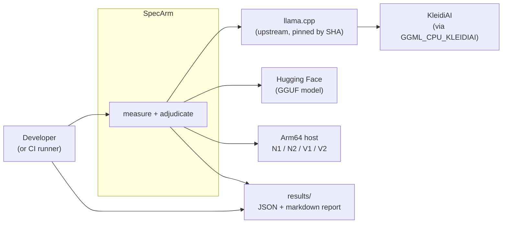
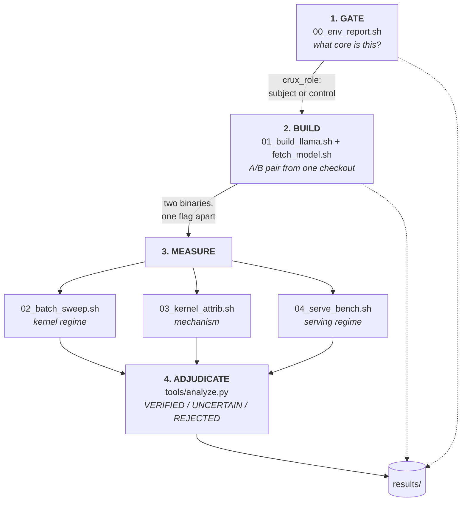
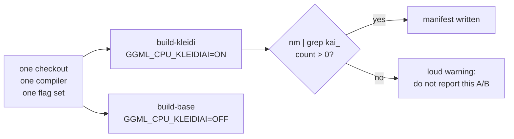
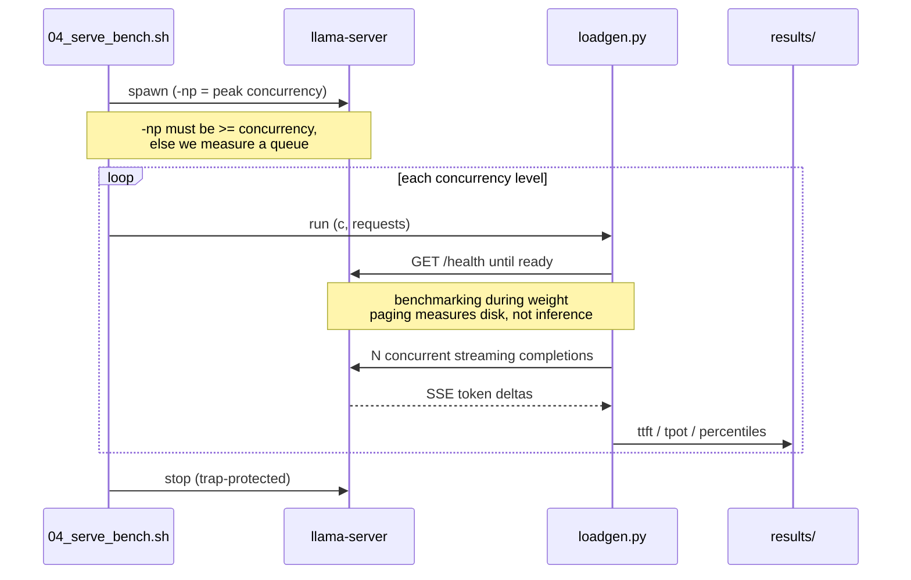
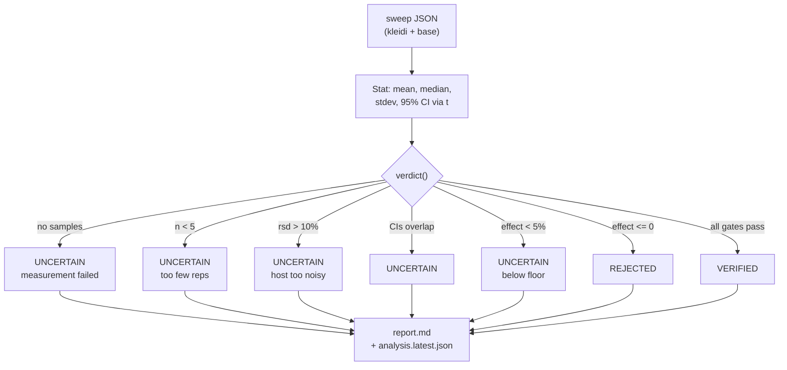
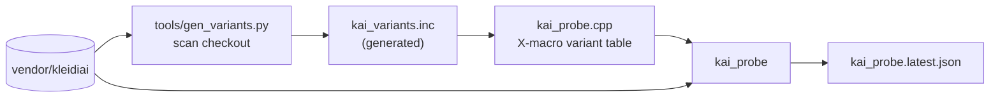
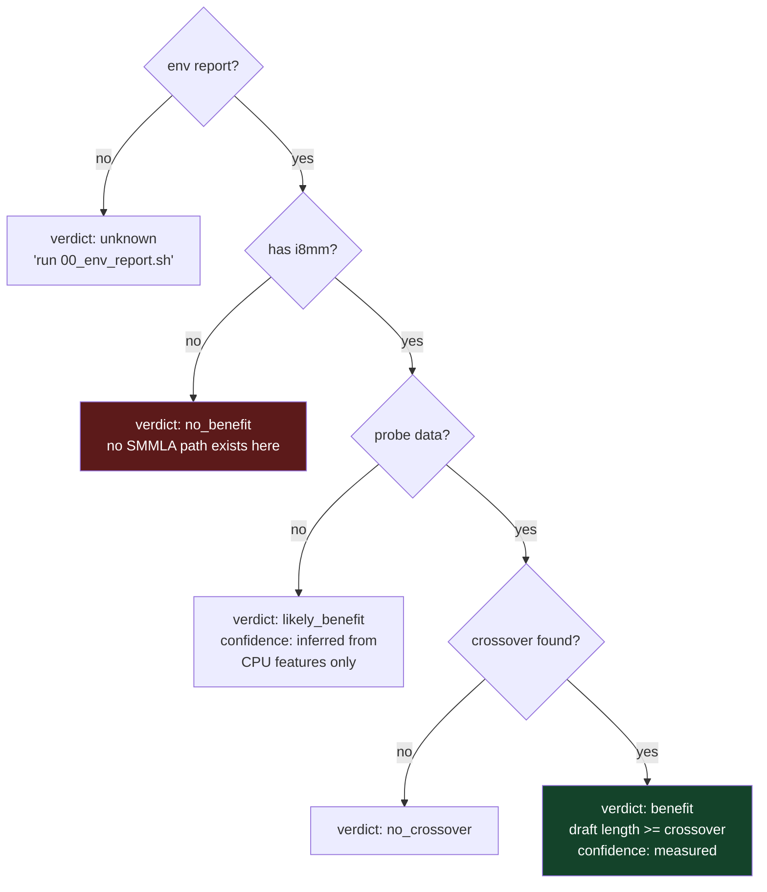
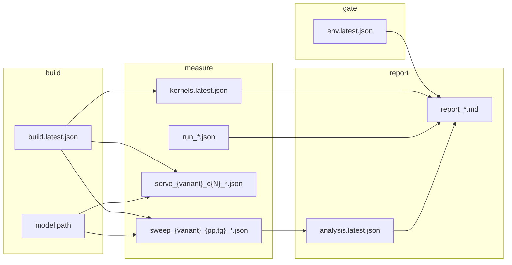

# Architecture

How SpecArm is put together, why it is put together that way, and what it does
when things go wrong.

- [1. System context](#1-system-context)
- [2. High-level architecture](#2-high-level-architecture)
- [3. Component design](#3-component-design)
- [4. Data flow and artifact chain](#4-data-flow-and-artifact-chain)
- [5. Design decisions](#5-design-decisions)
- [6. Failure modes and degradation](#6-failure-modes-and-degradation)
- [7. Extension points](#7-extension-points)

---

## 1. System context

SpecArm is a measurement instrument, not a service. It takes an Arm64 Linux host
and produces an adjudicated claim about how that host executes LLM inference.



**Boundary.** SpecArm does not modify llama.cpp or KleidiAI. It configures,
builds, executes and observes them. Everything it asserts must be derivable from
artifacts left in `results/`.

## 2. High-level architecture

Four stages, strictly ordered. Each stage refuses to run if the previous one did
not leave a usable artifact — there is no path that produces a report from
missing data.



| Stage | Question it answers | Fails closed when |
|:--|:--|:--|
| **Gate** | Does this core even have i8mm? | not arm64 → hard stop |
| **Build** | Are the two binaries comparable? | flag silently ignored → warns loudly |
| **Measure** | What happens as batch size grows? | no build manifest → hard stop |
| **Adjudicate** | Is the difference defensible? | thin/noisy data → UNCERTAIN, never VERIFIED |

## 3. Component design

### 3.1 `scripts/lib.sh` — shared foundation

Sourced by every script; never executed. Provides path resolution, logging,
`json_escape`, and `cpu_has`.

One subtlety worth naming: `cpu_has` matches with `grep -qw` (word boundary)
because `/proc/cpuinfo` contains both `i8mm` and `svei8mm`. A substring match
would report i8mm present on a core that only has the SVE variant, which would
silently invalidate the gate.

### 3.2 `00_env_report.sh` — the gate

| | |
|:--|:--|
| **In** | `/proc/cpuinfo`, `/etc/os-release`, `prctl(PR_SVE_GET_VL)`, `systemd-detect-virt` |
| **Out** | `results/env_<host>_<stamp>.json`, `results/env.latest.json` |
| **Exit** | `0` always, unless `--require-i8mm` and the core lacks it → `3` |

Resolves the core from MIDR (`CPU implementer` + `CPU part`), mapping the four
Neoverse parts it knows and reporting anything else as `Arm-unknown(0x…)` rather
than guessing. Sets `crux_role`:

- `subject` — has i8mm; the experiment is meaningful
- `control` — no i8mm; a null result here is expected, not evidence

It also records SVE vector length, because on Neoverse N2 SVE2 is 128-bit — the
same width as NEON. Recording it prevents a later claim that attributes a gain to
vector width that cannot have come from vector width.

### 3.3 `01_build_llama.sh` — the A/B pair

| | |
|:--|:--|
| **In** | `vendor/llama.cpp` (cloned if absent) |
| **Out** | four binaries, `results/build.latest.json` |



The verification step is the point. A build where `GGML_CPU_KLEIDIAI=ON` was
accepted but did nothing would produce a perfectly clean "no difference" result
that means nothing. Counting `kai_*` symbols catches that before measurement.

### 3.4 `02_batch_sweep.sh` — kernel regime

Sweeps `llama-bench -p N` over small N. Verifying N draft tokens is one forward
pass over N tokens; processing a prompt of N tokens is also one forward pass over
N tokens. Same matmul shape, so `-p N` proxies verification cost without needing
a working speculative decoder first.

Records environment snapshots before and after so a run taken on a throttling
burstable instance can be rejected rather than silently trusted.

### 3.5 `03_kernel_attrib.sh` — mechanism

The only component that can establish *causation*. KleidiAI microkernel symbols
encode their ISA path:

```
kai_run_matmul_clamp_f32_qai8dxp1x8_qsi4c32p4x8_1x4x32_neon_dotprod
                                                        └── dotprod (GEMV-ish)
kai_run_matmul_clamp_f32_qai8dxp4x8_qsi4c32p4x8_8x4x32_neon_i8mm
                                                        └── i8mm (SMMLA)
```

So the hot symbol *names* the kernel that ran. Classification order matters:
i8mm and SME kernel names also contain `neon`, so `neon` is tested last.

Two evidence classes, never conflated:

| Class | Means | Is it proof? |
|:--|:--|:--|
| `execution` | `perf` sampled it; a kai_ symbol was hot | **Yes** |
| `capability_only` | `perf` blocked; kernels only *linked* | **No**, and labelled so |

### 3.6 `04_serve_bench.sh` + `tools/loadgen.py` — serving regime

Where the kernel question becomes a Cloud AI question. A server batches
concurrent requests, so client concurrency drives real matmul batch size.



`loadgen.py` separates **TTFT** (first token — prefill, GEMM regime) from
**TPOT** (subsequent tokens — decode, GEMV regime). Keeping them apart is
essential: averaging them would blur precisely the boundary under study.

### 3.7 `tools/analyze.py` — adjudication



Gate order is deliberate. "We measured nothing" is checked before "we measured no
gain", so a failed run can never be published as a negative result.

### 3.8 `src/kai_probe/` — direct microkernel measurement

The only component that measures KleidiAI with nothing in between. Everything
else observes kernels *through* llama.cpp, inheriting its threading policy, KV
cache behaviour and graph scheduling as confounds.



Two outputs, of very different epistemic weight:

| Output | Kind | Certainty |
|:--|:--|:--|
| `mr` (row granularity) per variant | **API call** | Exact — the kernel declares it |
| Crossover M where i8mm beats dotprod | measurement | Subject to noise |

The first is why the project has a claim at all: a kernel with `mr=8` computes 8
rows per macro-tile, so at M=1 it produces one useful row out of eight. That is a
shape mismatch, not a tuning oversight, and it needs no statistics.

**Variant names are never hardcoded.** They move between KleidiAI releases, so
`gen_variants.py` discovers the headers actually present and emits the X-macro
list. An upgrade that renames a kernel produces a clear "variant not found"
message instead of an opaque linker error.

**Correctness gates timing.** Every variant is cross-checked against the others
at each shape — they compute the same product, so they must agree. Disagreement
means the packing is wrong, and the probe exits non-zero rather than reporting
fast garbage.

### 3.9 `tools/advisor.py` — the reusable artifact

Consumes the evidence chain and answers the developer's actual question. Its
distinguishing property is **graceful degradation with labelled confidence**:



Every recommendation carries whether it was **measured on this machine** or
**inferred from CPU features**. The verdict is also the process exit code
(`0` benefit, `3` no crossover, `4` no i8mm, `5` unknown) so it can gate a
deployment script.

When the serving evidence contradicts the probe, it emits a warning rather than
picking whichever supports the thesis.

## 4. Data flow and artifact chain

Every file is an input to the next stage. Nothing is passed in memory between
stages, so any stage can be re-run alone against existing artifacts.



Schemas are versioned by a `schema` field (`specarm.env/1`, `specarm.build/1`,
`specarm.run/1`, `specarm.kernels/1`, `specarm.serve/1`, `specarm.analysis/1`) so
a consumer can detect a shape change instead of misreading it.

## 5. Design decisions

| Decision | Rationale | Rejected alternative |
|:--|:--|:--|
| Build both variants from **one checkout** | Any other difference (compiler, source, flags) makes the A/B uninterpretable | Two clones — invites drift |
| `BUILD_SHARED_LIBS=OFF` | Static binary resolves `kai_*` symbols cleanly under `perf` | Shared libs — symbol attribution gets harder |
| Record resolved **SHA**, don't hard-pin a tag | A pinned tag we cannot verify is a guess; a recorded SHA is a fact | Inventing a plausible tag |
| Classify kernels by **symbol name** | Names encode the ISA — direct evidence, no inference | Timing alone — correlation only |
| Thresholds **pre-registered** in git | Thresholds chosen after seeing data are decoration | Tuning until the result looks good |
| `perf` failure **degrades**, doesn't abort | Hosted runners restrict PMU; a labelled weaker result beats no result | Requiring perf — unusable in CI |
| Publish **rejected** rows | A harness that reports only wins is not credible | Reporting the best run |
| Command substitution over process substitution | `$(...)` propagates failure under `set -e`; `< <(...)` returns *read's* status | `read < <(build)` — silently continues on build failure |
| stdlib-only Python | No pip on the benchmark host, nothing to drift between runs | numpy/pandas — version-dependent percentiles |
| Nearest-rank percentiles | Explicit and stable | Library default — varies by interpolation method |

## 6. Failure modes and degradation

| Failure | Detected by | Behaviour |
|:--|:--|:--|
| Not arm64 | `require_aarch64` | **Hard stop** |
| Core lacks i8mm | `crux_role` | Labelled `control`; `--require-i8mm` hard-stops |
| KleidiAI flag ignored | `kai_*` symbol count | Loud warning; result marked untrustworthy |
| `perf` unavailable | probe record of `true` | Degrade to `capability_only`, labelled |
| Burstable throttling | RSD gate + env snapshots | UNCERTAIN |
| Too few reps | `MIN_REPS` | UNCERTAIN |
| Server never healthy | `/health` poll timeout | Exit 2, no numbers emitted |
| Requests fail under load | `requests_failed > 0` | Non-zero exit + warning; not a throughput number |
| llama-bench JSON shape drifts | `test_pipeline.py` | Fails in CI on x86 before an Arm runner is spent |

**Everything degrades toward saying less, never toward claiming more.**

## 7. Extension points

- **New core** — add its MIDR part to the lookup in `00_env_report.sh`. Unknown
  parts already report safely.
- **New ISA class** — extend `isa_of()` in `03_kernel_attrib.sh`; order matters,
  most specific first.
- **New model/quant** — `SPECARM_MODEL_URL`. Q4_0 is the default because that is
  what KleidiAI's int4 microkernels target.
- **New workload** — edit `REQUESTS`/`SYSTEM` in `tools/loadgen.py`.
- **New metric** — emit into the stage JSON, consume in `analyze.py`. Add a
  matching assertion to `test_pipeline.py` so drift fails loudly.

## Related

- [methodology.md](methodology.md) — the pre-registered experiment
- [metrics.md](metrics.md) — precise definition of every number reported
- [flows.md](flows.md) — end-to-end operational sequences
- [reproducing.md](reproducing.md) — step by step on each target
