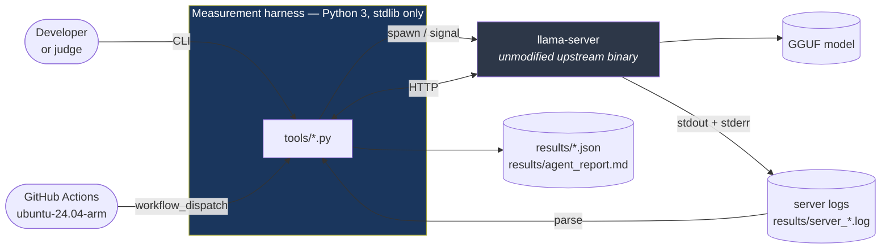
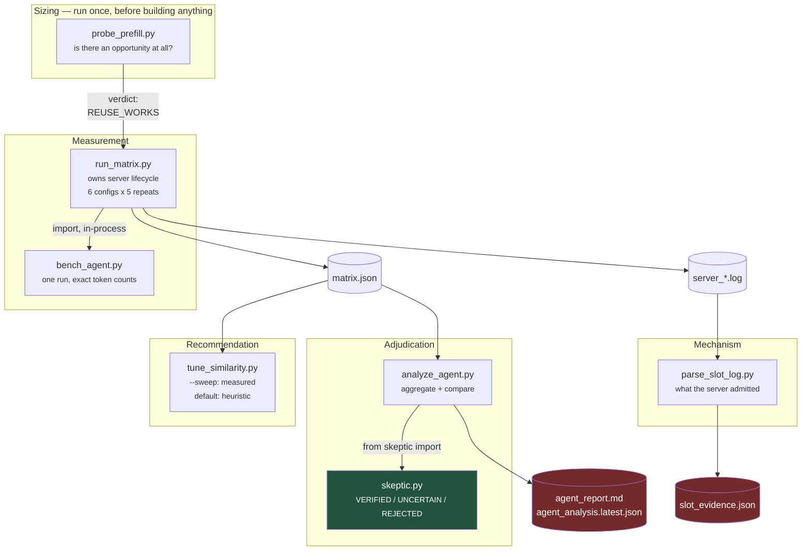
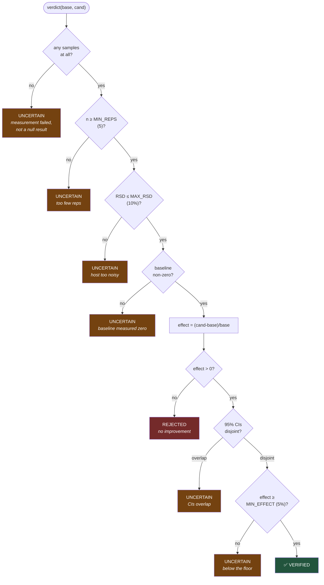
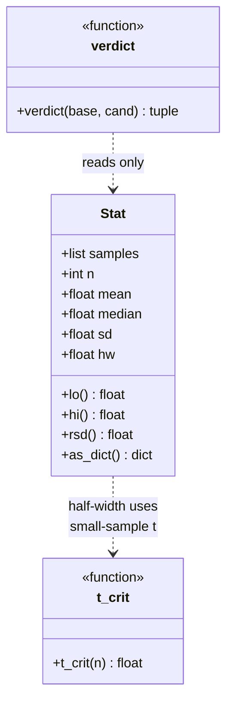
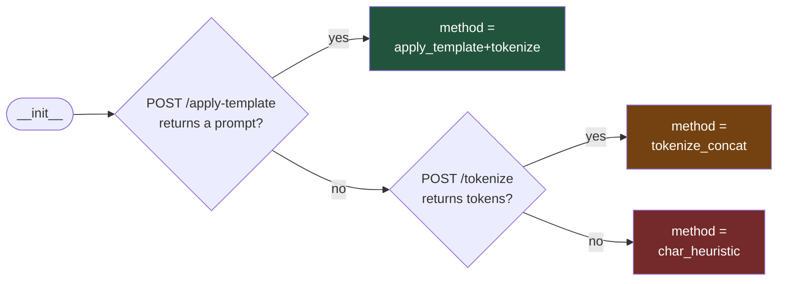
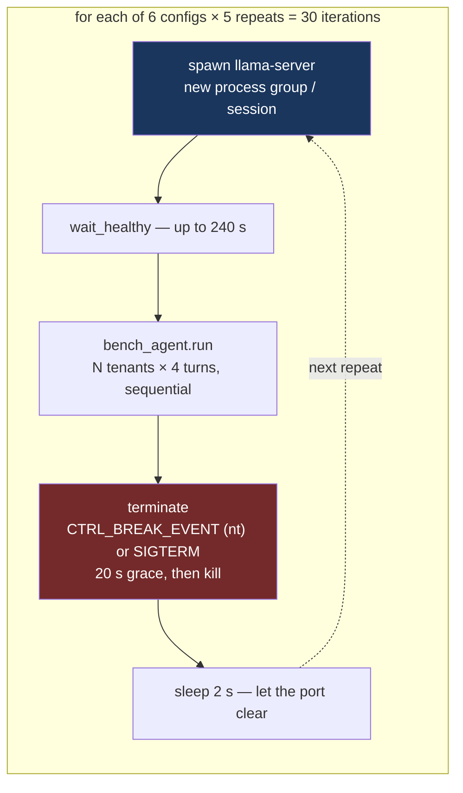
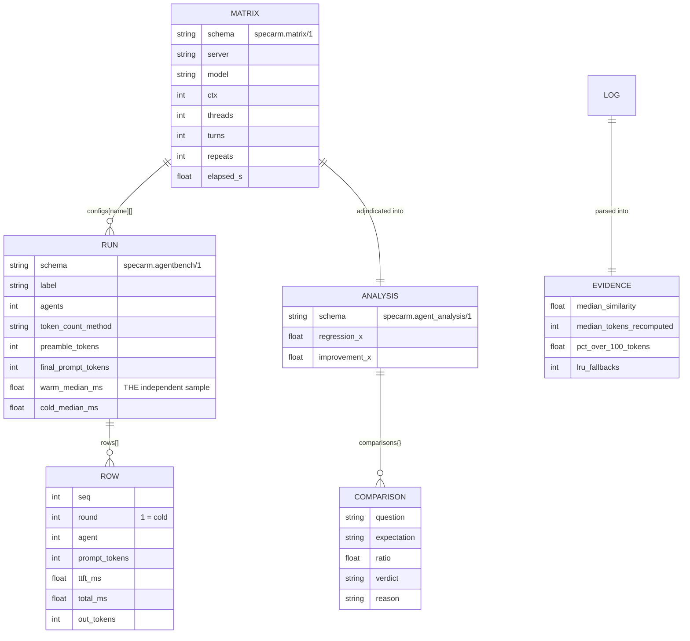
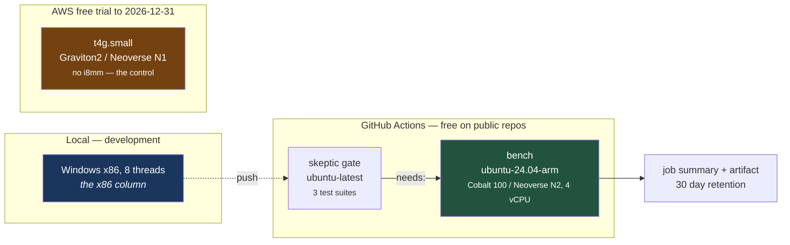

# Architecture

Three levels of zoom: what the system talks to, what the modules are, and how
the two load-bearing pieces actually work inside.

Every diagram here is generated from the code as it exists, not from a design
that preceded it. Where a diagram and the code disagree, the code is right and
this file is a bug.

- [Level 1 — System context](#level-1--system-context)
- [Level 2 — Modules and data flow](#level-2--modules-and-data-flow)
- [Level 3 — Inside the two pieces that matter](#level-3--inside-the-two-pieces-that-matter)
- [Process model](#process-model)
- [Data model](#data-model)
- [Deployment](#deployment)
- [Design decisions](#design-decisions-and-what-they-cost)

---

## Level 1 — System context

The harness owns no inference code. It spawns an unmodified upstream
`llama-server`, drives it over HTTP, and reads its log. That boundary is
deliberate: a finding about upstream behaviour is worthless if the measurement
tool has patched the thing it is measuring.

**The HTTP surface used, and why each endpoint is there:**

| Endpoint | Used for | Why not something simpler |
|:--|:--|:--|
| `GET /health` | Gate before measuring | A server that is listening is not yet a server that has loaded a model |
| `POST /apply-template` | Apply the chat template | Token counts must include role markers and template scaffolding |
| `POST /tokenize` | Exact token count | `len(text)//4` is a guess; this is the tokenizer that will actually run |
| `POST /v1/chat/completions` | The measurement, `stream: true` | Streaming is the only way to observe *first* token separately from last |

---

## Level 2 — Modules and data flow

Seven modules. Each writes a file the next one reads, so any stage can be
re-run without repeating the 47 minutes above it.

| Module | Reads | Writes | One-line job |
|:--|:--|:--|:--|
| `probe_prefill.py` | — | `prefill_default.json` | Is prefix reuse already working? (It was — this killed hypothesis 2) |
| `run_matrix.py` | — | `matrix.json`, `server_*.log` | 30 runs, **fresh server each** |
| `bench_agent.py` | — | in-process dict | One run: per-turn TTFT + exact token counts |
| `analyze_agent.py` | `matrix.json` | `agent_report.md`, `agent_analysis.latest.json` | Aggregate to CIs, run the 6 pre-declared comparisons |
| `skeptic.py` | — | — | The single definition of VERIFIED |
| `parse_slot_log.py` | `server_*.log` | `slot_evidence.json` | Similarity chosen, **tokens recomputed** |
| `tune_similarity.py` | `matrix.json` | stdout | Right threshold for a given workload |

**The dependency that matters:** `skeptic.py` imports nothing from this project.
It is a leaf. Nothing in it knows what is being measured, so it cannot be
tempted into a verdict by context.

---

## Level 3 — Inside the two pieces that matter

### `skeptic.verdict` — the gate order is the design

The order is not arbitrary. Each gate answers a question that must be settled
before the next one is meaningful, and the first four exist to stop a *failed
measurement* being published as a *negative result*.

**The distinction that most harnesses get wrong:** four different failure paths
land on UNCERTAIN, and only one path — a measured non-improvement — lands on
REJECTED. "We measured nothing" and "we measured no gain" are different claims,
and conflating them lets a broken run masquerade as evidence.

`Stat` is the only thing `verdict` sees:

`hw = t_crit(n) * sd / sqrt(n)` — and `t_crit` uses a **small-sample t table**,
not 1.96. At n=5 the normal approximation understates the interval by roughly
30%, which is exactly enough to manufacture VERIFIED verdicts out of thin data.

### `Tokenizer` — a fallback chain that records which rung it used

`method` travels into every result as `token_count_method`. A count from
`char_heuristic` is a *different claim* from one produced by the server's own
tokenizer, and a report that does not say which it used is not reproducible.

---

## Process model

This is the part that makes the confidence intervals mean anything.

| Choice | Reason | Cost |
|:--|:--|:--|
| **Fresh server every repeat** | A warm server's slots still hold the previous run's KV, so repeat 2 measures *carry-over*, not the configuration | 30 model loads ≈ most of the 47 minutes |
| **New process group / session** | So the whole tree can be signalled on Windows and POSIX alike | A little platform-specific code |
| **Sequential requests** | Removes queueing and thread contention as competing explanations | Deletes the realistic concurrent case — a real limitation, see [methodology](methodology.md) |
| **`sleep 2` after terminate** | The port outlives the process; the next spawn fails without it | 60 s across the matrix |

---

## Data model

Every artifact carries a `schema` string. When a schema changes, old results
stay readable instead of silently mis-parsed.

**The single most important field is `RUN.warm_median_ms`.** It is the
independent sample. `n` equals the repeat count — never the request count,
because requests inside one run share a server, a cache state and a schedule.
Pooling 96 requests instead of 5 medians would shrink the intervals to nothing
and manufacture significance.

`ROW.round == 1` is cold for every tenant by definition, so it is separated out
rather than averaged in.

---

## Deployment

**Status:** the N2 runner has produced a full 30-run matrix
(`results/arm-neoverse-n2/`, 2026-08-10). The N1 host is the outstanding
experiment — it is the only way to separate microarchitecture from core count in
the cost comparison.

**The gate is the point.** If the adjudicator is broken there is no reason to
spend an Arm runner on measurements it would misjudge, so `skeptic` runs the
three test suites on cheap x86 first and `bench` declares `needs: skeptic`.

Why two Arm targets: **N1 has no i8mm and N2 does.** Prefill throughput
therefore differs, so the *cost of a slot miss* differs, so the right threshold
may differ. One core cannot show that; two can.

---

## Design decisions, and what they cost

| Decision | Bought | Paid |
|:--|:--|:--|
| stdlib only — no numpy, requests, pytest | Runs on any Python 3.8+ with zero install; a judge cannot hit a dependency error | Hand-rolled t-table; tests are `__main__` scripts, so no collection or coverage |
| Unmodified upstream `llama-server` | The finding is about upstream, provably | No ability to instrument internals — mechanism comes from log text, which is brittle |
| Log parsing for mechanism evidence | The server *itself* states what it did; immune to CPU noise and thermal state | Two regexes against unstructured text, **no fixtures committed** — silent zero-match on format drift |
| `skeptic.py` as a leaf module | Cannot be influenced by what it is judging | Latency must be inverted to a rate by the caller, since `verdict` is higher-is-better |
| Pre-registered thresholds | Cannot be tuned to fit a result | Some real effects land on UNCERTAIN and stay there |
| Per-repeat medians as samples | Intervals that survive scrutiny | n=5 instead of n=96, so only large effects can clear the bar |

### Known architectural weaknesses

Stated here rather than discovered by a reviewer:

1. **`parse_slot_log.py` has no fixtures.** An upstream log-format change makes it return zero matches, silently. It should ship a captured log and a test.
2. **No packaging.** No `pyproject.toml`, so there is no `pip install`, no entry points, and no version.
3. **50-minute minimum feedback loop.** No smoke mode, so every change to the measurement path costs most of an hour to validate.
4. **The analytic half of `tune_similarity.py` models an inferred formula.** It is labelled a heuristic because it has already disagreed with measurement once. `--sweep` is authoritative and slower.
5. **Hardcoded default port.** A busy port fails the run rather than choosing another.
