# Flows

Every path through the system, end to end. Start with
[the mechanism](#1-the-mechanism--how-a-slot-gets-chosen-wrong) — it is the only
diagram here that explains *why the project exists*.

1. [The mechanism — how a slot gets chosen wrong](#1-the-mechanism--how-a-slot-gets-chosen-wrong)
2. [Slot lifetime across turns](#2-slot-lifetime-across-turns)
3. [One measurement run](#3-one-measurement-run)
4. [One turn, in detail](#4-one-turn-in-detail)
5. [The full matrix](#5-the-full-matrix)
6. [Adjudication](#6-adjudication)
7. [Mechanism extraction from logs](#7-mechanism-extraction-from-logs)
8. [Tuning for your own workload](#8-tuning-for-your-own-workload)
9. [CI on Arm](#9-ci-on-arm)
10. [How three hypotheses died](#10-how-three-hypotheses-died)

---

## 1. The mechanism — how a slot gets chosen wrong

`llama-server` holds conversations in **slots**, each keeping its KV cache so
already-processed text is not reprocessed. To route an incoming request it scores
every slot by longest-common-prefix similarity and accepts any slot clearing
`--slot-prompt-similarity`.

Similarity is approximately `shared_prefix / total_prompt`. **The default
threshold is 0.10.**

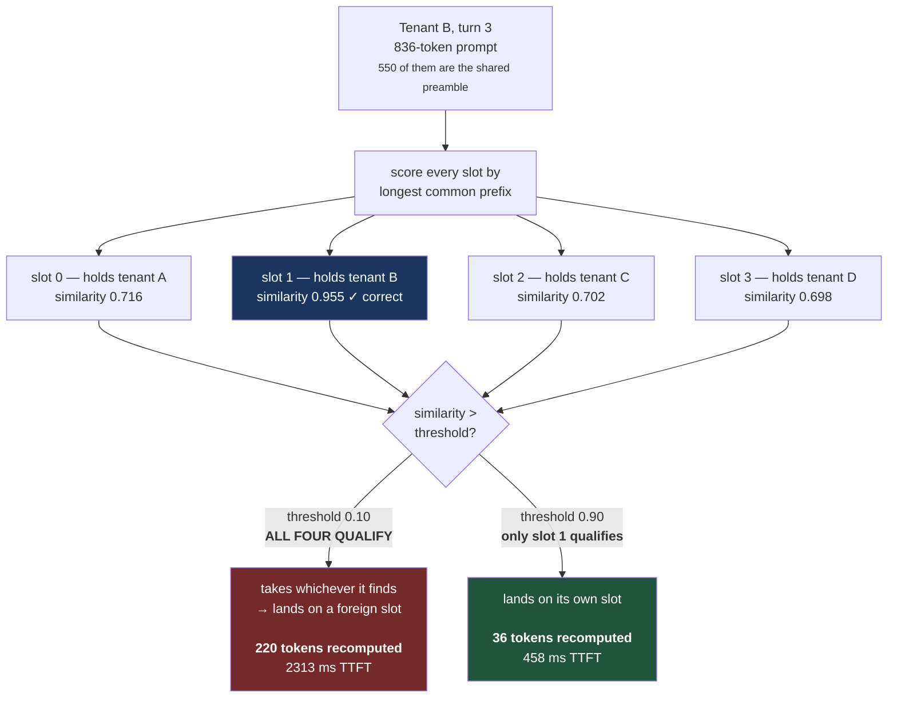

Because every tenant carries the same 550-token preamble, **any two tenants are
already 0.6–0.9 similar to each other.** Against 0.10, every slot looks like a
valid match for every tenant.

The server states the decision itself, which is why this is evidence rather than
inference:

```
slot get_availabl: id  0 | task 12 | selected slot by LCP similarity, f_sim_best = 0.716 (> 0.100 thold)
slot print_timing: id  0 | prompt eval time = 1893.44 ms / 220 tokens
```

### The corollary that makes this non-obvious

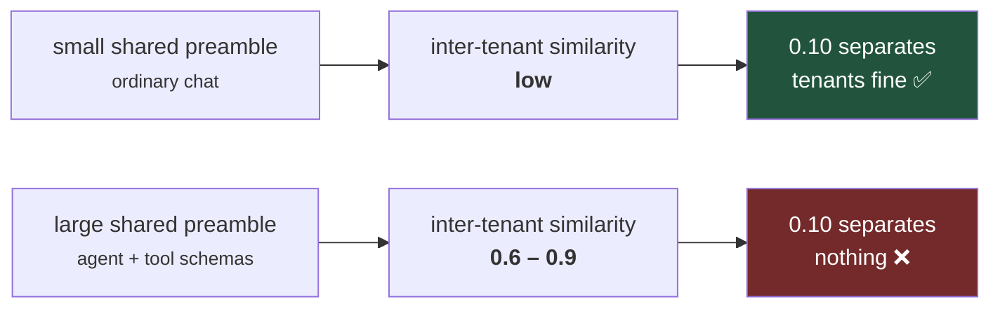

**The bigger your system prompt, the worse the default behaves.** That is
backwards from intuition, which is why the default is reasonable for chat and
wrong for agents — and why nobody had reported it.

It is also invisible to ordinary benchmarking: a single-conversation benchmark
never has a second tenant to be confused with.

---

## 2. Slot lifetime across turns

What actually happens to one tenant's cache over four turns.

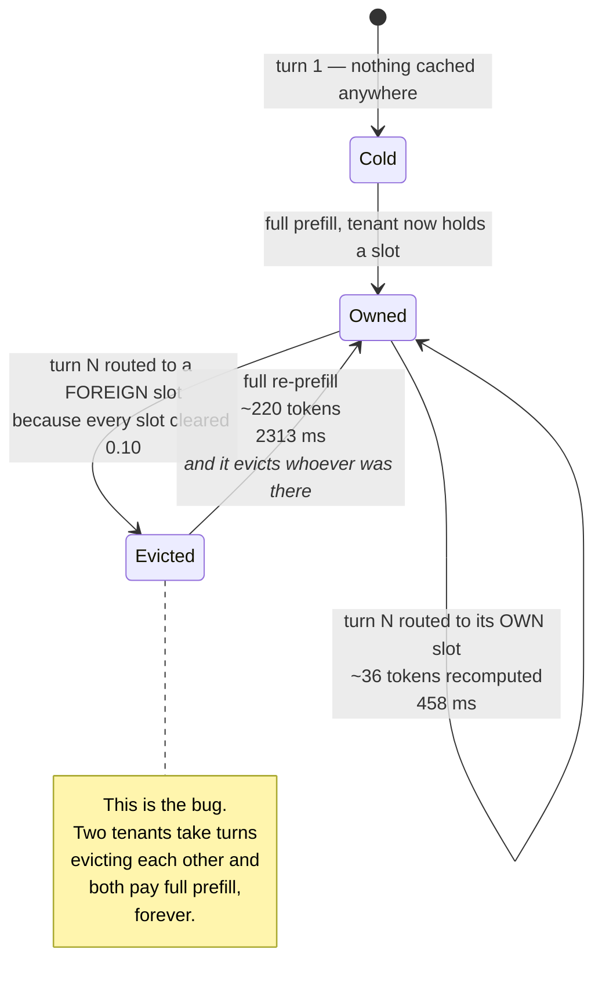

The self-sustaining part matters: tenant B displacing tenant A does not merely
cost B a re-prefill — it destroys A's cache, so A pays too on its next turn. The
regression does not decay. It is a stable thrashing state.

---

## 3. One measurement run

`bench_agent.run()` — one run against an already-running server. Repeats and
server lifecycle belong to `run_matrix.py`, because a repeat reusing a warm
server is not an independent sample.

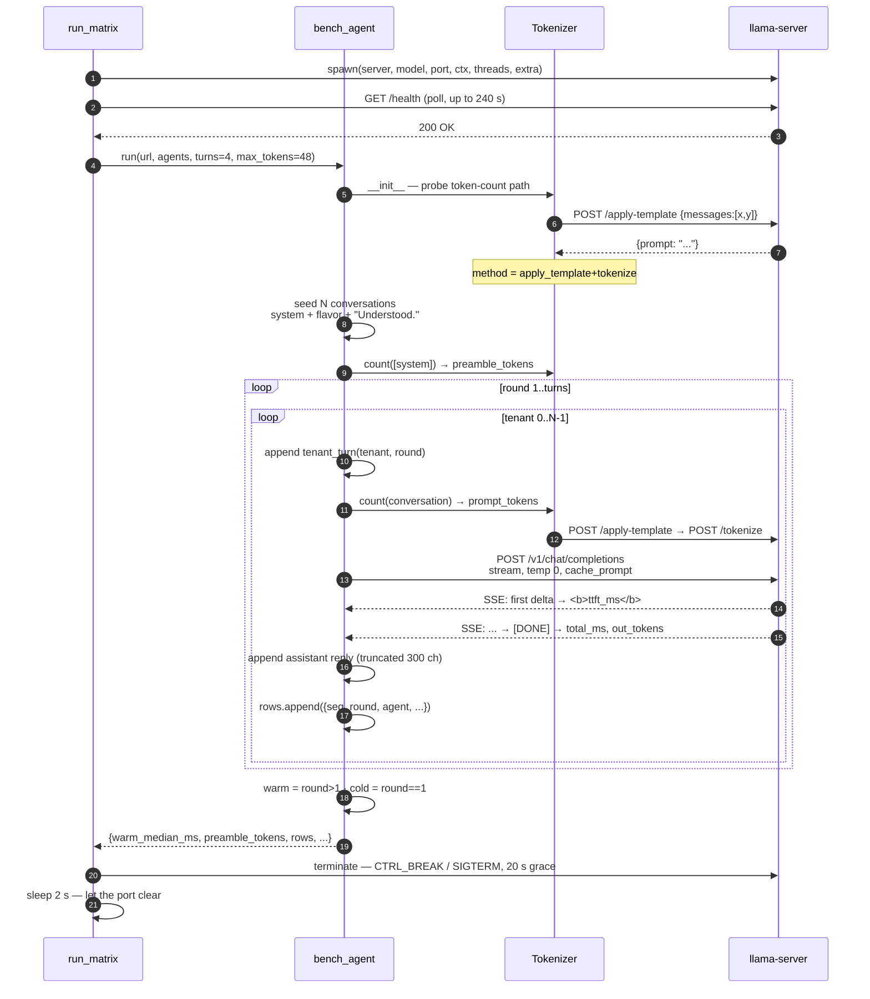

**Round-robin, not per-tenant:** the outer loop is the round and the inner loop
is the tenant. All tenants advance one turn before anyone advances two — which is
what creates the interleaving that triggers the bug. Draining one tenant at a
time would never reproduce it.

**Round 1 is cold for every tenant by definition**, so it is separated rather
than averaged in. `warm_median_ms` — the median of rounds 2+ — is the single
number that becomes an independent sample.

---

## 4. One turn, in detail

Where the two numbers come from, and why streaming is required.

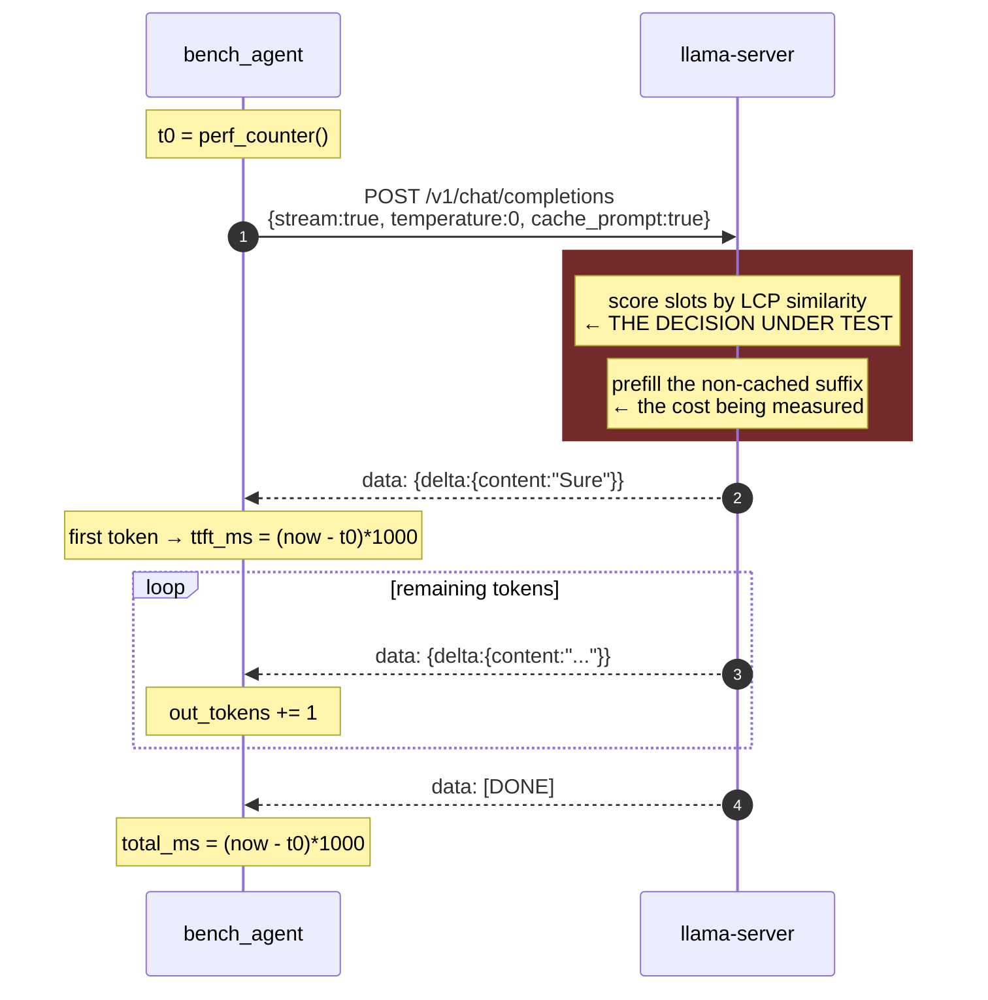

| Setting | Value | Why |
|:--|:--|:--|
| `stream` | `true` | Without it, first-token time is unobservable — you only see the last one |
| `temperature` | `0.0` | Deterministic output, so token sequences are identical across repeats and only wall-clock varies |
| `cache_prompt` | `true` | Caching must be *on*, or there is no cache to mis-route |
| `max_tokens` | `48` | Enough to measure TTFT, short enough that decode does not dominate the run |

Prefill token counts come back byte-identical across all five repeats. That is
expected, not suspicious — temperature is 0 and the workload is fixed. It also
means the token metric carries less independent information than the timing
metric, which is stated in [methodology](methodology.md).

---

## 5. The full matrix

Six configurations, each changing **one** thing from the baseline.

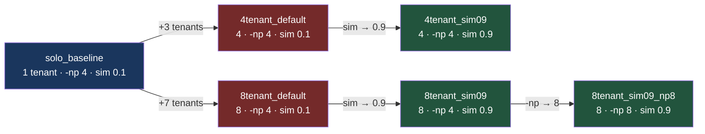

Each edge is one variable. `4tenant_default → 4tenant_sim09` changes **only** the
threshold, which is what licenses the causal claim; `8tenant_sim09 →
8tenant_sim09_np8` changes only slot count, which is what ruled out capacity as
the explanation.

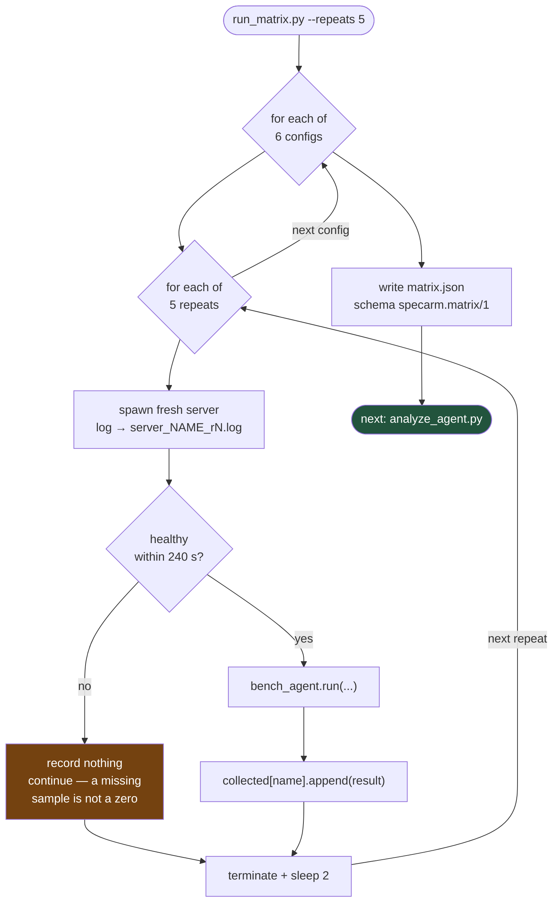

A server that never becomes healthy contributes **no sample** rather than a
zero. A zero would drag a mean toward a conclusion; a missing sample reduces `n`,
which the adjudicator then reports as UNCERTAIN.

---

## 6. Adjudication

```mermaid
sequenceDiagram
    autonumber
    participant A as analyze_agent
    participant K as skeptic
    participant F as results/

    A->>F: read matrix.json
    A->>A: samples_for(cfg) = [warm_median_ms per repeat]
    Note over A: n = 5 repeats, NOT 96 requests

    loop each of 6 configs
        A->>K: Stat(samples_ms)
        K-->>A: mean, median, sd, hw = t_crit(n)·sd/√n, rsd
    end

    loop each of 6 pre-declared comparisons
        A->>A: as_rate(ms) = 1000/ms
        Note over A: verdict() is higher-is-better;<br/>TTFT is lower-is-better
        A->>K: verdict(base_rate, cand_rate)
        K-->>A: (VERIFIED | UNCERTAIN | REJECTED, reason)

        alt expectation == regression_expected
            Note over A: REJECTED is the FINDING here.<br/>Relabel → "REGRESSION CONFIRMED" 🔴
        else improvement or parity
            Note over A: ✅ / ⚠️ / ❌ as-is
        end
    end

    A->>F: write agent_report.md
    A->>F: write agent_analysis.latest.json
```

The comparisons and their expectations are declared in `COMPARISONS` **before**
any data is read:

| Question | Reference | Candidate | Expectation |
|:--|:--|:--|:--|
| Does adding tenants break prefix caching? | `solo_baseline` | `4tenant_default` | regression |
| Does it get worse with more tenants? | `solo_baseline` | `8tenant_default` | regression |
| Does raising the threshold fix it? | `4tenant_default` | `4tenant_sim09` | improvement |
| Does the fix hold when tenants exceed slots? | `8tenant_default` | `8tenant_sim09` | improvement |
| With the fix, is multi-tenant back at parity? | `solo_baseline` | `8tenant_sim09` | parity |
| Do extra slots add anything once the threshold is right? | `8tenant_sim09` | `8tenant_sim09_np8` | improvement |

**Why the relabel exists and why it is not cheating:** `verdict()` only ever
answers "is the candidate faster?" For a comparison whose entire purpose is to
expose a regression, a REJECTED *is* the finding. The raw `verdict` is preserved
in the JSON alongside the displayed label, so the relabel is presentational and
auditable — not a second, friendlier adjudicator.

---

## 7. Mechanism extraction from logs

Latency is the consequence. This is the cause.

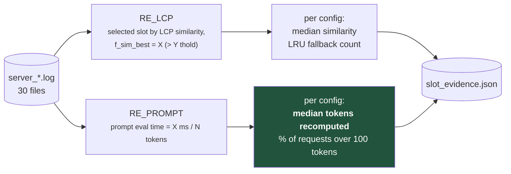

| config | median similarity | **tokens recomputed** | >100 tok |
|:--|--:|--:|--:|
| `solo_baseline` | 0.955 | **35** | 25% |
| `4tenant_default` | 0.716 | **220** | 81% |
| `4tenant_sim09` | 0.955 | **36** | 25% |
| `8tenant_sim09_np8` | 0.955 | 36 | 25% |

Identical across all five repeats — deterministic, because temperature is 0.

**Why this is the stronger evidence:** tokens-recomputed comes from the server's
own accounting and is immune to CPU noise, thermal state and scheduling. TTFT is
what a user feels; this is what actually happened. If the two ever disagree,
this one is right.

---

## 8. Tuning for your own workload

Two modes, and the difference between them is the point.

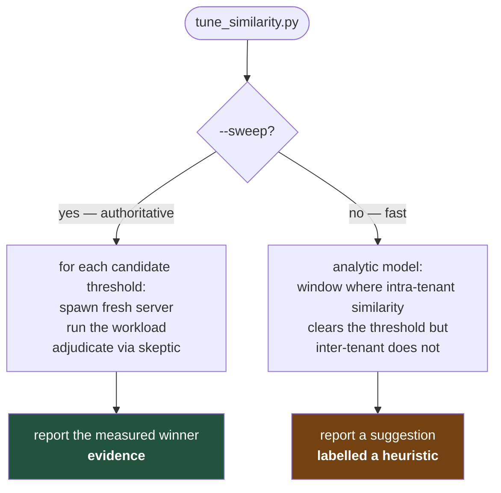

The analytic mode is labelled a heuristic for a specific reason, not out of
modesty: its model of the similarity formula is **inferred from the flag's
documentation rather than read from source**, and it has already disagreed with
measurement once — the model said the usable window closed at 0.857, while 0.9
empirically worked. When a model contradicts a measurement, the measurement wins
and the model gets a warning label.

The window the analytic mode reasons about, and why it binds from turn 2:

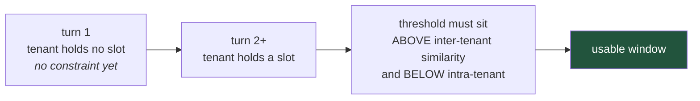

---

## 9. CI on Arm

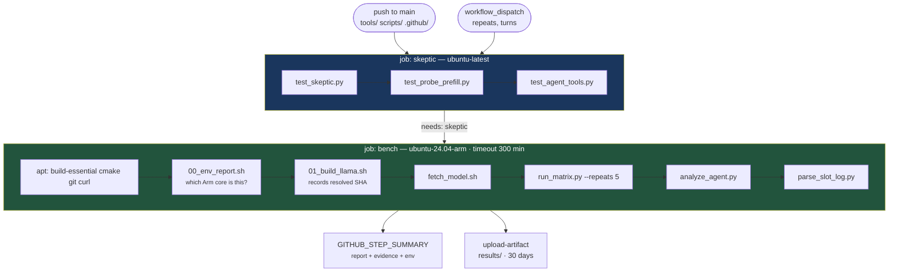

**Why the gate:** if the adjudicator is broken there is no point spending an Arm
runner on measurements it would misjudge. Cheap x86 tests first; `bench`
declares `needs: skeptic`.

**Why it is free:** `ubuntu-24.04-arm` is an Arm-hosted GitHub runner — Cobalt
100, Neoverse N2 — at no cost on public repositories. Anyone can fork this repo
and re-run every number without paying for hardware, which is the only real
reason to believe a benchmark you did not run yourself.

`if: always()` on the publish and upload steps: a failed run still uploads its
logs, because a failure with no artifact is unrepairable.

---

## 10. How three hypotheses died

The flow that matters most is the one that stopped work early.

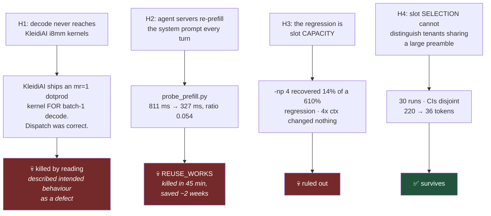

The gate that produced this is *measure the opportunity before building the
fix*. H2 is the case that paid for the discipline: a 45-minute probe returned
REUSE_WORKS and cancelled roughly two weeks of work on a problem that did not
exist.

Full history, including what would falsify H4, is in
[methodology.md](methodology.md).
