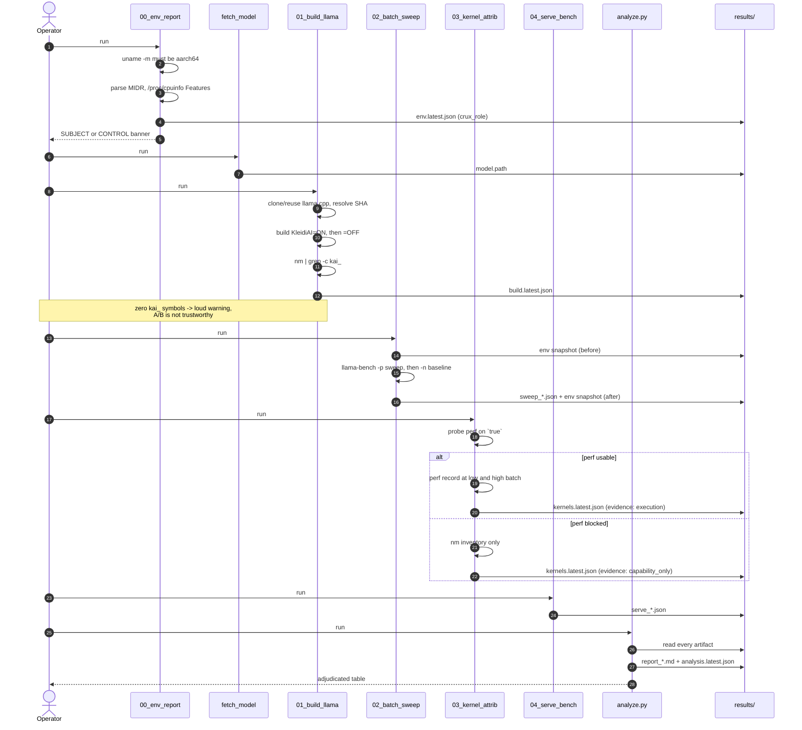
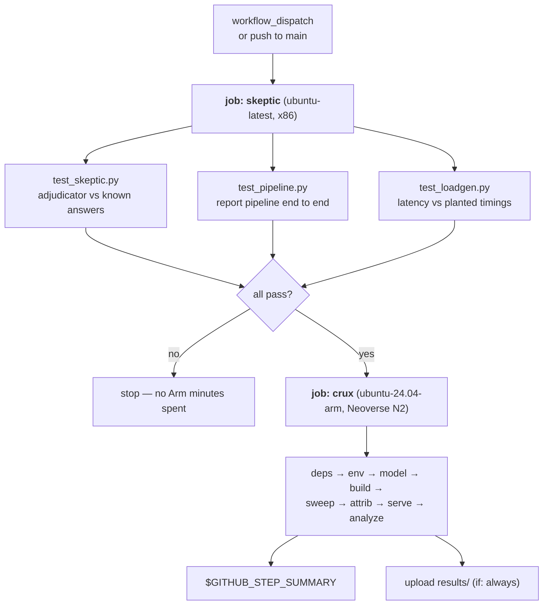
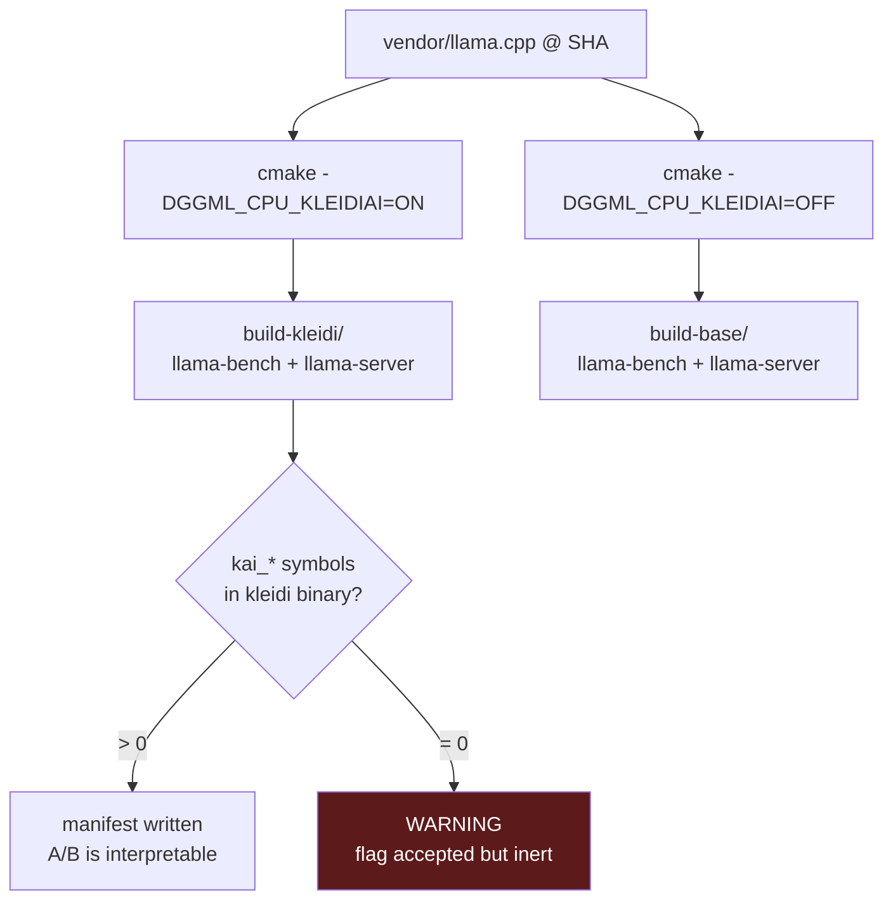
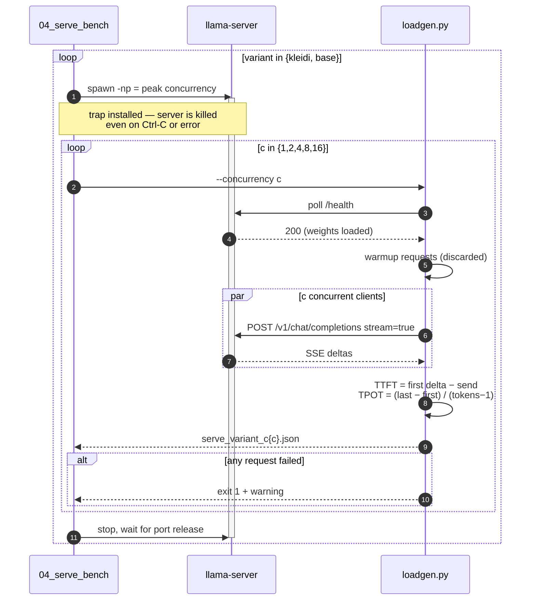
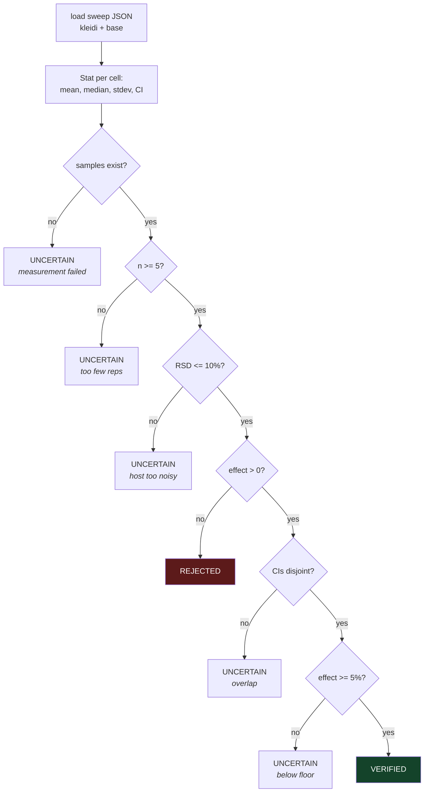
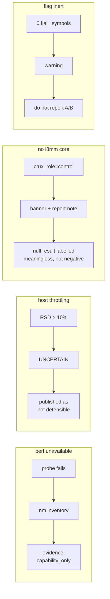
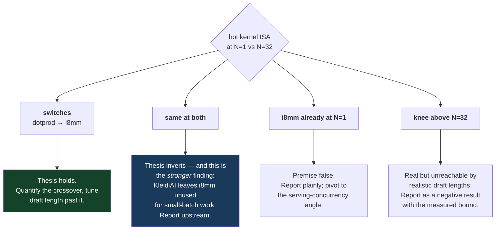

# Flows

End-to-end operational sequences. [architecture.md](architecture.md) covers what
the components *are*; this covers what actually happens, in order, including when
things go wrong.

- [1. Full local run](#1-full-local-run)
- [2. CI run](#2-ci-run)
- [3. Build A/B flow](#3-build-ab-flow)
- [4. Serving benchmark flow](#4-serving-benchmark-flow)
- [5. Adjudication flow](#5-adjudication-flow)
- [6. Degradation flows](#6-degradation-flows)
- [7. Decision flow: what the crux outcome means](#7-decision-flow-what-the-crux-outcome-means)

---

## 1. Full local run

Each stage writes before the next reads. Any stage can be re-run alone against
existing artifacts — nothing is held in memory between them.

## 2. CI run

The x86 job gates the Arm job. An Arm runner is never spent on a pipeline that
could not report what it measured.

`if: always()` on the summary and upload steps matters: a run that fails midway
still surfaces its environment report and partial artifacts, which is usually
exactly what you need to diagnose it.

## 3. Build A/B flow

Both variants come from **one checkout, one compiler, one flag apart**. Any other
difference makes the comparison uninterpretable, so there is no code path that
builds them from separate sources.

## 4. Serving benchmark flow

Health-polling before load is not politeness — benchmarking while weights are
still being paged in measures disk throughput, not inference.

## 5. Adjudication flow

Order is load-bearing. "No samples" is tested before "no gain", so a run that
failed can never be published as a negative result.

## 6. Degradation flows

Every failure path narrows what is claimed. None of them fabricate.

## 7. Decision flow: what the crux outcome means

The experiment is designed so that every outcome routes somewhere useful. This
was committed before any data existed ([methodology.md](methodology.md) §7).

There is no branch labelled "quietly drop the project." That is the point of
pre-registering the falsification criteria.

## Related

- [architecture.md](architecture.md) — component design and rationale
- [metrics.md](metrics.md) — what each number means
- [reproducing.md](reproducing.md) — running these flows yourself
